---

title: "Programación funcional Curso 3"
subtitle: "Scala_03"
author: "Juan Francisco Cardona McCormick"
date: "04/01/2022"
revisión:
---
# Programación Funcional Curso 3. Scala_03

## M0. Bienvenida

### U0. Bienvenida

#### Antes de iniciar


**Importante**

* Te invitamos a ingresar al canal de [Microsoft Teams S4N Campus Students](https://teams.microsoft.com/l/channel/19%3ac42db2d304b64e03a6513494cc550918%40thread.tacv2/S4N%2520Campus%2520students?groupId=a1adcd66-1b55-478a-ad09-2a659c71cc5b&tenantId=b41b72d0-4e9f-4c26-8a69-f949f367c91d). Todas tus preguntas y solicitudes serán respondidas allí.
* El aprendizaje será 100% virtual y desarrollarás las unidades a tu propio ritmo (auto-gestionado).
* Estamos en versión Beta. Nos interesa probar los contenidos y las actividades.
* Esperamos feedback de tu parte. Los comentarios podrás agregarlos en este [Sheets](https://docs.google.com/spreadsheets/d/1bU9sgtsiyLLlSSp8jrS84ZZMJ5IihNNDnbuURxk3hLk/edit?usp=sharing).

## M1. Tipos algebraicos

### U1. Introducción a los tipos de datos inmutables: tuplas

#### Introducción

Los lenguajes de programación tienen muchas formas de guardar información asociada: como *registers* (registros), *class* (clases) y similares.

En esta unidad estudiarás un tipo de dato básico llamado la tupla.

- Las tuplas  te permitirá guardar información asociada con algunos cambios muy interesantes: *no tienen nombres asociados a cada campo*.

- Las tuplas también puede ser utilizadas de forma dinámica, lo que significa que no hay que hacer definiciones de tipo de la tupla, ya que la instanciación de una tupla establece el número de sus elementos (*aridad*) y su correspondiente tipo, cosa que no puedes asi con un *registro* o una *clase*.

- Las tuplas son *inmutables*, esta última característica es la que revisaremos con más detalle en este curso en particular y observaremos las consecuencias directas de utilizarlo a través de *métodos de selección* o *coincidencia de patrones*, la forma de crearlo a partir del soporte que da el lenguaje o los objetos que nos permite otras formas de creación.


  **¡Comencemos!**

##### Guía curso


##### Vídeo - Introducción a los tipos de datos inmutables

Observarás la importancia de los tipos de datos inmutables en general, también ampliarás tus concepto de inmutabilidad vistos previamente y entenderás los beneficios de utilizar dichos tipos de datos, en particular las tuplas.

[Vídeo pendiente de edición](videos/els4n-fp-scala-c3-m1-u1-01.mp4)

##### Objetivos de la unidad

###### Lograrás:

* Entender el concepto de tuplas en tus programas
* Utilizaras las tuplas en tus programas.
* Aplicarás la inmutabilidad en tus programas, y podrás "modificar" las tuplas.

###### Lo que debes saber:

* Entender y aplicar el concepto de funciones puras en Scala.
* Entender y aplicar el concepto de tipos de datos inmutables.

###### Esperamos que aprendas a:

* Los beneficios de usar tuplas y la inmutabilidad en tus programas.
* Usar los operadores de selección y la coincidencia de patrones para acceder el contenido de las tuplas.
* Construir nuevas tuplas a partir de tuplas existentes, sin violar la restricción de inmutabilidad.

###### Ruta de aprendizaje:

* Fundamentos
  * Definición de tuplas, creación y acceso
  * Coincidencia de patrones para el manejo de tuplas
  * Otras formas de manejo de tuplas: operador `copy` y funciones de proyección
* Práctica
  * Tuplas definición y uso
  * Ejemplos de tuplas y coincidencia de patrones
  * Manejo y transformación de tulas
* Evaluación
* Cierre

**Tiempo estimado:** 2h 15 min


------
---

#### Tuplas

##### Vídeo - La tupla un tipo de dato inmutable muchas veces olvidado

Este vídeo te mostrará la tupla como un tipo de dato inmutable que permite ser creado dinámicamente según lo requieras como programador, permitiéndote crear un tipo nuevo sin necesidad de definirlo explicitámente como lo haces cuando defines una nueva clase. Observa, como declarar una tupla, instanciarla y acceder a sus elementos.

[Vídeo pendiente de edición](videos/ready_pre_edition/EPAM-LATAM-FP-C3-M0-U0-V1-P01-Docente.mp4)

###### Preguntas Vídeo

1.

> > Es un efecto colateral<<

( ). Un programa funcional

(x). Una operación de entrada y salida

( ). Una operación matemática

( ). Una acción llevada por otro procesos

[explanation]

Cada operación que modifique el estado del computador, como memoria, entrada y salidas, es un efecto colateral.

[explanation]

2.

> > Dos tipos de datos inmutables<<

[ ]. Objetos

[x]. Tuplas

[x]. Tipos de datos algebraicos

[ ]. Arreglos

[explanation]

Por definición de lenguaje de programación, las tuplas y los tipos de datos algebraicos son inmutables, es decir, no tienen operaciones de modificación.

[explanation]

##### Jupyter Notebook - Tuplas definición y uso

Este **Notebook** te permitirá poner en práctica lo aprendido con el vídeo anterior:  con la forma de crear tuplas directamente a través del constructor del lenguaje (el operador parentésis), a través de la instanciación de objetos `TupleX` (donde `X` es el indicador de aridad) y utilizando métodos de acceso para acceder al contenido de los mismos.

[Jupyter Notebook - Tuplas definición y uso - Error técnico](https://hub.gke2.mybinder.org/user/juancardonas4n--s4n-fun-prog-c3-5syyqu6i/tree/notebooks/els4n-fp-c3-m1-u1-nb-01.ipynb)

###### Pregunta Jupyter Notebook

1. Dado el siguiente código

```scala
type T3IID = (Int,Int,Double)
type T3IDI = (Int,Double,Int)

def aplicar(tpl1:T3IID,tpl2:T3IDI,f:(Int,Double) => Int) = f(tpl1._1,tpl2._2) + f(tpl2._3,tpl1._3)
```

> > Si aplicamos la función `aplicar`  con los siguientes valores que resultado `res0` que obtendremos es<<

```scala
scala> aplicar((1,2,3.0),(1,3.0,2),(x:Int,_) => x * 2)
aplicar((1,2,3.0),(1,3.0,2),(x:Int,_) => x * 2)
val res0: Int =
```

   ( ). 4.

   ( ). 5.

   (x). 6.

   ( ). 7.

   [explanation]

   La función `f` toma solamente el primer argumento, el segundo lo ignora. Ahora toma el `tpl1._1 = 1` y `tpl2._3 = 2`, cada uno es múltiplicado por 2 y sumados obteniendo: `1 * 2 + 2 * 2 = 6`.

   [explanation]

###### Cierre Jupyter Notebook


Las **tuplas** te permitirán en tus programas definir contenedores de datos relacionados, que no requieren un **nombre de tipo específico** y mucho menos **definiciones** de dichos tipos, tienen un mecanismo sencillo de acceso a través de su funciones de **accedencia**, numeradas por cada posición. Y también te permitirá mantener tus **funciones puras** de forma que cuando requieres retornar más de un valor dentro de la función lo puedes hacer fácilmente utilizando una **tupla** que contiene los valores necesarios.

> ¡Continuemos con un vídeo! >>

----

#### Coincidencia de patrones

##### Vídeo - Coincidencia de patrones en tuplas

Este vídeo te mostrará el uso de la coincidencia de patrones bajo las tuplas: a través de la coincidencia de variables, de literales y de comodines, cómo también te mostremos el uso etiquetas.

[Vídeo pendiente de edición](videos/els4n-fp-scala-c3-m1-u1-03.mp4)

###### Pregunta vídeo - Coincidencia de patrones de tuplas

1.

> > Los tipos de datos son vistos como:

(x). Conjuntos.

( ). Referencias.

(). Objectos

( ). Funciones

[explanation]

Un tipo es un conjunto con valores.

[explanation]

2.

> > La palabra reservada `type` nos permite

( ). Definir tipos

(x). Da otro nombre a un tipo ya conocido

( ). Constructor básico para tuplas

( ). Declarar tipos

[explanation]

La palabra reservada `type` define un alias, es decir permite identificar un tipo con dos o más nombres.

[explanation]

##### Jupyter Notebook - Ejemplos de tuplas y coincidencia de patrones

Este *Notebook* te ayudará a cimentar los conceptos vistos en el vídeo anterior y ponerlos en práctica a través de una serie de ejercicios sobre el uso de coincidencia de patrones en tuplas.

[Jupyter Notebook - Ejemplos de tuplas y coincidencia de patrones - Error técnico](https://hub.gke2.mybinder.org/user/juancardonas4n--s4n-fun-prog-c3-1u7gjoff/tree/notebooks/els4n-fp-c3-m1-u1-nb-02.ipynb)

###### Pregunta Jupyter Notebook

1. Suponga que se define la siguiente estructura en scala

```scala
type T2D = (Double, Double)
type Est = (String, T3D, T3D)
```

La tupla `Est` tiene la información de un estudiante, donde el segundo elemento son los porcentajes de tres evaluaciones, y el tercero son la notas. Esperamos implementar la función `obtNotaEst` que se muestra su firma a continuación:

```scala
def obtNotaEst(est:Est):Double = ???
```

> > Cuál de las siguiente funciones computa el valor de la nota del estudiante<<

( ) A.

```scala
def obtNotaEst(est:Est):Double = est._2 * est._3
```

( ) B.

```scala
def obtNotaEst(est:Est):Double =
  est._2._0 * est._3._0 + est._2._1 * est._3._1
```

(x) C.

```scala
def obtNotaEst(est:Est):Double = est match {
  case (_,(p1,p2),(n1,n2)) => n1 * p1 + n2 * p2
```

( ) D.

```scala
def obtNotaEst(est:Est):Double =
  est._2._1 + est._3._1 * est._2._2 + est._3._2
```

[explanation]

La primera opción no es válida, por que no se puede multiplicar dos tuplas completas. La segunda opción no es válida por que las funciones de acceso de cada elemento comienza en ._1 y por cada elemento tiene su correspondiente en su elemento. La tercera opción es válida por que accede a cada elemento de la tupla interna y la multiplica con su correspondiente valor ponderado. La cuarta es incorrecta por que la expresión multiplica las ponderaciones y luego se las suma a las notas.

[explanation]

###### Cierre Jupyter Notebook


Como has observado, las **tuplas** tienen funciones de **accedencia** que permiten acceder ordenamente  a los elementos de la misma. Pero, en muchas ocasiones, cuando una tupla tiene tuplas **anidadas**, no es fácil acceder a los elementos más profundos, por esto nos exige precisión sobre la función de accedencia más externa y luego visualizar correctamente la función de accedencia más interna. Es aquí, cuando la **coincidencia de patrones** nos ayuda a manejar este y otros aspectos con mayor fácilidad, por que nos permite veríficar si una tupla sigue una estructura de anidamiento específica, nos permite preguntar directamente sobre su contenido, al hacer coincidencia sobre valores *literales*, asignar el contenido de una posición de una tupla a una variable, realizar comparaciones a través de **guardas** (`if`), he ignorar elementos a través de **comodines**. Con una característica que a veces nos pasa de largo y es que una coincidencia de patrones es una **expresión** que produce un valor lo que permite ser parte de una expresión más grande.

> ¡Continuemos con un vídeo! >>

----

#### Manejo de tuplas

##### Vídeo - Manipulación de tuplas

Observarás como se puede manipular las tuplas, en particular al ser tipos de datos inmutables podrás "actualizarlos" creando nuevos a partir de los existentes.

[Vídeo pendiente de edición](videos/els4n-fp-scala-c3-m1-u1-04.mp4)

###### Preguntas - Vídeo - Manipulación de tuplas

1. Según el siguiente guión (*script*) de Scala
   
   ```scala
   val tpl @ (_,b,3) = (1,2,3)
   tpl._2 * b - tpl._3
   ```

> > Cuál es el resultado de la expresión evaluada en la última línea<<

( ) A. 6
( ) B. 4
( ) C. 2
(x) D. 1

[explanation]
La primera línea en el lado derecho de la asignación instancia una tupla de tres elementos y la asigna completamente a la variable
`tpl`. Asigna a la variable `b` el valor de 2 y las tuplas coinciden en el tercer elemento se realiza la asiganción.
Los valores de `tpl`son `(1,2,3)` respectivamente para las funciones de acceso `._1`, `._2` y `._3`, y la variable `b` contiene el valor de `2`. Por lo tanto la evaluación de expresion `tpl._2 * b - tpl._3` produce `2 * 2 - 3` por lo tanto el resultado es `1`.
[explanation]

2. Según el siguiente guión (*script*) de Scala
   
   ```scala
   val tpl = (1,2,3)
   val tpl2 = tpl.copy(_3 = 1, _1 = 3)
   tpl2 match {
   case (a,1,c) => a * c
   case (a,2,c) => c - a
   case (a,_,c) => a + c
   }
   ```

> > Cuál es el valor retornado por la expresión<<

( ) A. 1
(x) B. 2
( ) C. 3
( ) D. 4

[explanation]
La segunda línea produce una copia de la original, pero intercambiando el primer y tercer elemento de la tupla y viceversa. Por
lo tanto el resultado de `tpl2` es `(3,2,1)`. Cuando se aplica la coincidencia de patrones en el tercer elemento se obtiene que
coincide con el tercero por lo tanto realiza la expresión: `c - a` que al sustituir se obtiene `3 - 1` cuyo resultado es `2`.
[explanation]

##### Jupyter Notebook - Manejo y transformación de tuplas

Pondrás en práctica todo lo visto en esta unidad a través del manejo de tuplas y la creación de otras tuplas. De esta forma tendrás los conocimientos y el contexto para aprender a manejar otros tipos de datos inmutables.

[Jupyter Notebook - Manejo y transformación de tuplas - Error técnico](https://hub.gke2.mybinder.org/user/juancardonas4n--s4n-fun-prog-c3-71ef49js/notebooks/notebooks/els4n-fp-c3-m1-u1-nb-03.ipynb)

###### Pregunta Jupyter Notebook - Manejo y transformación de tuplas

1.

> > Cuáles de los siguientes códigos invierte el tipo del parámetro de entrada y su valor<<

[x] A.

```scala
def invertir(tpl:(Int,Double,Bool)) = (tpl._3,tpl._2,tpl._1)
```

[x] B.

```scala
def invertir(tpl:(Int,Double,Bool)) = tpl match {
   case (a,b,c) => new Tuple[Bool,Double,Int](c,b,a)
}
```

[x] C.

```scala
def invertir(tpl:(Int,Double,Bool)) =
  tpl.copy(_1 = tpl._3, t_3 = tpl._1)
```

[ ] D.

```scala
def invertir(tpl:(Int,Double,Bool)) = tpl match {
    case tpl2 @ (_,_,_) => tpl2
}
```

[explanation]

La primera opción es valida, por que utilizando funciones de acceso, crear una tupla nueva en orden inverso. La segunda opción es válida por que utilizando coincidencia de patrones vuelve a crear una tupla nueva, poniendo los valores de la coincidencia de patrones en orden inverso. La tercera opción es válida por que crea una copia de la original y modifica las primera con el valor de la tercera y la tercera con el valor de la primera. La cuarta opción no es válida, por que devuelve una referencia a la tupla original.

[explanation]

###### Cierre Jupyter Notebook


Para muchos de nosotros la inmutabilidad de las tuplas, puede ser aparentemente un problema, puesto que estamos enseñados a cambiar el estado de un objeto a través sus métodos. Pero una de las ventajas de las tuplas es que no tenemos que preocuparnos de *quien* pueda cambiarla, puesto que la inmutabilidad lo impide, la tupla una vez creada permencerá sin cambio durante toda la ejecución del programa. Si requerimos nueva información, **simplemente la creamos, no la modificamos** (principio de la inmutabilidad). En el caso de la  tuplas, esto puede ser un poco tedioso, puesto que si queremos obtener una tupla nueva a partir de una tupla anterior, debemos copiar uno a uno los elemento de la nueva tupla basados en la anterior, utilizando para ello, las funciones de accedencia o la coincidencia de patrones. El lenguaje nos ayuda a través del **operador de copia**, que se encarga de crear una nueva tupla con los valores anteriores y a través de las **funciones de proyección** podamos cambiar aquellas cosas que deben cambiar para la nueva tupla, sin tener que copiar los cada uno de los valores de manera individual.

> ¡Ahora pasemos a evaluar lo aprendido! >>

----

#### Evaluación

1.

> > La diferencia entre tuplas y las clases es que<<

( ) A. las tuplas son colecciones, mientras que las clases son tipos de datos.
(x) B. las tuplas son tipos sin nombres, mientras que las clases son tipos generalmente tienen nombres excepto las anónimas.
( ) C. las tuplas no son recursivas mientras que las clases permiten que sus campos (o atributos) sean otras clases.
( ) D. las tuplas permiten que sus campos sean modificados a través de la operación de selección mientras que las clases lo hacen a través de los métodos *setters*.
[explanation]
La opción A, las tuplas son tipos de datos pero no son colecciones por que adolecen de iteradores, aunque permitan guardar valores de diferentes tipos y este se construya utilizando una forma normalizada del operador del operador de producto cartesiano; una clase por definición es un tipo de dato. La opción B, una tupla no nombra sus campos, mientras que las clases cuando se crean son ligadas a un identificador excepto cuando se definen clases anónimas. La opción C, las tuplas pueden contener un campo de cualquier tipo y ese tipo puede ser un tipo asociado con una tupla. La opción D, las tuplas son inmutables por lo tanto estas no pueden ser modificadas, aunque es cierto que las clases puede ser modificadas si tienen métodos *setters*.
[explanation]

2. La firma de la siguiente función produce una tupla cuyo primer valor es el mismo de entrada (\) y el segundo es el valor inverso $valor^{-1}$.
   
   > > Construya el cuerpo de la función en scala:<<

```{.scala}
def obtInv(valor:Double):(Double,Double) = ???
```

[explanation]
La idea es construir una tupla a partir de los valores de entrada `valor` y su correspondiente valor inverso.

```{.scala}
def obtInv(valor:Double):(Double,Double) = (valor,1.0/valor)
```

[explanation]

3. La función `distRango` recibe dos valores enteros `a` y `b`, y retorna una tupla binaria donde el segundo campo es otra tupla binaria. El primer campo de tupla externa es computado con la distancia (`dist`) entre ambos valores de entrada cómo se observa en la fórmula a continuación  y  la tupla interna calcula el rango (`rango`) que toma los dos valores iniciales y establece el orden entre ambos, como se observan la función rango a continuación.

> > Implemente `distRango` construyendo las tuplas a partir de `TupleX`.<<

```{.scala}
def distRango(a:Int, b:Int):Tuple2[Int,Tuple2[Int,Int]] = ???
```

$$
dist(a,b) =\ \mid a - b \mid
$$

$$
rango(a,b) = \begin{cases}(a,b) & \text{Si}\ a \leq b\\
                          (b,a) & \text{En caso contrario} \\
             \end{cases}
$$

[explanation]
El siguiente segmento de código muestra cómo se construye el cuerpo de la función:

```{.scala}
def distRango(a:Int, b:Int):Tuple2[Int,Tuple2[Int,Int]] = new     Tuple2(scala.math.abs(a - b), if (a <= b) new Tuple2(a,b) else new Tuple2(b,a))
```

Se construye una tupla de tipo `Tuple2` donde el primer campo es el rango calculado con el valor absoluto. El segundo campo se construye con una expresión de condición que confirme que la condición $a \leq b$ y esto retorna la tupla conteniendo el rango de `a` y `b` en caso contrario se retorna la tupla conteniendo el rango `b` y `a`.
[explanation]

4. Observa la siguiente firma:
   
   > > cuál de la siguientes opciones obtiene retorna la tupla más interna de la tupla de u<<

```{.scala}
def funcion(u:((Int,Int),Int,Int)) = u match {
...
}
```

[x] A. `case (x,_,_) => x`
[ ] B. `case (_,y,z) => u`
[x] C. `case ((w,x),y,z) => (w,x)`
[ ] D. `case (x,y,z) => (x,z)`

[explanation]
La opción A es válida, porque la coincidencia de patrones toma el primer campo de la tupla más externa que es realidad la tupla más interna. La opción B no es válida, porque ignora el valor del primer campo de la tupla más externa y devuelve la tupla original. La opción C es válida porque se obtiene con detalle la tupla más interna y se vuelve a construir una copia de la tupla original. La opción D no es válida, porque aunque se construye una tupla con otra tupla anidada.
[explanation]

5. Observa la siguiente firma de la función (`funcion`)

```{.scala}
def funcion(u:(Int,Int),v:(Int,Int)) = ???
```

> > ésta tiene dos parámetros que son tuplas `u`y `v`. Implemente una función (`funcion` ) que verifique si `u._2`y `v._1` cumplen las siguientes condiciones: si son iguales y este es cero (`0`) compute: `u._1 + v._2`, si ambos son uno (`1`) compute: `u._1 - v._2`, si son iguales sin importar que valor (diferente de `0`ó `1`) compute: `u._1 * v._2`, en cualquier otro caso retorne cero (`0`). **Recuerde:** que esta implementación utiliza _coincidencia de patrones_ y no los operadores de selección.<<

[explanation]
El siguiente es el cuerpo de la función esperada:

```{.scala}
def funcion(u:(Int,Int),v:(Int,Int)) = (u,v) match {
   case ((w,0),(0,z)) => w + z
   case ((w,1),(1,z)) => w - z
   case ((w,x),(y,z)) if x == y => w * z
   case _             => 0
}
```

[explanation]

6. Observa la siguiente expresión:

```{.scala}
val tupla = new Tuple1(1)
```

> > De acuerdo con la información anterior, el tipo de la expresión obtenida es<<

( ) A. `val tupla: Int = 1`
( ) B. `val tupla: (,Int) = (,1)`
( ) C. `val tupla:(Int) = (1)`
(x) D. `val tupla:(Int,) = (1,)`

[explanation]
El rango de una tupla (El número de elementos que ellas puede contener) es desde un único elemento (o *singlenton*) hasta 22 elementos, todos ellos de diferentes tipos.  El objetivo del ejercicio es mostrar cuál es el tipo creado por una tupla *singlenton* de tipo entero cuya  representación en Scala se obtiene de la siguiente forma: `(Int,)`. La opción A establece que la tupla es de tipo entero. La opción B no está permitida por el lenguaje. La opción C el tipo `(Int)`no existe dentro de Scala. La opción D es la correcta como se explicó previamente.
[explanation]

7.

> > Implementa la función (`funcion`) del ejercicio 5 sin utilizar coincidencia de patrones sobre los parámetros sino utilizando únicamente operaciones de selección sobre tuplas.<<

[explanation]
El siguiente es el código que se implementa

```{.scala}
def funcion(u:(Int,Int),v:(Int,Int)) = if (u._2 == v._1)
                                          if (u._2 == 0) u._1 + v._2
                                          else if (u._2 == 1) u._1 - v._2
                                               else u._1 * v._2
                                       else 0
```

[explanation]

---

#### Cierre

La mayoría de programadores optamos por utilizar tipos de datos como registros o clases y evitamos utilizar las tuplas, debido a que estas no se equiparan en la flexibilidad que tiene las clases. Pero las tuplas, como lo hemos visto tienen características muy interesantes que las hacen muy útiles, la primera de ellas es la capacidad de *retornar varios valores dentro de una tupla*, esto está en la línea directa con una de las características de las funciones puras, como la de una función pura debe retornar un único valor, y en este caso las tuplas ayudan para retornar es único valor.

La segunda característica es la *inmutabilidad*, esta permite crear valores que no pueden ser modificados, lo que igualmente facilita la construcción de funciones puras.

Una tercera característica es la flexibilidad que tienen para crear colecciones de datos, que pueden ser tipos intermedios, sin necesidad de declaración o definición.

Estas y otras más características nos muestran la importancia las tuplas, y de la inmutabilidad, que más adelante nos facilitará crear aplicaciones que consuman gran cantidad de datos.

##### ¿Quieres saber más?

* [¿Qué son las tuplas? (Inglés)](https://whatis.techtarget.com/definition/tuple)
* [Tuplas definición de Wikipedia](https://es.wikipedia.org/wiki/Tupla)
* [Tuplas en lenguajes de programación (Inglés)](https://weekly-geekly.imtqy.com/articles/276871/index.html)
* [Tuplas en Scala (Inglés)](https://www.geeksforgeeks.org/scala-tuple/)
* [Tuplas en Scala comandos (Inglés)](https://www.tutorialspoint.com/scala/scala_tuples.htm)

##### EPAM Insights

---

### U2. Tipos de datos algebraicos

#### Introducción

El nombre tipos de datos algebraicos te puede sonar extraño, en un mundo en el que trabajas preferentemente con clases, registros, estructuras, objetos, etc. En esta unidad hablaremos sobre qué son los tipos de datos algebraicos y te mostraremos cómo puedes crearlos, usarlos y *manipularlos*, para ello, volveremos sobre un tema teórico que es la construcción de tipos de datos y explicaremos dos técnicas de construcción de tipos de datos que son: el *producto* (*producto cartesiano*, ya  estudiado en el tema de las tuplas) y la *suma* (*unión*). Te mostraremos que los tipos de datos algebraicos, se construyen a partir del *producto* y *suma*; y a que adicionalmente, requiere de dos mecanismos dentro de los lenguajes de programación para obtener su soporte: un *constructor de tipo* y un *constructor de valor*. El *constructor de tipo* permite añadir un nuevo tipo al sistema de tipos y el *constructor de valor* o *constructor de valores* permite que el usuario cree valores del nuevo tipo.

##### Guía del curso


##### Objetivos de la unidad

###### Lograrás:

* Interpretar, emplear, desarrollar y manipular tipos de datos algebraicos (Algebraic data types) en tus programas.

###### Lo que debes saber:

* El concepto de programación funcional.
* Definición de funciones puras.
* Funciones como valores.
* Definición de tuplas.
* Definición de inmutabilidad de datos.

###### Esperamos que aprendas a:

* Definir tus tipos de datos algebraicos y relacionarlos con tuplas.
* Ejemplificar (*instanciar*), acceder y manipular tipos de datos algebraicos dentro de tus programas.
* Generalizar los tipos de datos algebraicos.

###### Ruta de aprendizaje:

* Fundamentos
  * Construcción de tipos de datos por suma y productos
  * Definición de tipos de datos algebracios
  * Constructores de tipos y de valores de tipos
  * Coincidencia de patrones en tipos de datos algebraicos
  * Manipulación de tipos de datos algebraicos
  * Generalización de tipos de datos algebraicos
* Prácticas
  * Construcción y creación de tipos de datos algebraicos
  * Ejemplos de tipos de datos algebraicos y coincidencia de patrones
  * Generalización de  tipos de datos algebraicos
* Evaluación
* Cierre

**Tiempo estimado:** 1h 45 min


---

#### Infografía - Construcción de tipos

Hemos hablado sobre *tipos de datos* en diferentes escenarios, pero ahora te hablaremos de manera informal .

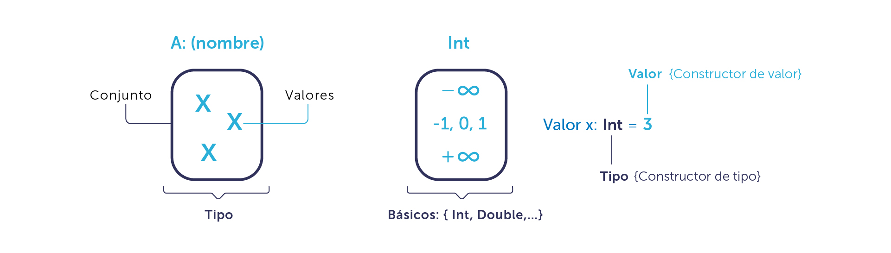

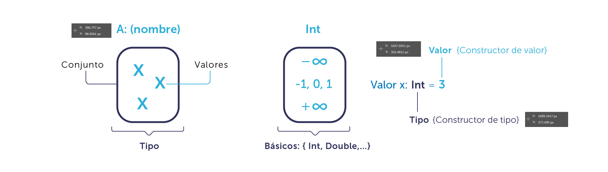
En la anterior figura puedes observar algo que ya conoces cómo es la asociación entre los tipos de datos con los conjuntos matemáticos.

1. Básicamente, un tipo de dato es un conjunto y sus elementos son sus valores. Observarás que hay dos tipos de elementos.
2. El primer elemento observado, es *el constructor de tipo* que nos sirve añadir un tipo nuevo al *sistema de tipos* y nombrarlo dentro del mismo.
3. Y el segundo elemento observado lo identificas en los literales enteros que representan los valores del tipo de dato, estos literales son también conocidos como *constructores de valores*.

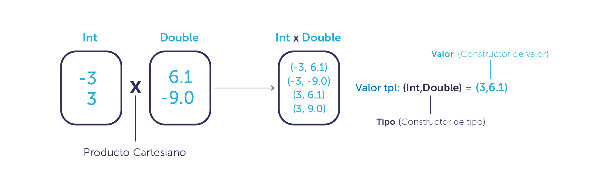

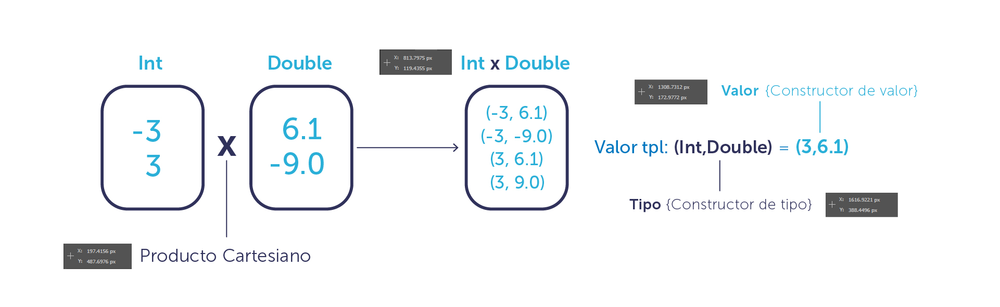

En la figura anterior observas como se construye un tipo de dato, también llamadado *tipo de dato compuesto* o *tipo de dato definido por usuario*.

4. La tupla es un tipo de dato *compuesto*, es decir, que se puede formar de dos o más tipos utilizando el *producto cartesiano*.
5. De nuevo tenemos un *constructor de tipo* en la declaración de la tupla con los tipos de datos que agrupan $Int \times Double$, que dependiendo del lenguaje que implemente las tuplas se verá diferente.
6. En Scala el *constructor de tipo* se observa así: `(Int, Double)`. Es decir, este es un tipo de dato nuevo que se agregará al *sistema de tipos*, pero se tiene un nuevo constructor de valores que utiliza el operador paréntesis normalizado para indicar los elementos (valores) que pertenecen este tipo.
7. Este nos indica *un constructor de valor* para la tupla de tipo $Int \times Double$  a través del operador paréntesis normalizado.

Ahora, hablemos que son los **tipos de datos algebraicos**: estos son tipos que se construyen utilizando las operaciones de *suma* (*unión* entre conjuntos) y *producto* (*producto cartesiano* ya visto en el ejemplo de la tupla). Puedes utilizar una o la otra o ambas.

Aunque ya habíamos utilizado el *producto* para construir a las tuplas, existe un problema con ellas, si quiero tener una tupla que contenga valores en la plano de tres dimensiones el tipo probablemente será: $Double \times Double \times Double$; igualmente si quiero representar los porcentajes de un curso que tiene tres notas, probablemente utilizaremos un tipo parecido. ¿Qué podríamos hacer para diferenciar ambos tipos? Una primera idea que se nos podría ocurrir es utilizar los *alias de tipos*, para ello definiríamos un alias para cada caso: `type Coord3D = (Double, Double, Double)`  y  `type PorNotas = (Double, Double, Double)`. Si observas bien, lo que hemos hecho es dar dos alias distintos para un mismo tipo, pero no podemos restringir su uso como parámetros a funciones que esperan trabajar con tipos distinto como por ejemplo: `convCoord3DPolar`(convertir a coordenadas polares) o `obtNotaFinal` (obtener la nota final), en ambos casos, podemos tener un valor del tipo $Double \times Double \times Double$ y utilizarlo como parámetro para las dos funciones, sin distinguir si trabajamos con coordenadas o con notas.

Esa diferenciación entre los tipos con un mismo cuerpo se puede lograr a través de los tipos de datos algebraicos y la siguiente imagen nos muestra como se puede hacer para crear un tipo `Coordenada` .

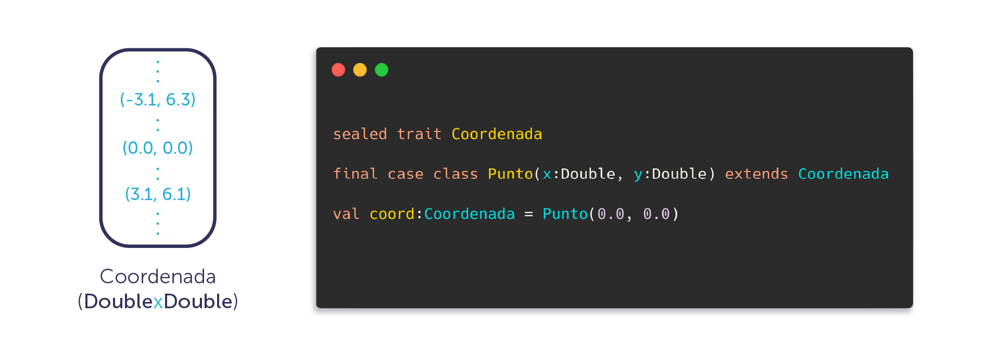

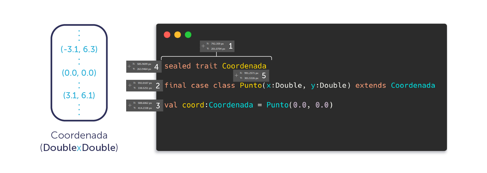

1. Este *constructor de tipo* define el tipo `Coordenada`.
2. Este *constructor de valor* define el mecanismo para poblar de valores al tipo `Coordenada`.
3. Es un ejemplo para crear la variable `coord` de tipo `Coordenada` y asignarle el valor correspondiente (*Note que no hay que hacer uso de operador `new`*).
4. La definición **`sealed trait Coordenada`**  le indica al sistema de tipos de vamos a definir un nuevo tipo `Coordenada`, indicándole el nombre y que esta interface (`trait`) estará sellada, es decir que todos su valores deben estar definidos dentro del mismo "archivo".  Un `trait`  indicar valores y métodos abstractos, pero trataremos de evitarlos en el caso de TDA.
5. El constructor de valor `Punto`, indica como construir un valor e identificar cuáles serán las funciones de acceso: `.x` y `.y`. Recuerde que este tipo es inmutable.

La gráfica anterior mostró como definir un tipo de dato algebraico a través del *producto*. En la siguiente, vamos a mostrar como producir un tipo de dato algebraico utilizando la operación de *suma* (*unión*). Suponga que quiere tener un tipo que represente los tres colores básicos que se utilizan en las terminales.

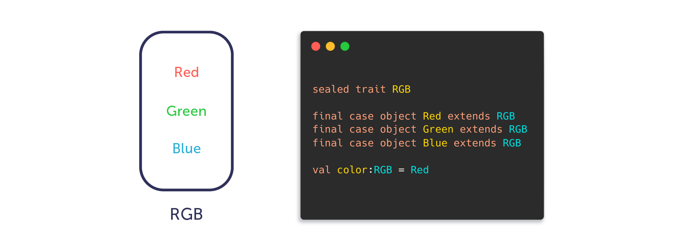

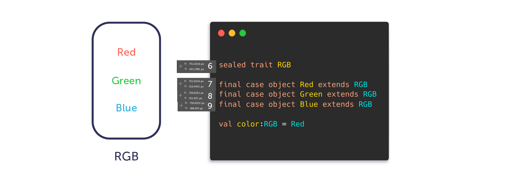

6. El tipo de dato `RGB` está definido por el *constructor de tipo*  **`sealed trait RBG`** (`RGB`) inicia la definifición, de forma que todas los alternativas de los valores estén incluidos dentro del "archivo". Y se procede a definir sus valores

7. El constructor de valor utiliza un `case object` para establecer que este valor es único, semejante a una constante que define el valor `Red`.

8. Este constructor de valor define el valor de `RGB`: `Green`.

9. Este constructor de valor define el valor de `RGB`: `Blue`.

Cada *constructor de valor* es un conjunto con un valor único, y a través de la operación de *suma* (*unión*) se forma los valores del conjunto de dato `RGB`.

#### Tipos de datos algebraicos

##### Video - Definiendo tipos de datos algebraicos

En este vídeo te mostraremos con más detalle la creación de tipos de datos algebraicos en el lenguaje de programación Scala a través de la forma que este implementa los  *productos* y las *sumas* sobre tipos. Igualmente, te mostraremos un ejemplo de cómo combinar ambos tipos de construcciones. También, observaremos el uso de los métodos de acceso que nos permite obtener su  contenido, la coincidencia de patrones que nos permite observar la estructura y sus valores; y la forma de construir nuevos valores de un tipo de datos algebraicos a partir de las funciones de copia.

[Vídeo - Definiendo tipos de datos algebraicos](https://youtu.be/A550Fl0XKTo)

###### Preguntas - Vídeo - Definición de tipos de datos algebraicos

1. Según el siguiente guión (*script*) de Scala

```scala
sealed trait Monedas
final case object COLPesos  extends Monedas
final case object USDolares extends Monedas
final case object EUEuros   extends Monedas
final case object JAPYenes  extends Monedas
```

> > La anterior es la definición de un tipo de dato algebraico por Producto<<

( ) verdadero
(x) falso

[explanation]

La estructura es una estructura de definición basado en suma (Unión), donde cada `case object`crea un valor para el tipo `Monedas`. Por lo tanto la respuesta es **falso**.

[explanation]

2. Según el siguiente guión (*script*) de Scala

```scala
sealed trait Cuentas
final case class CuentaCorriente(id:String, saldo:Double) extends Cuentas
```

> > De las siguiente funciones cuál obtiene el saldo actual<<

( ) A.

```scala
def funcionA(cuenta:Cuentas) = cuenta.saldo
```

(x) B.

```scala
def funcionB(cuenta:CuentaCorriente) = cuenta.saldo
```

( ) C.

```scala
def funcionC(cuenta:Cuenta) = cuenta._2
```

( ) D.

```scala
def funcionC(cuenta:CuentaCorriente) = cuenta._2
```

[explanation]
La opción A. Aunque la variable `cuenta`es de tipo `Cuentas`el compilador no sabe sobre cual es el subtipo de cuenta, aunque sea único. Por lo tanto, esta opción es incorrecta.

La opción B. La variable `cuenta`es efectivamente del tipo `CuentaCorriente`, por lo tanto el compilador sabe que la función de acceso pertenece a este tipo de dato. Por lo tanto, esta opción es correcta.

La opción C. La expresión está tratando a la variable `cuenta` de tipo `Cuenta` como si fuera una tupla, que en  este caso no lo es, es otro tipo de dato algebraico. Por lo tanto, esta opción es incorrecta.

La opción D. La expresión está tratando a la variable `cuenta` de tipo `CuentaCorriente` como si fuera una tupla, que en  este caso no lo es, es otro tipo de dato algebraico. Por lo tanto, esta opción es incorrecta.

[explanation]

#### Aplicación y uso de tipos de datos algebraicos

##### Infografía - Aplicación y uso de tipos de datos algebraicos

Con la definición que ya has visto de los tipos, ahora podemos mirar como se usan y se aplican, en particular dentro del lenguaje de programación [Haskell](https://www.haskell.org).

1. `data` inicia la definición de un tipo de dato algebraico.
2. Cada tipo de dato algebraico debe llegar un nombre único que será identificado como  `DiaSemana`
3. Los diferentes constructores de valores:`Lunes`, `Martes`,  $\ldots$ , y `Domingo`, cada uno separado por `|`
4. Cada constructor de valor no sólo es un valor  posible para tipo de dato `DiaSemana`, sino también es una función.

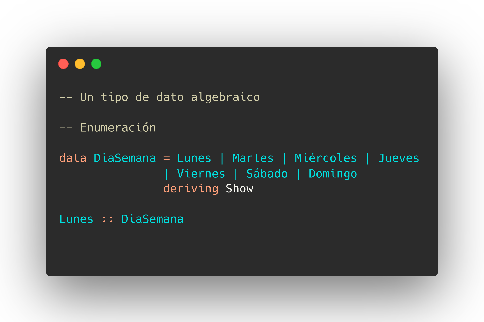

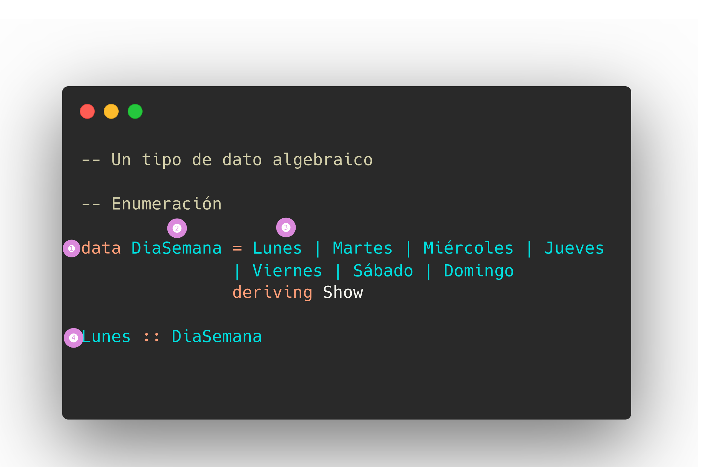

Ahora mostraremos como construir a partir de producto tipos de datos algebraicos en Haskell

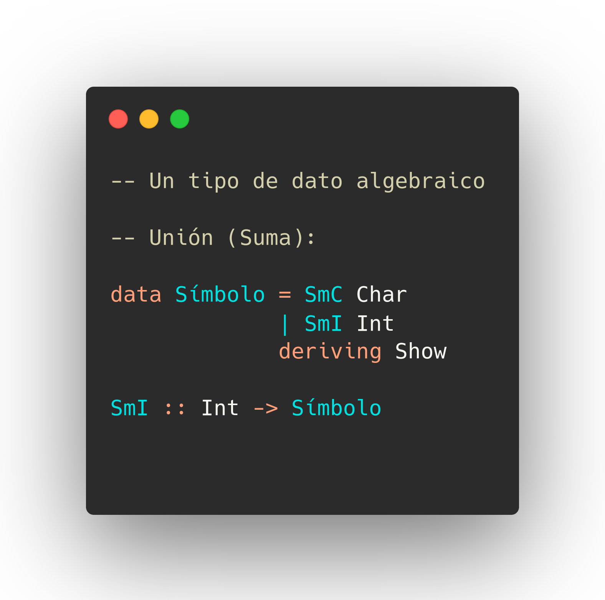


1. Los tipos de datos algebraicos se definen elementos a través de la operación de unión.

2. Observa el tipo de dato `Símbolo`,  sus valores pueden provenir de dos tipos: `Char` y  `Int`.  Como dicho valor proviene de esos dos tipos, se tiene un constructor de valor para cada tipo, por ejemplo

3. el primer constructor  `SimC` toma un valor de `Char` y lo hace parte el tipo `Símbolo`.

4. Igualmente en para el constructor de valor  `SimI`que lo hace con un valor de tipo `Int`.

En la siguiente figura se construye un tipo de dato algebraico utilizando *producto*.

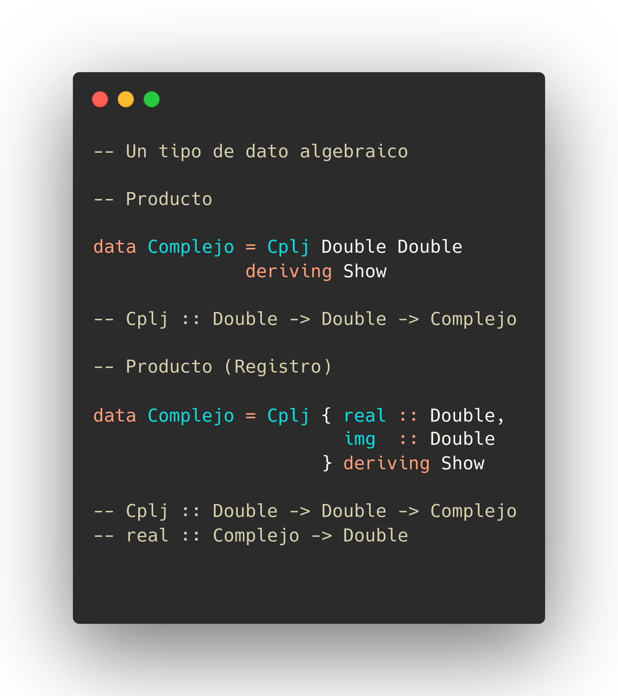

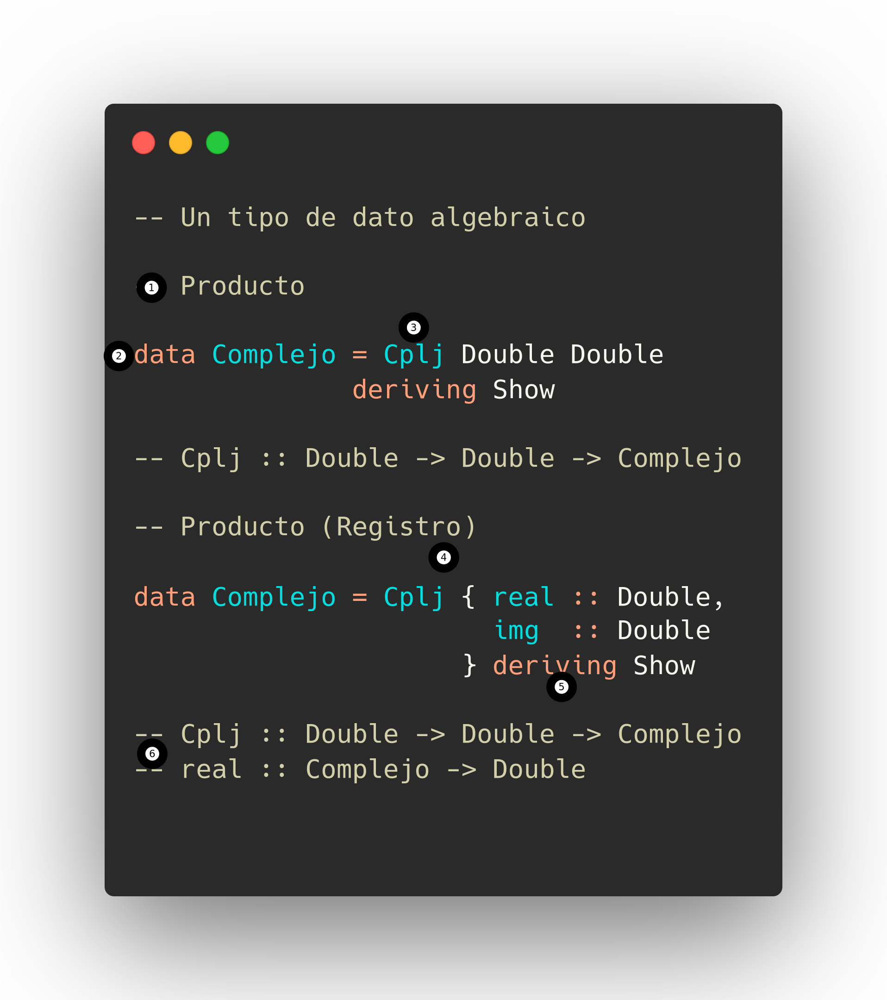

1. Los tipos algebraicos se pueden construir utilizando el producto cartesiano, similar a lo que se hizo con las tuplas.

2. Un número `Complejo` que está formado por dos partes $r + i$ donde, $r$ es la parte real (primer `Double`) y $i$ es la representación del valor imaginario $\sqrt{-1}$ (segundo `Double`).

3. El *constructor de valor* `Cplj`construye un valor complejo con dos valores del tipo `Double`. Esta es una función que recibe dos parámetros de tipo `Double` y produce un valor de tipo`Complejo`.

4. El TDA  `Complejo` puede ser construido a través de registros. El método combina la forma anterior basada en posiciones pero especificando para cada campos un nombre que se convierte en un método extractor.

5. El constructor `deriving`  te permitirá  adicionar un comportamiento extra al tipo de dato algebraico utilizando para ello la sobrecarga de operaciones, en este caso las operaciones de `Show` que te permite mostrar el contenido, de todo esto se encarga el compilador.

6. Observa que tanto`Cplj` como `real` son funciones, la primera te permite crea un valor de tipo `Complejo`, la segunda te permite extraer la parte denominada real del tipo en cuestión.

##### Vídeo - Aplicación y uso de tipos de datos algebraicos en Scala

En este vídeo, te mostraremos con más detalle la creación de tipos de datos algebraicos con un ejemplo que *combina* las operaciones de *suma* y *producto*, en un solo tipo. Este ejemplo, nos sirve como base para aprender más sobre la coincidencia de patrones en los tipos de datos algebraicos y como manipularlos a través de los operadores de copia. 

La coincidencia de patrones es el mecanismo por excelencia para acceder de forma posicional a la estructura de los TDA y disecando en los elementos que constituyen dicha estructura. 

Las operaciones de copia nos permite crear nuevos valores de un  tipo de dato algebraicos a partir del original, facilitando la creación de estos nuevos valores, "cambiando" aquellos elementos que queremos diferenciar de los originales.

Una aplicación de coincidencia de patrones y operaciones de copia facilitan el uso de los TDA en nuestros programas.

[Vídeo - Aplicación y uso de tipos de datos algebraicos en Scala](https://youtu.be/-yeXdhETVm0)

###### Preguntas - Vídeo - Aplicación y uso de tipos de datos algebraicos en Scala

1. Según el siguiente guión (*script*) de Scala nos describe un tipo de dato `Config` que este caso permite dos valores posibles: `Remote` y `Local`.

```scala
sealed trait Config
final case class Remote(host:String) extends Config
final case object Local              extends Config
```

> > De las siguiente definiciones de funciones, produce una función que muestra que la conexión es remota *para cualquier valor del tipo `Config`*<<

[ ] A.

```scala
def funcionA(remote:Remote):Boolean = true
```

[ ] B.

```scala
def funcionB(cfg:Config):Boolean = if (cfg == Remote) true else false
```

[x] C.

```scala
def funcionC(cfg:Config):Boolean = cfg match {
   case Remote(_) => true
   case Local     => false
}
```

[x] D.

```scala
def funcionD(cfg:Config):Boolean = cfg match {
   case Local => false
   case _     => true
}
```

[explanation]
La opción A, funciona si el tipo que se pasa solamente es `Remote` pero si le pasan un valor de tipo `Local` el compilador lo rechaza por lo tanto no es válido.
La opción B, aunque se puede hacer una comparación entre tipos algebraicos la comparación no funcion por que en primer lugar `Remote` deber tener una valor asignado (`host`) y segundo la comparación se debe hacer entre valores del mismo tipo. Por lo tanto, esta opción no es válida.
La opción C, utiliza coincidencia de patrones y verifica a través de la coincidencia la variable `cfg` de tipo `Config` y en este caso la coincidencia verifica en el primer `case` que sea de subtipo `Remote` sin importar el valor interno y retorna que es verdadero (`true`); en el segundo `case`, lo constrasta con `Local` en cuyo caso es `falso`. Por lo tanto, cumple con lo solicitado en la pregunta, es válido.
La opción D, también utiliza coincidencia de patrones sobre la variable `cfg`. En el primer `case`verifica que es de tipo `Local` por lo que retorna `false`; y el segundo `case` retorna en cualquier caso (que siempre será del subtipo `Remote`) `true`. Por lo tanto, cumple con lo solicitado en la pregunta, es válido
[explanation]

2. Según el siguiente guión (*script*) de Scala

```scala
sealed trait Cuentas
final case class CuentaCorriente(id:String, saldo:Double) extends Cuentas
```

> > De las siguiente funciones cuál obtiene el saldo actual<<

( ) A.

```scala
def funcionA(cuenta:Cuentas) = cuenta.saldo
```

(x) B.

```scala
def funcionB(cuenta:CuentaCorriente) = cuenta.saldo
```

( ) C.

```scala
def funcionC(cuenta:Cuenta) = cuenta._2
```

( ) D.

```scala
def funcionC(cuenta:CuentaCorriente) = cuenta._2
```

[explanation]
La opción A. Aunque la variable `cuenta`es de tipo `Cuentas`el compilador no sabe sobre cual es el subtipo de cuenta, aunque sea único. Por lo tanto, esta opción es incorrecta.

La opción B. La variable `cuenta`es efectivamente del tipo `CuentaCorriente`, por lo tanto el compilador sabe que la función de acceso pertenece a este tipo de dato. Por lo tanto, esta opción es correcta.

La opción C. La expresión está tratando a la variable `cuenta` de tipo `Cuenta` como si fuera una tupla, que en  este caso no lo es, es otro tipo de dato algebraico. Por lo tanto, esta opción es incorrecta.

La opción D. La expresión está tratando a la variable `cuenta` de tipo `CuentaCorriente` como si fuera una tupla, que en  este caso no lo es, es otro tipo de dato algebraico. Por lo tanto, esta opción es incorrecta.

[explanation]

#### Práctica de aplicación y uso de tipos de datos algebraicos

##### Jupyter Notebook - Tipos de datos algebraicos en Scala

En este *notebook* pondrás en práctica todo lo visto en esta unidad a través de varios ejercicios que te permitan construir tipos de datos algebraicos por medio del producto, suma y ambos. También utilizarás lo aprendido en el vídeo anterior de cómo crear nuevos tipos de datos algebraicos a partir del contenido de los anteriores y a recordar como utilizar la composición de funciones.

[Jupyter Notebook - Aplicación de tipos de datos algebraicos - Remoto](https://mybinder.org/v2/gh/juancardonas4n/epam-latam-s4n-fun-prog-c3/HEAD?labpath=notebooks%2Fels4n-fp-c3-m1-u2-nb-01.ipynb)

###### Pregunta Jupyter Notebook - Aplicación de tipos de datos algebraicos

1. Se tiene definido un tipo de algebraico de la siguiente forma:
   
   ```scala
   sealed trait UnTDA
   final case class  CValor1(a:Int,b:Double,c:Boolean) extends UnTDA
   final case class  CValor2(d:Double,e:Int) extends UnTDA
   final case class  CValor3(f:Int) extends UnTDA
   final case object CValor4 extends UnTDA
   ```

> > Cuál de las siguientes funciones calcula la aridad de cualquiera de los valores de un tipo  `UnTDA`<<

[ ] A.

```scala
def a(unTDA:UnTDA):Int = unTDA.productArity
```

[ ] B.

```scala
def b(unTDA:UnTDA):Int = unTDA match {
   case (a,b,c)  => 3
   case (d,e)    => 2
   case (f)      => 1
   case _        => 0
}
```

[x]. C.

```scala
def c(unTDA:UnTDA):Int = unTDA match {
    case CValor1(_,_,_) => 3
    case CValor2(_,_)   => 2
    case CValor3(_)     => 1
    case CValor4        => 0
}
```

[x]. D.

```scala
def d(unTDA:UnTDA):Int = unTDA match {
    case s @ CValor1(a,b,c) => 3
    case t @ CValor2(d,e)   => 2
    case u @ CValor3(f)     => 1
    case _                  => 0
}
```

[explanation]

La primera opción funciona si el tipo de dato es una tupla, pero en este caso no es válido, por que trabajamos con tipos de datos algebraicos. La segunda opción indica que trabaja en la estructura de producto de cada uno de los constructores, pero nuevamente funcionaría si fuera una tupla. La tercera opción es correcta, puesto que en cada caso mira la forma de los constructores de valores del tipo `UnTDA` y  no le importa el contenido, por que esta utilizando el comodín, pero examina la estructura y dependiendo de esta retorna el número de elementos que forman el producto, por lo tanto es válida. La cuarta, aunque en los tres primeros casos esta utilizando la etiqueta, pero en cada uno de ellos examina la estructura del producto de cada constructor, y aunque asigna valores para cada uno de los elementos del producto, el valor a retornar es la aridad del producto, por lo tanto es también correcta.

[explanation]

###### Cierre Jupyter Notebook


Cómo ya habías visto en la  conclusión del tema de las tuplas, **los tipos de datos algebraicos** son también **tipos de datos inmutables**, que permite ser creados utilizando dos operaciones traídas de la teoría de conjuntos: el **producto** (*producto cartesiano*) y la **suma** (*unión*); a diferencia de la tupla que sólo utiliza el primero. Pero, adicionalmente la forma de construir los tipos de datos algebraicos, nos permiten **nombrar cada constructor de valor** (`case class` ó `case object`), esto te permitirá específicar con mayor claridad la información relacionada con el valor a construir y en cuando la utilices en la coincidencia de patrones, te permitirá idéntificar sin equivocos el constructor de valor. Con las tuplas y los tipos de datos algebraicos, tienes dos herramientas que te facilitarán la construcción de funciones pura y como las visto en el último ejercicio del actual notebook, te permite realizar fácilmente composición de funciones, en próximos cursos te mostremos como sacar un mayor provecho de esta combinación de técnicas.

#### Generalizar tipos de datos algebraicos

##### Infografía - Jerarquía de tipos y generalización

Hemos dado una definición de tipo asociada a la teoría de conjuntos, donde un tipo de dato son los valores agrupados por un conjunto determinado por un nombre. Ampliaremos dicha definición, indicando que un tipo se encuentra completamente definido cuando no solamente indicamos los valores sino que también un conjunto de funciones asociadas al tipo.

En la siguientes imágenes tenemos la representación de dos tipos de datos:

1. Este es el tipo de dato `Int` con sus operadores (aritméticos y otros).
2. Este es el tipo de dato `Double`, con sus operadores (aritméticos y otros).
3. Los operadores `+`, `-`, `*`, `==`, `!=` entre otros, para el tipo de dato `Int` (La división no aparece definida por algunas propiedades, que no hablaremos ahora).
4. Los operadores `+`, `-`, `*`, `==`, `!=` entre otros, para el tipo de dato `Double` (La división si aparece por que cumple ciertas propiedades, que no hablaremos ahora).

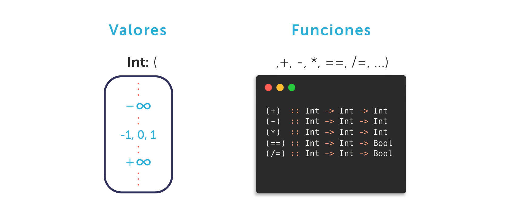

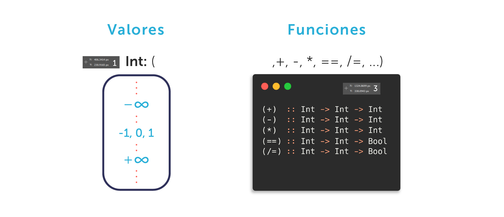

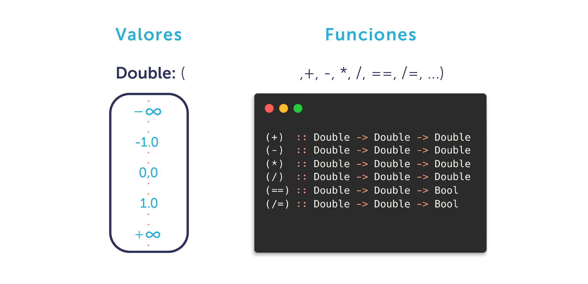

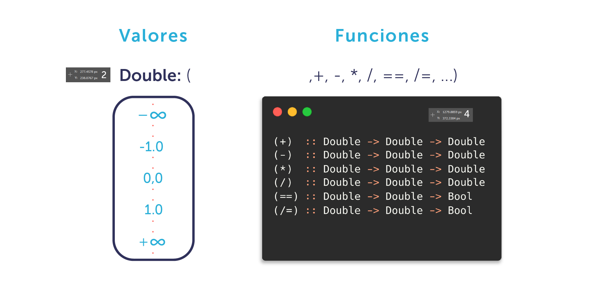

Si comparamos los tipos del operador de `+` definido para enteros y para flotantes, estos son distintos, lo que en principio nos haría pensar que el lenguaje de programación ofrece dos operaciones de suma. Pero todos sabemos que en realidad se ofrece una única operación de suma, y no solo para estos dos tipos sino para otros tipos que requieran esta operación. Esa única operación de suma que se ofrece, se encuentra *sobrecargada* y sirve para cualquiera de los tipos que la requieran.

Esto se logra por que las operaciones de los tipos se pueden agrupar en clases. **¡Clases!** ¿Cómo en la programación orientada a objetos? **¡No!**, Este tipo de *clases* parte de una definición que se encarga de *clasificar* a los tipos de datos por comportamientos similares, ofrecidos por los operadores y las funciones, que en la realidad son la misma cosa.

Si observas la siguiente imagen vamos a establecer una clasificación específica.

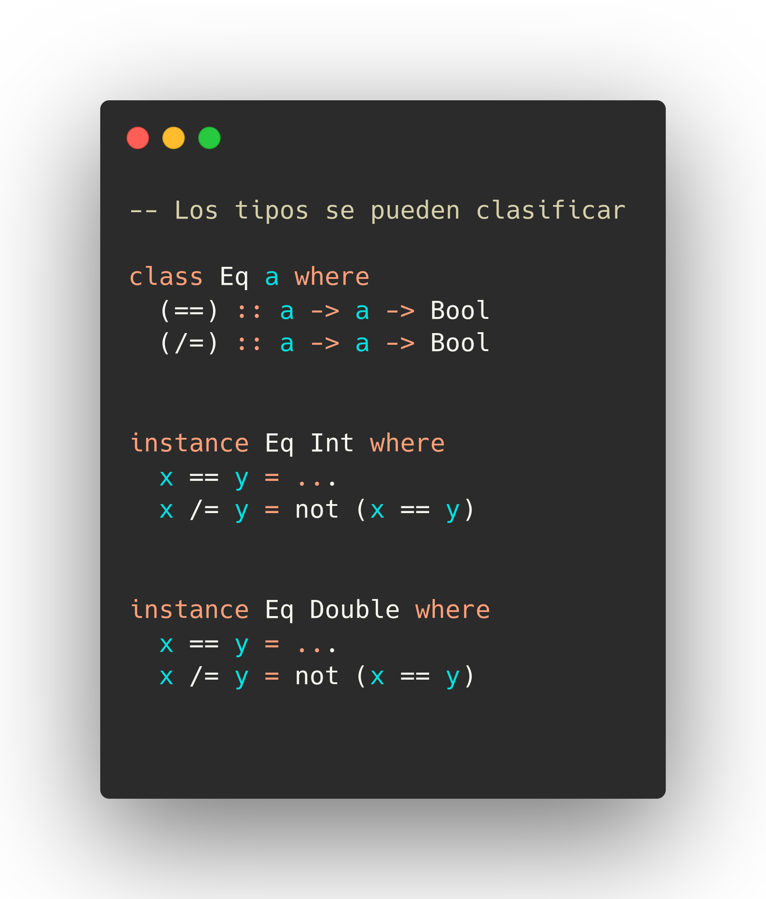

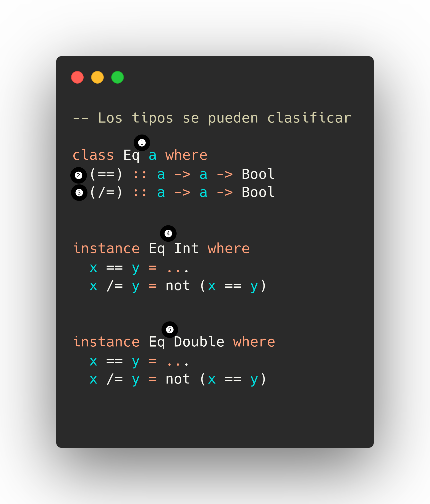

1. La clase `Eq` que indica un comportamiento común de igualdad o diferencia.

2. La clase  `Eq` define un comportamiento por igualdad (`==`), que recibe dos valores de un mismo tipo `a` e indica si son iguales o no.

3. La clase `Eq` define un comportamiento por diferencia (`!=`), que recibe dos valores de un mismo tipo `a` e indica si son diferentes o no.

La clase `Eq` es una clasificación que indica que si un tipo quiere pertenecer a dicha implementación debe definir ambas funciones (en realidad se puede definir únicamente la igualdad, ya que la negación se implementa a partir del operador de  igualdad.). Para que un tipo clasifique a una *clase* particular esta obligado a implementar las funciones que una clase establece, es decir que realiza una *instanciación* (No en la definición de **POO** sino que un tipo que implementa los métodos de una clase, no crea una instancia.).

4. Muestra la *instanciación* del tipo `Int` como miembro de la clase `Eq`.
5. Muestra la *instanciación* del tipo `Double` como miembro de la clase `Eq`.

Cada tipo de dato que quiera pertenecer a una clasificación debe escribir la instanciación específica. Pero esto no es necesario y es aquí donde la teoría de tipos nos ayuda. Por ejemplo, los valores de un tipo algebraico formado por *enumeración* como es el caso de `DiaSemana` encontramos que cada constructor de valor hace que sean diferentes, si los constructores son diferentes, el resultado de la comparación es diferente, si son el mismo, obviamente serán iguales. Ahora, para un producto, simple se compara uno a uno los elementos y se puede de esar forma saber si son iguales  o no.

Esta clasificación permite tener en Haskell una jerarquía de clasificaciones (también se tendrá en otros lenguajes como Scala) como vemos en la siguiente figura.

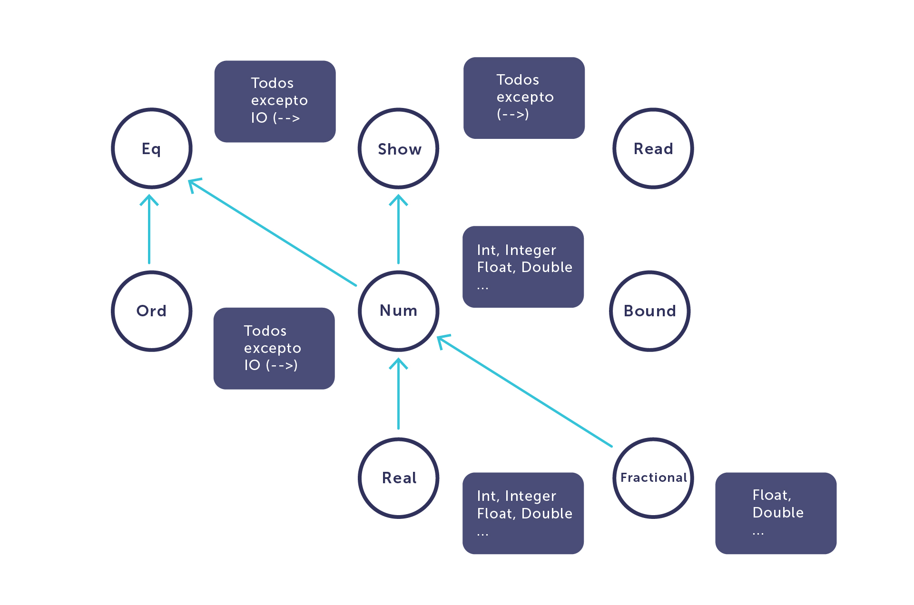

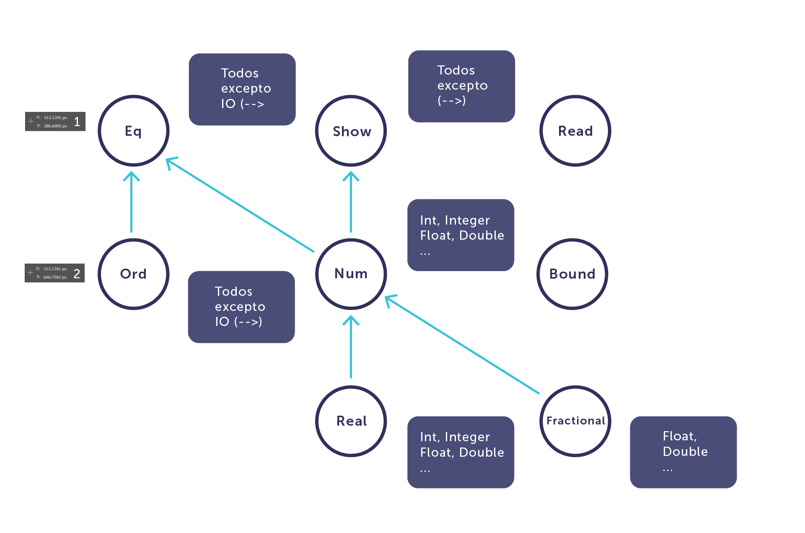

1. La clase `Eq` una de las clases base de la jerarquía.
2. Para que una tipo sea *instancia* de la clase `Ord` (Orden) esta debe pertenecer a la clase `Eq`

Lo que nos dice la jerarquía es si un tipo pertence a un tipo determinado debe tener el comportamiento de las clases de las que depende de la parte alta de la jerarquía. Este mecanismo, permite la sobercarga de operadores y que cuando pertenece a una clase particular, la instanciación permite la invocación del método correspondiente.

##### Notebook - Uso de la generalización de tipos

La programación funcional ha borrado la diferencia entre datos y funciones, esto nos va a permitir crear aplicaciones que los datos sean comportamiento y los comportamientos sean datos y aunque esto nos permitirá hacer aplicaciones reutilizables de formas insospechadas, la verdadera potencia la encontramos cuando nuestra programación pueda hacerse independiente del tipo y aplicar un comportamiento que muchos tipos de datos comparte, y esto se hará a través de la generalización de los tipos que mostraremos en este **Notebook** como una introducción a este importante tema y nos planterá como aprovecharnos de esto de una forma muy sencilla, que es la utilización de variables de tipos en nuestros tipos de datos algebraicos, que podrán ser remplazados en tiempo de ejecución por el tipo específico. Demos un paso más en este facinante mundo.

https://mybinder.org/v2/gh/juancardonas4n/epam-latam-s4n-fun-prog-c3/HEAD?labpath=notebooks%2Fels4n-fp-c3-m1-u2-nb-02.ipynb

###### Pregunta - Notebook - Uso de la generalización de tipos

1. Se tiene definido un tipo de algebraico de la siguiente forma:
   
   ```scala
   sealed trait UnTDAG[+A]
   final case class  VTDG1[+A](a:A) extends UnTDAG[A]
   final case class  VTDG2[+A](a:A,b:A) extends UnTDAG[A]
   final case class  VTDG3[+A](a:A,b:A,c:A) extends UnTDAG[A]
   final case object VTDG0 extends UnTDA[Nothing]
   ```

> > Cuál de las siguientes funciones calcula la aridad de cualquiera de los valores de un tipo  `UnTDA`<<

[x] A.

```scala
def funcionA[A](unTDAG:UnTDAG[A]):Int = unTDAG match {
    case VTDG1(_)     => 1
    case VTDG2(_,_)   => 2
    case VTDG3(_,_,_) => 3
    case VTDG0        => 0
}
```

[x] B.

```scala
def funcionB[B](unTDAG:UnTDAG[B]):Int = unTDAG match {
   case VTDG1(_)     => 3
   case VTDG2(_,_)   => 2
   case VTDG3(_,_,_) => 1
   case VDTG0        => 0
}
```

[x]. C.

```scala
def funcionC[A](unTDAG:UnTDAG[B]):Int = unTDAG match {
    case VDTG1(a)     => 3
    case VDTG2(a,b)   => 2
    case VDTG3(a,b,c) => 1
    case VDTG0        => 0
}
```

[ ]. D.

```scala
def funcionD[A](unTDAG:UnTDAG[A]):Int = unTDA match {
    case VDTG1 => 3
    case VDTG2 => 2
    case VDTG3 => 1
    case VDTG0 => 0
}
```

[explanation]

La opción A, trabaja sobre un tipo genérico `A` y a través de la coincidencida de patrones verifica que todos los valores con sus correspondientes comodines en las posiciones específicas que están definidas para el tipo de dato `UnTDAG`, por lo tanto es correcta.

La opción B, trabaja sobre un tipo genérico `B` y a través de la coincidencida de patrones verifica que todos los valores con sus correspondientes comodines en las posiciones específicas que están definidas para el tipo de dato `UnTDAG`, por lo tanto es correcta.

La opción C, trabaja sobre un tipo genérico `A` y a través de la coincidencida de patrones verifica que todos los valores con sus correspondientes variables diferentes en las posiciones específicas que están definidas para el tipo de dato `UnTDAG`, por lo tanto es correcta.

La opción D, trabaja sobre un tipo genérico `A`en la coincidencia de patrones falla al dar la estructura de cada uno de los tipos de valores construidos para este tipo en particular (`UnTDAG`), excepto para último que no tiene otros valores asociados.

[explanation]

###### Cierre - Notebook - Uso de la generalización de tipos


La generalización de los tipos de datos algebraicos, te ayudará a que tus tipos de datos y tus funciones tenga un comportamiento independiente de los tipos de datos y te puedas enfocar mucho más en **las partes comunes de muchos algoritmos** que enfocarte en las partes diferentes, lo que hará finalmente que tus programas sean **menos complejos** y sean **más fáciles de mantener**. Pero esto no es trivial, antes de poder generalizar, tienes que tener un gran sentido de observación y ver las partes comunes de tu programas, es decir que primero programarás sin generalización y a medida que esos patrones comunes surgan irás replazando esas partes comunes por código genérico. Más adelante, observarás que la combinación de tipos de datos algebraicos con funciones puras te facilitarán la ocurrencia de dicho patrones y encontrás las formas que la programación funcional te puede ayudar para simplificar tu código.

#### Evaluación

1.

> > A partir de cero o más conjunto de datos, estas operaciones nos sirve para definir tipos de datos algebraicos<<

( ) A. Producto cartesiano y cardialidad de conjuntos.
(x) B. La unión y el producto.
( ) C. Suma e idempotencia de conjuntos.
( ) D. Producto cartesiano y constructores de valores.
[explanation]
La opción A, con el producto cartesiano construimos TDA, pero con la cardinalidad sabemos del número de elementos.

La opción B, la unión y el producto nos permite construir tipos de datos algebraicos, esto es por definición de los tipos de datos algebraicos.

La opción C, la *suma* es otra forma de unión y nos permite contruir TDA, pero la idempotencia de conjuntos es la propiedad de funciones con la construcción del conjunto de Kleene que permite tener todos las frases de un conjunto.

La opción D, el *producto cartesiano* nos permite construir un TDA, pero los constructures de valores es un término muy genérico y puede incluir los literales enteros que sirven para construir el conjunto de los enteros que no es un TDA.

​    [explanation]

2.

> > Son las tuplas un tipo de dato algebraico<<

(x) verdadero.

( ) falso.

[explanation]
Las tuplas son construidas utilizando la operación de producto entre tipos, como los tipos de datos algebraicos que son definidos por *sumas* y *productos*. Por lo tanto es verdadero.

[explanation]

3. Observe el siguiente código:
   
   ```scala
   sealed trait Bool
   final case object False extends Bool
   final case object True extends Bool
   ```
   
   > > Cuál de las siguiente funciones convierte un valor de tipo `Boolean` al tipo `Bool`<<

[X] A.

```scala
def funcionA(b:Boolean):Bool = if (b) True else False
```

[X] B.

```scala
def funcionB(b:Boolean):Bool = b match {
   case true => True
   case _    => False
}
```

[ ] C.

```scala
def funcionC(b:Boolean):Bool = b match {
   case _    => False
   case true => True
}
```

[X] D.

```scala
def funcionD(b:Boolean):Bool = b match {
   case c if c => True
   case _      => False
}
```

[explanation]
La opción A, verifica que el valor de la variable `b` que es de tipo `Bool` en la expresión `if` y por lo tanto convierte cada valor de la variable `b` en el correspondiente valor del tipo esperado. Es válida.
La opción B, utiliza la coincidencia de patrones sobre la variable `b` de forma que cada uno de sus valores literales es convertido al valor del tipo esperado. Es válida.
La opción C, utiliza la coincidencia de patrones sobre la variable `b`, pero esta vez los `case`s en vez de ir del más específico al más genérico, van del más genérico al más específico, por lo que el comodín `_` producirá `False` en cualquier caso. No es válida.
La opción D, utiliza coincidencia de patrones pero esta vez utiliza las guardas que puede tener un constructor `case` lo que hace que que válida que el valor de c contiene un valor de verdad, este produce el valor `True`, en el caso por omisión produce el valor de `False`,  por lo tanto produce los valores del tipo esperado. Es válida.
[explanation]
4. Observe el siguiente código:

```scala
sealed trait Transacciones
final case class TransCant(seq:Int,cantidad:Double,valor:Double) extends Transacciones
final case class TransDesc(seq:Int,valor:Double,descuento:Double) extends Transacciones
final case object NoTrans extends Transacciones
```

> > Cuál de las siguiente funciones obtiene el valor final de la transacción<<

( ) A.

```scala
def funcionA(trans:Transacciones):Double =
  if (trans.cantidad == 0)
     if (trans.descuento == 0) 0.0
     else trans.valor * trans.descuento
  else
     trans.cantidad * trans.valor
```

( ) B.

```scala
def funcionB(trans:Transacciones):Double = b match {
   case TransCant(_,c,v) => c + v
   case TransDesc(_,v,d) => v - d
}
```

( ) C.

```scala
def funcionC(trans:Transacciones):Double = b match {
   case _ => 0.0
   case TransCant(_,c,v) => c * v
   case TransDesc(_,v,d) => v - d
}
```

(x) D.

```scala
def funcionD(trans:Transacciones):Double = b match {
   case NoTrans          => 0.0
   case TransCant(s,c,v) => c * v
   case TransDesc(s,v,d) => v - d
}
```

[explanation]
La opción A, no se puede tener acceso a los métodos de acceso sin especificar el tipo sobre el que se va actuar. No es válida.
La opción B, no cubre todos los casos de los valores de tipo `Transacciones`y adicionalemente la operación en valor `TransCant` no es la correcta. No es válida.
La opción C, el primer `case` es más genérico que los demás y por lo tanto siempre calcula el valor de `0.0`. No es válida.
La opción D, para cada valor calcula el resultado específico, si el valor es `NoTrans` el resultado es `0.0`. Cuando es `TransCant` múltiplica la cantidad por el valor y cuando es `TransDesc` toma el valor menos el descuento. Es válida.
[explanation]
5. Observe el siguiente código:

```scala
sealed trait Tipo
final case class  SubTipoA(a:Int,b:Boolean) extends Tipo
final case class  SubTipoB(d:Double,c:Char) extends Tipo
final case object SubTipoC extends Tipo
```

> > Cuál es la función del constructor `sealed` en el trait<<

( ) A. Un `sealed trait` es una forma para distinguir los tipos de datos algebraicos (TDA).
( ) B. Un `sealed trait` es un constructor al inicio del archivo para declarar al compilador que lo que sigue con `final` pertenecen al mismo tipo.
(x) C. Un `sealed trait` indica que el `Tipo` y todos sus subtipos deben estar definidos dentro del mismo archivo.
() D. Un `sealed trait` es un constructor que indica que la siguiente es una clase de orden y solo se especifica una vez dentro de un archivo.
[explanation]
El constructor `sealed` se antepone ante un `trait` que todos sus subtipos deben definirse dentro del mismo archivo para que el compilador reconozca todos los posible valores de los tipos de datos algebraicos. La opción C, es válida.
[explanation]
6. Observe el siguiente código:

```scala
sealed trait Marcados[+A]
final case class  Marca[A](sec:Int,unA:A) extends Marcados[A]
final case object SinMarca extends Marcados[Nothing]
```

> > Cuál de las siguiente funciones implementa una función que incrementa la secuencia de la marca, si se encuentra `SinMarca` se deja igual.<<

[x] A.

```scala
def funcionA[A](mrc:Marcados[A]):Marcados[A] = mrc match {
   case m @ Marca(s,_) => m.copy(sec = s + 1)
   case j              => j
}
```

[ ] B.

```scala
def funcionB[B](mrc:Marcados[B]):Marcados[B] = mrc match {
   case m @ Marca(s,_) => Marca(s + 1, m.unA)
   case _              => _
}
```

[ ] C.

```scala
def funcionC[C](mrc:Marcados[C]):Marcados[C] = mrc match {
   case m @ Marca(_,_) => m.copy(sec += 1)
   case _              => SinMarca
}
```

[x] D.

```scala
def funcionD[D](mrc:Marcados[D]):Marcados[D] = mrc match {
   case Marca(s,u) => Marca(s + 1, u)
   case _          => SinMarca
}
```

[explanation]
La opción A, realiza coincidencia de patrones desde el particular al más general, si encuentra un marca a través de la etiqueta `m` crea una copia del valor e inicializa el campo de `sec` con el valor actual más uno. El segundo devuelve el mismo valor. Es válido.
La opción B, realiza la coincidencia de patrones desde el particular al más general, el primer caso crea una `Marca` nueva incrementando la secuencia, y copiando el valor genérico original en la copia. El problema se presenta en la segundo `case` puesto que éste reconce los demás con el comodín, pero no puede pasar de nuevo el mismo comodín. Es no válido.
La opción C, realiza la coincidencia de patrones desde el particular al más general, el problema está en la construcción del resultado, la función `sec` es una función de acceso, y como el tipo es inmutable no se puede ser modificado.
La opción D, realiza la coincidencia de patrones desde el particular al más general, en el primer `case` se encarga de crear una copia construyendo un nuevo valor y en la segundo `case` el tipo esperado es un `SinMarca` por lo tanto lo returna nuevamente dicho valor. Es válido.
[explanation]

#### Cierre

En esta unidad te has encontrado con los tipos de datos algebraicos (TDA), construyéndolos a través de la operaciones de conjuntos: *suma* (*unión*) y *producto* (*producto cartesiano*).  En ellos has encontrado que las operaciones de próducto cartesiando puedes acceder los valores por su posición también los puedes acceder utilizando las funciones de acceso por ellos definidos en su declaración. La suma te permite combinar diferentes constructores de valores y puedes definir tus propios valores literales, esto te permite una flexibilidad infinita en la definición de tipos de datos.

Lo que has obtenido con los TDA es definir tipos de también llamados tipos de datos símbolicos, por que, permiten ser almacenados, consultados y creados cómo se leen y se escriben, a diferencia que las estructuras de datos como: registros y clases que en general su forma de almacenar es críptica para el usuario.

La flexibilidad de utilizar la teoría de conjuntos directamente en la definición de conjuntos, te permitirá generalizarlos, es decir de poder observar que su contenido puede pertenecer a cualquier tipo y que simplemente no tienes que crear un número infinito de tipos con nombres diferentes, cuando con su simple nombre y una o más variables de tipos puedas dinámicamente crear infinitos tipos.

Pero, es solo el principio, en la siguiente unidad observaremos como crear tipos de datos algebraicos utilizando una herramienta ya conocida como lo es la recursividad y más adelante, combinaremos esta recursividad de tipos con la de funciones y observarás que la programación funcional encontrá nuevos patrones que te permirán simplificar tu programación.

##### ¿Quieres saber más?

* [Everthing Your Ever Wanted to Know about Sealed Traits in Scala](https://underscore.io/blog/posts/2015/06/02/everything-about-sealed.html)
* [Algebraic Data Types - Sums and Products  -Scala](https://nrinaudo.github.io/scala-best-practices/definitions/adt.html#:~:text=Algebraic%20Data%20Types%20%28ADTs%20for%20short%29%20are%20a,represent.%20There%20are%20two%20basic%20categories%20of%20ADTs%3A)
* [Algebraic Data Types - Haskell](https://wiki.haskell.org/Algebraic_data_type)
* [Variances - Scala](https://docs.scala-lang.org/tour/variances.html#:~:text=Scala%20supports%20variance%20annotations%20of%20type%20parameters%20of,can%20restrict%20the%20reuse%20of%20a%20class%20abstraction.)
* [Scala `case class` - `case object` - Part 1](https://www.journaldev.com/9733/scala-caseclass-caseobject-part1)
* [Scala `case class` - `case object` - Part 2](https://www.journaldev.com/12122/scala-caseclass-caseobject-part2)

##### EPAM Insights

### U3. Tipos de datos algebraicos recursivos

#### Introducción

En este momento conoces como se construyen los tipos de datos algebraicos a través de las operaciones de *suma* (*unión*) y *producto* (*producto cartesiano*), utilizando para ello conjuntos preestablecidos (`Int`, `Double`, `Boolean`, `Float`, etc.) y tipos definidos (`Coordenada`, `Punto`, etc.). 

En esta unidad observaremos dos cosas que podemos utilizar dentro de la definición del tipos de datos algebraicos:

* la definición del tipo propio ateniéndonos para ello de lo que se conoce como la recursión estructural, en la que establece que para definir dicho tipo se debe tener un caso *base* y un caso *recursivo*, 
* y la misma recursión estructural nos sirve para definir las funciones que trabajen sobre esos tipos de datos algebraicos.

Lo anterior nos permite reconocer que dentro de la programación funcional la barrera entre datos y programa se pierde. En esta unidad te mostraremos los diferentes acercamientos a la *recursión estructural*, a la definición de tipos de *datos algebricos recursivos* haciendo uso de la *recursión estructural* y del uso de la misma para definir funciones que procesen tipos de *datos algebraicos recursivos*.

##### Guía del curso


##### Objetivos de la unidad

###### Lograrás:

* Utilizar y beneficiarte de la recursividad en la definición de tipos de datos recursivos e utilizar el patrón de recursión estructural para definir tus programas.

###### Lo que debes saber:

* El concepto de programación funcional.
* Definición de funciones puras.
* Funciones como valores.
* Recursividad.
* Recursividad de cola.
* Definición de tuplas.
* Definición de inmutabilidad de datos.

###### Esperamos que aprendas a:

* Entender la recursión estructural.
* Usar la recursión estructural.
* Definir, entender y usar los tipos de datos algebraicos recursivos.

###### Ruta de aprendizaje:

* Fundamentos
  * Qué es la recursión estructural
  * Qué son los tipos de datos recursivos
  * Tipos de datos algebraicos recursivos
* Prácticas
  * Uso y aplicación de la recursión estructural.
  * Definición de los tipos de datos algebraicos recursivos
* Evaluación
* Cierre

**Tiempo estimado:** 2h 15 min


#### Recursión estructural

##### Infografía - ¿Qué es la recursión estructural?

Has aprendido qué son los tipos de datos algebraicos, y sabes que estos pueden ser construidos utilizandos dos operaciones sobre conjuntos: *suma* ($\cup$) ó *unión*, y *producto* ($\times$) ó *producto cartesiano*. 

Si observas bien, estos dos mecanismos realizan la composición de un nuevo tipo a partir de otros tipos, es decir construyen un tipo de dato algebraico que es inmutable.

¿Qué pasa cuando requieres interactuar con un tipo cuya información es inmutable y debas descomponerlo en sus elementos básicos?

 Es aquí donde surge la *recursión estructural*:

> *La recursión estructural* es el proceso de descomposición de un tipo de dato algebraico en sus partes constituyentes, teniendo en cuenta la estructura del tipo de dato algebraico.

Cómo Scala es un lenguaje de programación multiparadigma, asociado tanto al paradigma orientado a objetos y como al funcional, dentro de él existen dos formas de *recursión estructural*:

1. Una objetual: a través del polimorfismo.
2. Otra funcional: a través de la coincidencia de patrones.

Cada una de ellas a al vez basada en la estructura de construcción: *suma* ó *producto*.

###### Polimorfismo a través de la sobrecarga de métodos (o operadores) en la POO

En primer lugar, repasaremos el manejo de polimorfismo, por sobrecarga de métodos en la programación orientada objeto y luego lo observarás en como se aplica en los tipos de datos algebraicos dicha recursión estructural.

En la siguiente figura puedes observar un ejemplo del polimorfismo:

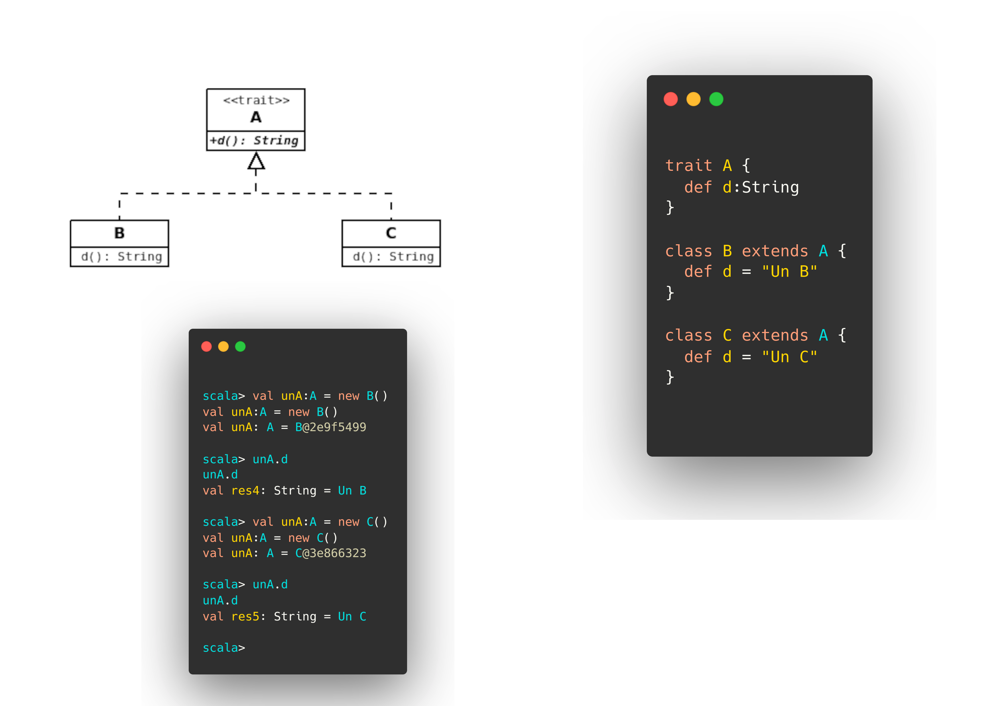

* Implementación. Se observa el modelo del polimorfismo donde las clases `B`y `C` son subclases de la clase `A`. Donde cada subclase implementa de forma directa el método `d`de forma distinta.
* Ejecución. No se puede crear instancias directamente  de un `trait` ó `interface`, porque son abstractas, pero si podemos crear instancias de las subclases (`B` ó `C`) y hacerlas instancias de la superclase `A`. Esto se observa en la ejecución del código donde se crea un ejemplar de `B` (ó `C`) como un valor de tipo `A`llamado `unA` y al invocar el método `d` puedes observar que se invoca en cada uno de los dos casos con el código definido para el método de la subclase.

En la siguiente figura, observas una implementación un poco diferente, porque en este caso la clase abstracta `A`deja una implementación por omisión del método `d`,  así que las correspondientes subclases deben sobre-escribir dicho método, si así lo requieren.

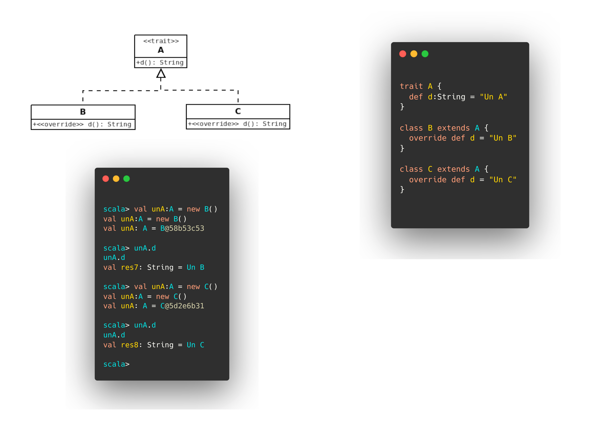

* Implementación. En este caso la clase `A` tiene implementado un método `d`, lo que permite que sus subclases puedan sobre-escribirlo. En este caso ambas subclases : `B` y `C`, lo harán anteponiendo el constructor `override` para indicar que dicho método sobre-escribirá. En caso contrario, se tomará siempre el método de la super-clase (`A`), cuando se realice una ejecución polimórfica, como se muestra a continuación.
* Ejecutar.  Cómo ya es de tu conocimiento, no puedes crear instancias directamente  de un `trait` ó `interface`. Igual, que lo hiciste anteriormente, puedes crear instancias de las subclases (`B` ó `C`) y hacerlas instancias de la super-clase `A` cómo lo puedes al observar el código de la ejecución en la imagen, donde se crean diferentes instancias de `A` llamada `unA`, pero de diferentes sub-clases, y al invocar el método `d` se invoca el correspondiente método implementado.

###### Polimorfismo en tipos de datos algebraicos

Hablemos ahora como utilizar la recursión estructural a partir de los tipos de datos algebraicos utilizando el concepto de polimorfismo. En la siguiente figura se observa una definición de un tipo de dato algebraico `A` con su correspondientes constructor de valor `B`. El `trait` `A`tiene un método *abstracto* `e` que retorna un valor de tipo `F`. Por lo tanto, `B` debe implementarlo de forma que el resultado que produzca debe ser tipo `F`.
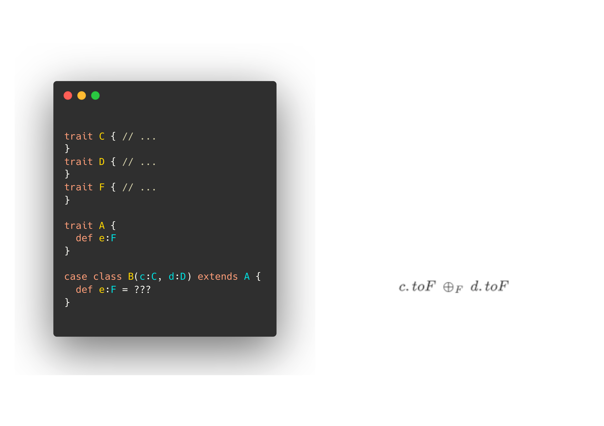
`B` utiliza producto en los valores de tipo `C` y `D`, por lo tanto el método `e` debe utilizar los métodos de los tipos `C` y `D` para obtener un valor de tipo `F`, en la figura se sugiere utilizar del parámetro `c` de tipo `C` un método que obtenga un valor de tipo `F` ($c.toF$), de forma idéntica se sugiere con el parámetro `d` de tipo `D` ($d.ToF$) y ahora esos valores puede ser combinados a través de un operador $\oplus_F$ del tipo `F`.

Te preguntarás: Si el tipo de dato algebraico es construido por medio de la operación de *suma*, ¿cómo aplicar el polimorfismo en dicho caso?

Bien, para ello observa la siguiente imagen, en ella observarás como se construye el tipo `A`, que tiene definido un método abstracto `f` y se tiene dos valores (`B` y `C`) construidos por medio de la operación *suma* y que también debe implementar (*sobrecargar*) dicho método.

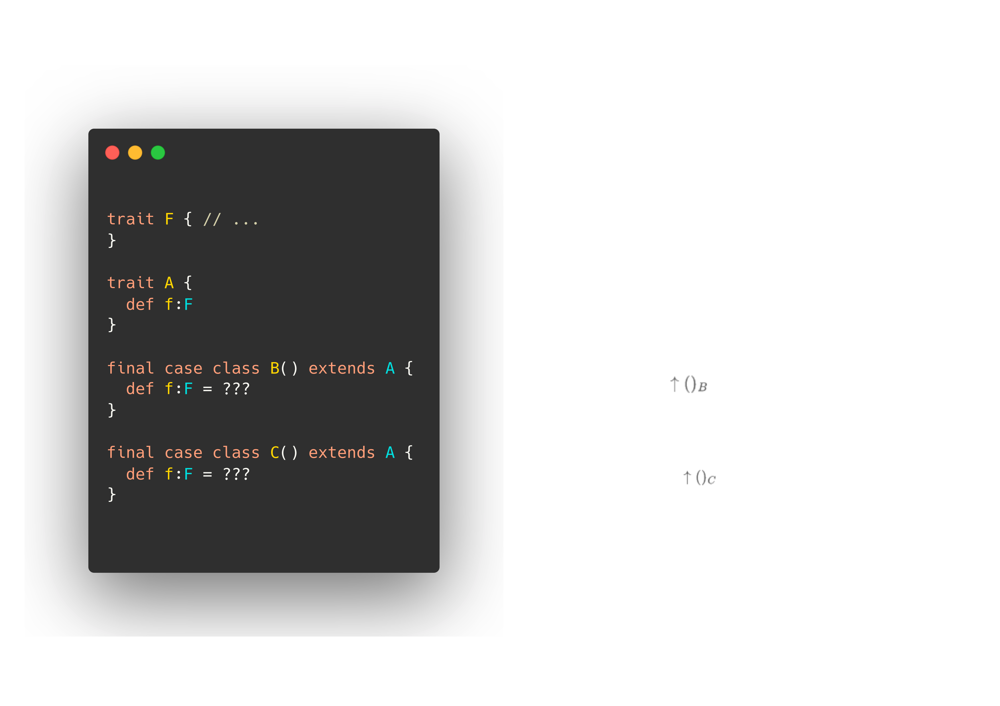

La implementación de cada método dependerá de la estructura interna del tipo. Por ejemplo, para el tipo `B` este tomará una función que recorra la estructura y la transforme en un valor de tipo `F`: $\uparrow()_B$, lo mismo pasa en la implementación para el tipo `C`:  $\uparrow()_C$. En cada uno de los caso en función del programador realizar dicha transformación.

#### Uso de la recursión estructural

##### Vídeo - La recursión estructural en tipos de datos algebraicos

Hemos visto hasta ahora utilizar la recursión estructural a través de polimorfimos en la POO y en los tipos de datos algebraicos. En este vídeo, iniciaremos mostrando una definición más formal de recursión estructural y luego la aplicaremos esta definición para definir los tipos de datos algebraicos recursivos, en particular un ejemplo llamado los [números de Peano](https://es.wikipedia.org/wiki/Axiomas_de_Peano#:~:text=Los%20axiomas%20de%20Peano%20o,para%20definir%20los%20n%C3%BAmeros%20naturales.), y a partir de ellos aplicaremos la recursión estructural a partir de la coincidencia de patrones.

[Vídeo - La recursión estructural en tipos de datos algebraicos - Por grabar](./videos/raw_videos/EPAM-LATAM-2022-01-03-11-22-14-Consola.mp4)

###### Preguntas - Vídeo - La recursión estructural en tipos de datos algebraico

1. Teniendo en cuenta la recursión estructural sobre los naturales
   
   > > Qué hace la siguiente función<<
   
   ```scala
   def funcion(n:Int) = {
   def aux(m:Int,a:Int,f:(Int,Int)=>Int):Int = m match {
      case 0 => a
      case k => aux(k-1,f(k,a))
   }
   aux(n,0,_+_)
   }
   ```

( ) A. Productoria de $n$ elementos.
( ) B. Factorial de $n$ elementos.
(x) C. Sumatoria de los $n$ elementos.
( ) D. Fibonacci de $n$ elementos.
[explanation]
La opción correcta es la C, porque el programa comienza con el valor $0$ y en cada iteracción $n$, $n-1$, $n-3$, $\dots$ , va sumado $0 + n + (n-1)+ \ldots + 1$, lo que es básicamente la sumatoria de todos los $n$ elementos.
[explanation]

2. Teniendo en cuenta la recursión estructural sobre los naturales
   
   > > Cuáles de las siguientes funciones realiza recursión estructural sobre los naturales

[ ] A.

```scala
def a(n:Int):Int = n match {
  case n => n + a(n-1)
  case _ => 0
}
```

[x] B.

```scala
def b(n:Int):Int = n match {
   case 0 => 0
   case l @ _ => b(l - 1)
}
```

[x] C.

```scala
def c(n:Int):Int = {
   def aux(m:Int,a:Int):Int = m match {
     case 0 => 1
     case k => aux(k - 1, a * k)
   }
   aux(n,1)
}
```

[x] D.

```scala
def d(n:Int):Int = n match {
   case 0 => 1
   case 1 => 1
   case n => d(n-1) + d(n-2)
}
```

[explanation]

La opción A, no sigue el formato del caso base $0$, por lo tanto no es válida.

La opción B, tiene dos casos el base $0$ y el caso $n$ , puesto que el segundo `case` el comodín selecciona cualquier elemento, y este elemento es asignado al *label* `l` que se comporta cómo si fuera un $n$, y a la vez realiza una invocación recursiva de la función `b`, pero está vez con un valor de $l$ (nuestro $n$) más pequeño.  Por lo tanto, cumple.

La opción C, utiliza una función auxiliar que tiene los dos casos: base $0$ y el caso $n$, donde este $n$ está representado por la variable $k$ y este caso vuelve a llamar la función `aux` con un valor más pequeño y con el cómputo de $a \times k$.  Por lo tanto, cumple.

La opción D, consta de dos casos base $0$ y $1$, pero ambos son casos de parada, y tiene el caso recursivo, que se encarga de llamar dos veces de forma recursiva a la función `d` en cada caso con un valor más pequeño.

[explanation]

#### Aplicación de la recursión estructural

##### Notebook - Uso y aplicación de la recursión estructural

En este **Notebook** podrás en práctica tus conocimientos sobre recursión estructural, en particular aplicarás la recursión estructural sobre un tipo de dato algebraico como lo es la implementación del tipo `Nat` ($\mathbb{N}$). Esta recursión estructural la aplicarás sobre la estructura de este tipo `Nat` teniendo en cuenta el caso base $0$ se presenta así:

```scala
case Cero => ???
```

Y el caso $n$ se representa así:

```scala
case Suc(n) => ???
```

[Jupyter Notebook - Uso y aplicación de la recursión estructural - Remoto]([](https://mybinder.org/v2/gh/juancardonas4n/epam-latam-s4n-fun-prog-c3/dev?labpath=notebooks%2Fels4n-fp-c3-m1-u3-nb-01.ipynb))

###### Pregunta - Notebook - Uso y aplicación de la recursión estructural

1. Suponga que todas las funciones implementadas del este *Notebook* fueron implementadas de forma correcta y que tiene acceso al código, reutilizando este código.

> > Cómo implementaría la función `menorIgualQue` sobre el tipo `Nat`

[X] A.

```scala
def menorIgualQue(n:Nat, m:Nat):Boolean = menorQue(n:Nat,m:Nat) || n == m
```

[ ] B.

```scala
def menorIgualQue(n:Nat,m:Nat):Boolean = (n,m) match {
   case (Cero,Cero)       => true
   case (Cero,_)          => true
   case (Suc(np),Cero)    => false
   case (Suc(np),Suc(mp)) => true
}
```

[ ] C.

```scala
def menorIgualQue(n:Nat,m:Nat):Boolean = (n,m) match {
   case (Cero,Cero)       => false
   case (Cero,_)          => true
   case (Suc(np),Cero)    => false
   case (Suc(np),Suc(mp)) => menorIgualQue(np,mp)
}
```

[X] D.

```scala
def menorIgualQue(n:Nat,m:Nat):Boolean = (n,m) match {
   case (Cero,Cero)       => true
   case (Cero,_)          => true
   case (Suc(np),Cero)    => false
   case (Suc(np),Suc(mp)) => menorIgualQue(np,mp)
}
```

[explanation]
La opción A, está reutilizando la función `menorQue` implementada que verifica que `n` sea menor a`m`. Si esto falla es decir que ambos son iguales, la parte final de la expresión se encarga de verificar que ambas sean iguales. Por lo tanto, cumple.

La opción B, funciona bien en los tres primeros casos, pero falla cuando ambos valores tienen un patrón que inicia con `Suc(...)`, supone que ambos son iguales, pero esto no es cierto. Por lo tanto, no cumple.

La opción C, falla en el primer caso cuando ambos son  `Cero` que debía retornar verdadero.

La opción D, en el primer caso ambos son iguales, funciona. En el segundo caso, el primero es cero y el segundo puede ser cualquier número natural diferente a cero, por lo tanto es verdadera, la tercera opción el primer valor es un número natural mayor a cero y la cuarta no supone que son iguales, sino que toma la parte interna de cada uno de los naturales y vuelve a comprobarlos, hasta que alcances uno de los tres primeros casos. Por lo tanto, cumple.

[explanation]

###### Cierre - Notebook - Uso y aplicación de la recursión estructural


Aunque la implementación del tipo `Nat` es poco práctico en la vida real, el anterior *Notebook* te permitió interactuar con tipos de datos algebraicos y utilizar el principio de recursión estructural para realizar cómputos. Esto te permitirá interiorizar la forma de manejar todas los tipos de datos algebraicos que te encontrarás en la programación funcional y te será muy natural enfrentar estructuras más complejas.

El siguiente *Notebook* te permitirá nuevarmente interactuar con un tipo de dato algebraico que te será más común en la programación funcional, como son las listas, en particular las listas de enteros

#### Tipos de datos algebraicos recursivos

##### Infografía - ¿Qué es un tipo de dato recursivo?

En la siguiente figura se observa como se construye un tipo de dato recursivo, a partir de un tipo algebraico ya definido.

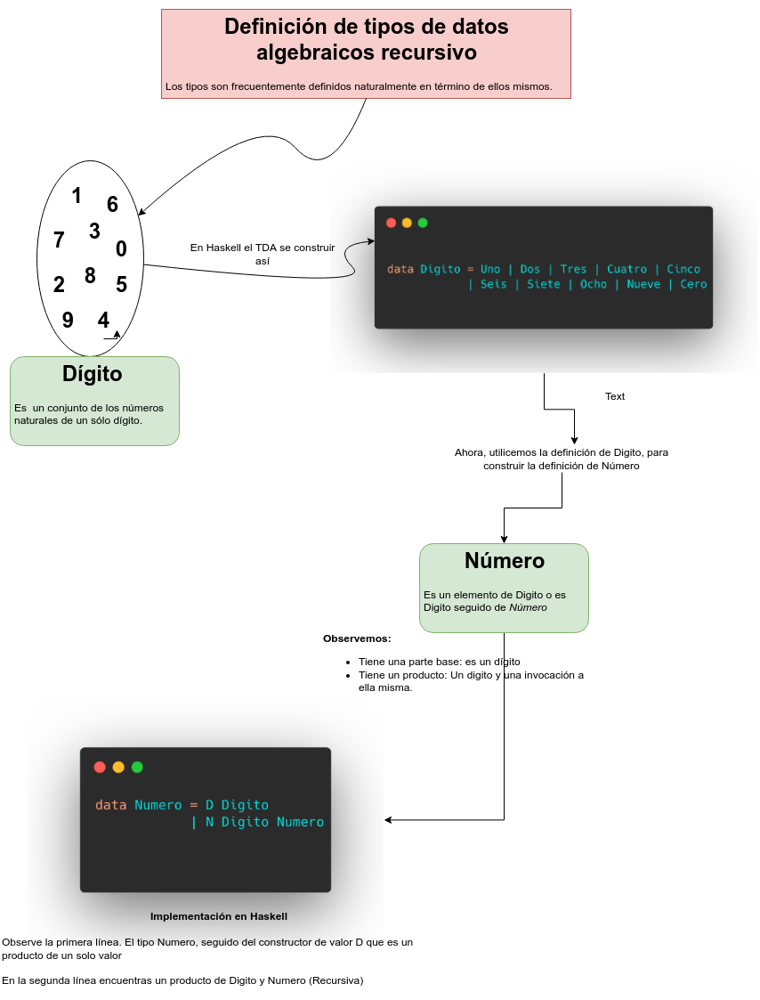

Partiendo de la definición de `Digito` vamos a utilizarla para definir que es un tipo de dato `Numero`, que en el caso más simple (también llamado base) consta de un `Digito`, observe constructor de valor `D`; y que en el caso más complejo es un `Digito` seguido de un `Numero` (definición llamada recursiva), observe el constructor de valor `N`.

##### Vídeo - Definición de tipos de datos algebraicos recursivos

Vamos a implementar de forma práctica los tipos de datos algebraicos recursivos a través de dos tipos de datos que serán muy comunes dentro de la programación como son las lista y árboles de enteros. Con dichos tipos, además de observar cómo definirlos a través de la recursión estructural, también observaremos que dicha recursión estructural nos sirve para recorrer las estructuras obteniendo información sobre ellas o construyendo nuevas estructuras a partir de ellas, no se te olvide que los tipos de datos algebraicos son inmutables, al igual que los tipos de datos recursivos.  

[](./videos/ready_pre_edition/EPAM-LATAM-M1-C3-M1-U3-V2-P01-Docente.mp4)


###### Preguntas - Vídeo - Definición de tipos de datos algebraicos recursivos

1. Observe el siguiente código
   
```scala
sealed trait ListaInt

final case object VaciaInt extends ListaInt
final case class ConsInt(n:Int, lst:ListaInt) extends ListaInt

def funcion(lst:ListaInt):Int = {
   def aux(l:ListaInt,n:Int):Int = l match {
      case VaciaInt                      => n
      case ConsInt(m, ll) if (m - n) > 0 => aux(ll,m)
      case ConsInt(_, ll)                => aux(ll,n)
   }
   aux(lst, lst.n)
}
```

**Nota** Tenga en cuenta que la función `funcion` no se le pasa una lista vacía.

>> Qué hace `funcion`.<<

( ) A. La función `aux` no cumple con la recursión estructural por lo tanto falla.

( ) B. La función `funcion` encuentra el primer valor positivo de la lista.

( ) C. La función `funcion` encuentra el primer valor negativo de la lista.

(X) D. La función `funcion` encuentra el mayor valor de la lista.

[explanation]
La precondición inicial impide pasar una lista vacía, por lo tanto la primera invocación de la función `aux` pasa la lista original y el primer elemento, este es comparado con cada elemento de la lista, buscando si existe uno mayor a él, si esto es así, el número mayor es pasado a la siguiente invocación de `aux`, sino continua el mismo valor. Al final queda el mayor. Por lo tanto la opción correcta es la D.
[explanation]

2. Observe el siguiente código

```scala
sealed trait ArbolBinInt

final case class Hoja(n:Int) extends ArbolBinInt
final case class BinInt(i:ArbolBinInt, d:ArbolBinInt) extends ArbolBinInt

def funcion(ab:ArbolBinInt):Int = ab match {
   case Hoja(n)     => n
   case BinInt(i,d) => {
      val vi = funcion(i)
      val vd = funcion(d)
      if (vi - vd < 0) vd else vi
   }
}
```

> > Qué hace `funcion`.<<

( ) A. La función `funcion` encuentra el menor valor del árbol.

( ) B. La función `funcion` encuentra el primer valor positivo de la árbol.

( ) C. La función `funcion` encuentra el primer valor negativo de la árbol.

(X) D. La función `funcion` encuentra el mayor valor del árbol.

[explanation]
Las hojas supone que su valor es el buscado. En los nodos `BinInt` busca en el lado izquierdo y en lado derecho los correspondientes valores `vi` y `vd`, los compara si este es negativo quiere decir que `vd` es mayor y pasa dicho resultado en caso contrario pasa a `vi`. Por lo tanto busca el mayor. La respuesta es la opción D.
[explanation]

##### Notebook - Uso y definición de tipos de datos algebraicos recursivos

Vamos en este **Notebook**  a aplicar los conceptos de tipos de datos algebraicos recursivos, en particular en el tema de las listas enteras, para aprender a desarrollar funciones que recorran este tipo de estructuras, y también observarás como aplicar la recursión estructural en ellas. En este *notebook* observarás que el uso de la recursión estructural sobre estructuras recursivas puede conducir a ciertos patrones que pueden ser simplificados con el uso de funciones como parámetros que más adelante llamaremos *funciones de alto orden*. Pero, no solo la construcción de funciones sobre estructuras recursivas tratará este *notebook*,  sino también como definir dichas estructuras y trabajar sobre ellas. Dicho esto: ¡Comencemos!

[Jupyter Notebook - Uso y aplicación de la recursión estructural - Remoto]([)

###### Pregunta - Notebook - Uso y definición de tipos de datos algebraicos recursivos

1. Observe la siguiente definición de tipo de dato algebraico recursivo para los números binarios

```scala
sealed trait BinNumber

final case object Zero extends BinNumber
final case object One  extends BinNumber

sealed trait Binary

final case class L(bn:BinNumber) extends Binary
final case class C(bn:BinNumber, bin:Binary) extends Binary
```

Esta forma de almacenar los número binarios, permite formas curiosas para representar el  número $0_{10}$ en  base $2$. Estas formas se muestran a continuación:

```scala
val cero_v1 = L(Zero)
val cero_v2 = C(Zero,L(Zero))
val cero_v3 = C(Zero, C(Zero, L(Zero)))
val cero_v6 = C(Zero, C(Zero, C(Zero,C(Zero,C(Zero,L(Zero))))))
```

Un valor diferente de `Zero`, en cualquier posición hará que el número no tenga el valor de $0_{10}$.

> > Cuáles de las siguiente funciones verifica que el número entrado con tipo `Binary` representa el valor $0_{10}$ ó $0_{2}$.

( ) A.

```scala
def isZero(bin:Binary):Boolean = (bin: @unchecked) match {
  case L(Zero)     => false
  case L(One)      => false
  case C(Zero,bin) => isZero(bin)
  case C(_,bin)    => false
}
```

(X) B.

```scala
def isZero(bin:Binary):Boolean = (bin: @unchecked) match {
  case L(Zero)     => true
  case L(One)      => false
  case C(Zero,bin) => isZero(bin)
  case C(_,bin)    => false
}
```

( ) C.

```scala
def isZero(bin:Binary):Boolean = {
   def aux(b:Binary,a:Boolean):Boolean = (b: @unchecked) match {
      case L(Zero)    => a
      case L(One)     => false
      case C(Zero,bp) => isZero(bp, a || true)
      case C(_,bin)   => isZero(bp, a || false)
   }
   aux(bi, true)
}
```

( ) D.

```scala
def isZero(bin:Binary):Boolean = {
   def aux(b:Binary,a:Boolean):Boolean = (b: @unchecked) match {
      case L(Zero)    => a
      case L(One)     => false
      case C(Zero,bp) => isZero(bp, true)
      case C(_,bin)   => isZero(bp, false)
   }
   aux(bi, true)
```

[explanation]

La opción A, falla en detectar un el valor de `Zero` solo. Por lo tanto, no cumple.

La opción B, cuando encuentra al menos un valor de `One` inmediatemente retorna `false`. Y en el caso que lo secuencia de valores entrados sean todos `Zero` este los examinará hasta que el último sea de valor `Zero`. Por lo tanto, cumple.

La opción C, la implementación de la función asumen que el resultado inicial es `true`, este valor fallo cuando el último valor entrado en el tipo `Binary`     sea un valor `One`, pero que pasá, si la secuencia es de esta forma `C(One,L(Zero))`, comienza con `true`, luego aplica `true || false` que produce `true` y que en la última posición retorna el valor acumulado que es `true`. Por lo tanto, no cumple.

La opción D, falla en la siguiente secuencia `C(One,C(Zero, L(Zero)))`, comienza con `true`, cuando encuentra el primer `One` lo convierte a `false`, cuando encuentra un `Zero` lo cambia a `true`y al final retorna esta valor. Por lo tanto, no cumple.

[explanation]

###### Cierre - Notebook - Uso y definición de tipos de datos algebraicos recursivos


Has observado, no solamente cómo definir tipos de datos algebraicos recursivos, sino también cómo crear funciones que trabajen con dichas estructuras. A través de estos ejercicios has aprendido e incorporado a tu estilo de programación ambos conceptos. Pero esto no queda ahí, los *tipos de datos algebraicos* (recursivos o no) en conjunto con las funciones como valores, te permitirán identificar patrones de comportamiento en el diseño e implementación de los tipos de datos y sus funciones, y la identificación de esos patrones las observaremos en curso venideros en particular en el tema de las funciones de alto orden que será una revolución en la forma de programar, ten un poco de paciencia, que esto apenas está comenzando. 

#### Evaluación

1.

> > Por qué es necesario el caso base en la construcción de tipos de datos algebraicos.<<

( ) A. Son necesarios porqué la estructura de los `trait` siempre lo requiere.

(X) B. Son necesarios porqué el tipo de dato algebraico requiere un punto de terminación.

( ) C. Son necesarios porqué el tipo de dato algebraico son conjuntos y los conjuntos pueden ser recursivos

( ) D. Son necesarios porqué la estructura de los `case class` no tiene un cierre transitivo.

[explanation]
Un tipo de dato algebraico recursivo, se comporta como una función (en el fondo los tipos de datos algebraicos son funciones), como la recursividad en la funciones estas requiere dos casos: el base y el recursivo; esto mismo debe ocurrir en los tipos de datos algebraicos. Por lo tanto, la opción B es la correcta, porqué se requiere un punto de terminación para que el tipo de dato no sea infinito, como las funciones que no terminan.
[explanation]

2.

> > Además de definir tipos de datos y ser utilizados para recorrer la estructura de un tipo de dato algebraico. Qué otro uso tiene la recursión estructural sobre los enteros.

( ) A. Para implementar los condicionales en los lenguajes funcionales.

( ) B. Para definir las funciones por valores.

( ) C. Para definir funciones que sean acotadas por su tamaño.

(X) D. Para definir ciclos que no existen en la programación funcional.

[explanation]

La recursión estructural sirve para definir el recorrido de estructuras, ya se a través de la sobrecarga de operadores o la coincidencia de patrones, pero la implementación de recursión estructural sobre los enteros, también sirven para simular los ciclos que no existen en la programación funcional. 

[explanation]

3. Observe el siguiente código

```scala
sealed trait NArbol

final case object NVacio extends NArbol
final case object Nodo(i:Int, ai:NArbol, ad:NArbol) extends NArbol
```

> > Cuál de los siguiente representaciones del valor `arbol`representa correctamente siguiente el formato del código anterior<<

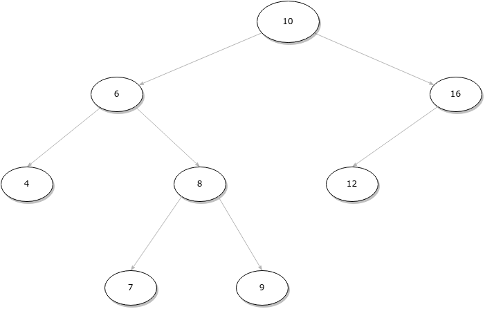

( ) A.

```scala
val arbol = Nodo(Nodo(Nodo(4),Nodo(Nodo(7),Nodo(9),8)6),Nodo(Nodo(12),16),10)
```

( ) B.

```scala
val arbol = Nodo(10,Nodo(6,Nodo(4),Nodo(8,Nodo(7),Nodo(9))),Nodo(16,Nodo(12))
```

( ) C.

```scala
val arbol = Nodo(Nodo(Nodo(NVacio,4,NVacio),6,Nodo(Nodo(NVacio,7,NVacio),8,Nodo(NVacio,9,NVacio))),10,Nodo(Nodo(NVacio,12,NVacio),16,NVacio))
```

(X) D.

```scala
val arbol = Nodo(10,Nodo(6,Nodo(4,NVacio,NVacio),Nodo(8,Nodo(7,NVacio,NVacio),Nodo(9,NVacio,NVacio))),Nodo(16,Nodo(12,NVacio,NVacio),NVacio)
```

[explanation]
La opción A, tiene el caso recursivo, pero no tiene el caso base; y adicionalmente el caso recursivo no cumple la estructura del `case class Nodo` donde primero va el entero y luego van los dos subárboles. Por lo tanto, no cumple.
La opción B, el caso recursivo sigue la estructura del `case class Nodo`, pero no tiene caso base.
La opción C, el caso recursivo no sigue la estructura del `case class Nodo`, difiere en los dos primeros elementos. Tiene caso base. Por lo tanto, no cumple.
La opción D, el caso recursivo sigue la estructura del `case class Nodo`, y el caso base esta ubicado donde se espera. Por lo tanto, cumple.
[explanation]

4. Observe el siguiente código

```scala
sealed trait Logica

final case object Verdadero extends Logica
final case object Falso extends Logica
final case class Y(p:Logica, q:Logica) extends Logica
final case class O(p:Logica, q:logica) extends Logica
```

> > Cuáles de las siguientes funciones evalua una expresión lógica<<

Tenga en cuenta que la siguiente son las tablas de verdad de `Y` $\wedge$ `O`.

| `&&`      | Verdadero | Falso | `||` | Verdadero | Falso     | 
|:---------:|:---------:|:-----:|:----:|:---------:|:---------:|
| Verdadero | Verdadero | Falso |      | Verdadero | Verdadero |
| Falso     | Falso     | Falso |      | Verdadero | Falso     |


[ ] A.

```scala
def eval(l:Logica):Boolean = l match {
   case Verdadero => Verdadero
   case Falso     => Falso
   case Y(p,q)    => eval(p) && eval(q)
   case O(p,q)    => eval(p) || eval(q)
}
```

[X] B.

```scala
def eval(l:Logica):Boolean = l match {
   case Verdadero => true
   case Falso     => falso
   case Y(p,q)    => eval(p) && eval(q)
   case O(p,q)    => eval(p) || eval(q)
}
```

[X] C.

```scala
def eval(l:Logica):Boolean = l match {
   case Verdadero      => true
   case Falso          => false
   case Y(Falso,_)     => false
   case Y(p,Falso)     => false
   case Y(p,q)         => eval(p) && eval(q)
   case O(Verdadero,q) => eval(q)
   case O(p,Verdadero) => eval(p)
   case O(p,q)         => eval(p) || eval(q)
}
```

[X] D.

```scala
def eval(l:Logica):Boolean = l match {
   case Verdadero      => true
   case Falso          => false
   case Y(Falso,_)     => false
   case Y(p,Falso)     => false
   case Y(p,q)         => eval(p) && eval(q)
   case O(Verdadero,_) => true
   case O(_,Verdadero) => true
   case O(p,q)         => eval(p) || eval(q)
}
```

[explanation]
La opción A, no es válida por el resultado es de un tipo diferente (`Logica`) y resultado esperado es `Boolean`. Por lo tanto, no cumple.
La opción B, en los casos base `Verdadero` y `Falso` retornan el valor correspondiente. En las operaciones `Y` $\wedge$ `O` este evalúa a cada sub-hijo y espera que la subexpresión sea correcta. Por lo tanto, cumple.
La opción C, en los casos base `Verdadero` y `Falso` retornan el valor correspondiente. En la operación `Y` si uno de ellos es `Falso` toda la expresión es inmediatamente falsa, excepto cuando ambas subexpresiones no son `Falso` que deja el caso recursivo para los elementos `p` y `q`. El problema se presenta con la operación `O`, cuando ambos son `Verdadero` el resultado es `true`  sin importar el valor, pero se deja la evaluación del valor de `p ` ó `q`, lo que puede conducir a un valor de falso. Por lo tanto, no cumple.
En la opción D, en los casos base `Verdadero` y `Falso` retornan el valor correspondiente. En la operación `Y` si uno de ellos es `Falso` toda la expresión es inmediatamente falsa, excepto cuando ambas subexpresiones no son `Falso` que deja el caso recursivo para los elementos `p` y `q`. En la operación `O`, cuando ambos son `Verdadero` el resultado es `true` sin importar el valor de las otras subexpresiones, y cuando al menos una de las subexpresiones de `O` no es verdadero, el computó se deja de forma recursiva con la forma de la subexpresiones. Por lo tanto, cumple.

6. Observe el siguiente código

```scala
sealed trait NArbol

final case object NVacio extends NArbol
final case class Nodo(i:Int, ai:NArbol, ad:NArbol) extends NArbol
```

> > Cuáles de los siguientes códigos se encargan de contar el número de enteros dentro de un árbol<<

[ ]  A.

```scala
def a(arbol:NArbol):Int = arbol match {
  case NVacio    => 0
  case Nodo(_,_,_) => a(arbol.ai) + a(arbol.ad)
}
```

[X] B.

```scala
def b(arbol:NArbol):Int = arbol match {
   case NVacio        => 0
   case Nodo(_,ai,ad) => 1 + b(ai) + b(ad)
}
```

[ ] C.

```scala
def c(arbol:NArbol):Int = arbol match {
   case NVacio        => 0
   case Nodo(n,ai,ad) => n + c(ai) + c(ad)
}
```

[X] D.

```scala
def d(arbol:NArbol):Int = arbol match {
   case NVacio        => 0
   case Nodo(_,_,_)   => 1 + d(arbol.ai) + d(arbol.ad)
}
```

[explanation]
La opción A, aunque hace un recorrido por todo el árbol en cada invocación de cada subárbol obtiene siempre el valor de $0$, es decir que al final producirá el valor de $0$. Por lo tanto, no cumple.
La opción B, está función hace un recorrido por todo el árbol, en cada subárbol se encarga de contar los nodos que están él y al final suma los del hijo derecho, más los del hijo derecho más uno por el actual que está visitando y, cuando llega a las hojas retorna $0$. Por lo tanto, cumple.
La opción C, está función hace el recorrido, pero el problema es que no se encarga de contar los nodos, sino de sumarlos. Por lo tanto, no cumple.
La opción D, esta función hace un recorrido, pero en vez de utilizar el resultado de la coincidencia de patrones, recorre el árbol a la izquierda con `arbol.ai` y a la derecha con `arbol.ad`, obteniendo de cada subárbol el número de nodos que contiene, y en cada visita le suma $1$ por la visita del actual. Igualmente, cuando visita la hojas el valor de retorno es $0$. Por lo tanto, cumple.
[explanation]

7. Observe el siguiente código

```scala
sealed trait NArbol

final case object NVacio extends NArbol
final case class Nodo(i:Int, ai:NArbol, ad:NArbol) extends NArbol

sealed trait ListaInt

final case class Cons(i:Int, lst:ListaInt) extends ListaInt
final objec class VaciaLst extends ListaInt
```

Suponga que tiene la función `concatenar` definida que tiene la siguiente forma:

```scala
def concatenar(lst1:ListaInt,lst2:ListaInt):ListaInt = ???
```

> > Cuales de las siguientes funciones de implementar la función colapsar el árbol, es decir transformar el árbol en una lista

La idea es tomar un árbol cómo el que se ve en la siguiente figura


Y convertirla en la siguiente lista

```scala
Cons(10,Cons(6,Cons(4,Cons(8,Cons(7,Cons(9,Cons(16,Cons(12,ListaVacia))))))))
```

[X] A.

```scala
def colapsar(a:NArbol):ListaInt = (a: @unchecked) match {
  case NVacio                       => ListaVacia
  case Nodo(i,ai:NArbol, ad:NArbol) => concatenar(Cons(i,colapsar(ai)),colapsar(ad))
}
```

[X] B.

```scala
def colapsar(a:NArbol):ListaInt = (a: @unchecked) match {
  case NVacio                       => ListaVacia
  case Nodo(i,ai:NArbol, ad:NArbol) => Cons(i, concatenar(colapsar(ai),colapsar(ad)))
}
```

[ ] C.

```scala
def colapsar(a:NArbol):ListaInt = (a: @unchecked) match {
  case NVacio                       => ListaVacia
  case Nodo(i,ai:NArbol, ad:NArbol) => concatenar(colapsar(ai),Cons(i,colapsar(ad)))
}
```

[ ] D.

```scala
def colapsar(a:NArbol):ListaInt = (a: @unchecked) match {
  case NVacio                       => ListaVacia
  case Nodo(i,ai:NArbol, ad:NArbol) => concatenar(concatenar(colapsar(ai),colapsar(ad)), Cons(i,Vacia))
}
```

[explanation]
La opción A, colapsa primero el lado izquierdo, y le añade el elemento del nodo actual, antes de colapsar el lado derecho, y esto produce a la lista correspondiente en el nodo específico. El caso base produce la lista `NVacia`. Por lo tanto, esta cumple.

La opción B, colapsa primero el lado izquierdo, y colapsa el lado derecho, cuyo resultado es combinado, y se le ante pone el elemento del nodo actual. En el caso base, produce una lista vacía. Por lo tanto, cumple.

La opción C, colapsa primero el lado izquierdo, y luego de colapsar el lado derecho, le antepone a la lista derecha el valor del nodo actual, lo que haría que quede en la mitad. Por lo tanto, no cumple.

La opción D, despues de colapsar el lado izquierdo, y luego de colapsar el lado derecho, concatena ambas listas, pero a esta lista pone al final el elemento del nodo actual. Por lo tanto, no cumple.
[explanation]

#### Cierre

Con esta unidad hemos completado la definición de tipos de datos algebraicos (TDA) por medio de la recursión estructural, como un mecanismo que nos sirve para definir la estructura de los TDA  y las funciones correspondientes que se encargen de recorrerlo. Tambiénm, la recursión estructural nos ha servido como base para la definición de tipos de datos algebraicos recursivos. En particular, hemos visto la definición de dos tipos de datos recursivos que son extensos dentro de la programación funcional como son: la lista de números enteros y los árboles binarios de enteros.

Gran parte de la programación funcional se basa en el uso de TDA recursivos y de la recursión estructural para desarrollar aplicaciones, en las cuales consistirán en un conjunto de TDA con un conjunto de funciones que manteniendo la inmutabilidad, nos permitirán representar información que será más confiable en los entornos de desarrollo modernos que involucran: *cloud*, *sistemas distribuidos* y *concurrencia*. Estos temas se verán potenciados porque la programación funcional nos facilita crear funciones que manipulen estos TDA de forma al ser inmutables podamos demostrar muchos comportamientos esperados. 

##### ¿Quieres saber más?

* [Basic Recursion Schemes in Scala](https://www.47deg.com/blog/basic-recursion-schemes-in-scala/)
* [Structural Recursion - an Introduction](https://eecs280staff.github.io/notes/21_Structural_Recursion.html)
* [Structural Recursion (In Haskell)](https://bentnib.org/posts/2011-04-22-structural-recursion.html)
* [Recursion - Structural vs Generative](https://craftofcoding.wordpress.com/2021/05/18/recursion-structural-versus-generative/)
* [Recursion and Structural Induction](https://courses.grainger.illinois.edu/cs173/fa2020/Lectures/Notes/RecursionAndStructuralInductionNotes.pdf)

##### EPAM - Insights

## M2. Uso de tipos de datos algebraicos

### U4. Objetos de compañía

#### Introducción

Si nos has seguido hasta ahora en los cursos de programación funcional, tienes un concepto claro de dos elementos que la programación funcional debe tener: el uso de *funciones puras* sobre *datos inmutables*. Sobre el primero hemos hablado bastante y seguiremos insistiendo durante este y demás cursos de programación funcional. El segundo concepto, datos inmutables, es un concepto que como el primero causa extrañeza a los programadores imperativos más avezados, como quien nos lee. 

Pero el mayor problema es como desarrollar nuestro código alrededor de este concepto de datos inmutables, cuando estamos enseñados a tomar una estructura de datos, como un registro o una clase y modificarla a través de los métodos asociados o funciones específicamente diseñadas para ello. Los tipos de datos inmutables requiere de un [idioma](https://en.wikipedia.org/wiki/Programming_idiom#:~:text=A%20programming%20idiom%20or%20code,more%20programming%20languages%20or%20libraries.) específico que nos permite construir versiones modificadas de nuestros datos originales. Este idioma comenzó a ser observado cuando comenzamos a trabajar con los tipos de datos algebraicos que gracias al soporte dado por el lenguaje de programación Scala podemos trabajar de forma que dicha estructura no puede ser modificada, pero esto no esta completo, porque se requiere de una familia de funciones que nos permita tomar los tipos de datos algebraicos y producir nuevas versiones, es aquí donde surgen los objetos de compañía, cómo un mecanismo para asociar a un tipo de dato algebraico un conjunto de funciones que en primer lugar nos permita crear nuevos valores de un tipo a través de método de fabricación ([*Factory Method*](https://es.wikipedia.org/wiki/Factory_Method_(patr%C3%B3n_de_dise%C3%B1o))), cómo también de funciones que crean nuevas versiones de tipos de datos algebraicos.

En esta unidad aprenderá no sólo acerca de los *Objetos de compañía*, sino también de su relación con las *Clases de compañía*, cómo utilizar las tipos de datos algebraicos por medio de objetos de compañía y también de forma práctica aprenderás a utilizarlos dentro de ejemplos muchos más reales.

¡Comencemos!

##### Guía del curso


##### Objetivos de la unidad

###### Lograrás

* Comprender y utilizar los objetos de compañía dentro de tus tipos de datos algebraicos, facilitando la instanciación de los mismos a través de constructores especializados.

###### Lo que debes saber:

* El concepto de programación funcional.
* Definición de funciones puras.
* Funciones como valores.
* Tipos de datos algebraicos.
* Tipos de datos algebraicos recursivos.

###### Concretamente esperamos que aprendas a:

* Entender patrones de diseño básicos: *singleton* y *factories*
* Definir los objetos de compañía.
* Utilizar los objetos de compañía en contexto reales.

###### Ruta de aprendizaje:

* Fundamentos
  * Patrones de diseño
  * Objetos de compañia
* Prácticas
  * Definición de objetos de compañía
  * Aplicación de objetos de compañía en listas de enteros y otros TDA
* Evaluación
* Cierre

**Tiempo estimado:** 1h 50 min


#### Patrones de diseño

##### Infografía - ¿Qué son los patrones de diseño? Dos patrones básicos: *Singleton* y *Factories*

Para comprender que son los objetos de compañía vamos a realizar un acercamiento para indicar de donde ellos posiblemente proviene y para ello iniciaremos con los patrones de diseño, en particular observaremos dos de ellos que son construidos a través de los objetos de compañía.

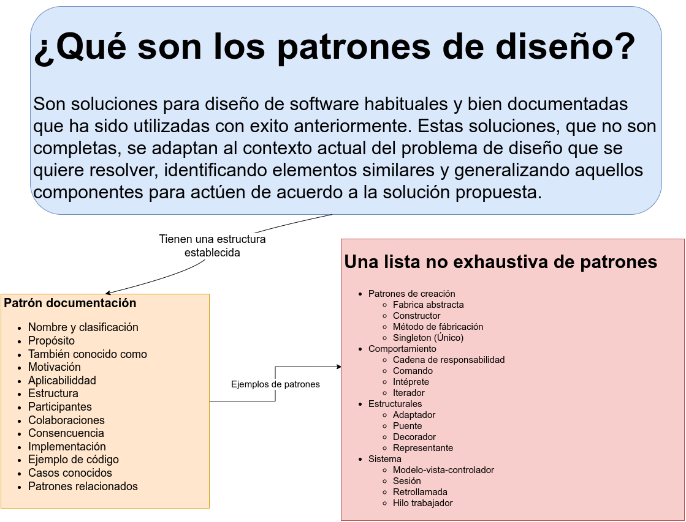


Cómo se observa en la figura, son muchos los patrones de diseño estos dos patrones:

* *Singleton* (Único)
* Método de fabricación

Estos patrones nos interesa porque a través de ellos podemos explicar el origen del concepto de qué son los objetos de compañía. No intentaremos una explicación completa y formal de como la documentación de los patrones sugiere que deberíamos hacer. Ambos patrones son muy simples e intentaremos una explicación informal directa.

En la siguiente figura se observa la estructura UML del patrón *Singleton*. El propósito de este patrón es la de garantizar un única existencia de una instancia de la clase que implemente dicho patrón.  La mayoría de los lenguajes de programación orientado a objetos el constructor de clase al ser público permite crear un número ilimitado de instancias y el diseño presentado en el diagrama UML nos muestra que esto lo podemos lograr, en primer lugar por el constructor de esta clase es privado, tenemos una única `instancia` que es global y que no puede acceder directamente, sino a través del método `obtInstancia()` que tiene como función retorna `instancia`así siempre habrá una sola instancia y no puede ser cambiada hasta que el programa termine. 

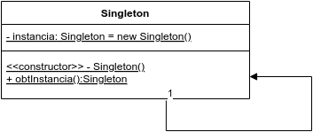


El método de fabricación se muestra en la siguiente figura. En ella, se observan dos jerarquías de clases, la primera es la jerarquía de la interface `Producto`, esta representa una familia de productos que se desea instanciar;  la segunda es la jerarquía de la interface  `Creador` que establece un mecanismo para crear instancias de `Producto` a través del  `metodoDeFabrica()`, pero aquí este método es *abstracto* por lo tanto se debe implementar a través de `CreadorConcreto` que establece a través del método *sobrecargado* `metodoDeFabrica()`que `ProductoConcreto` se quiere instanciar. Así el propósito de este patrón permite tener un método estándar para crear un objeto, delegando esa tarea a las subclases de `CreadorConcreto`. La idea es permitir construir de forma simple instancias que pueden resultar en un momento dado complejas debido al manejo de los constructores originales en la jerarquía de `Producto`.

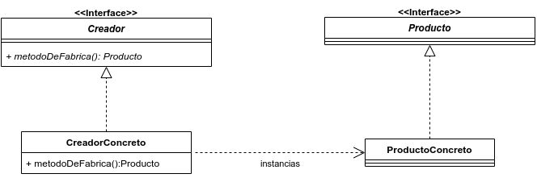

Estos dos patrones están relacionados con la creación de instancias, el primero crear un único elemento y el otro con la forma de crear instancias de forma simple, ocultando las complejidades de la creación y facilitando a los usuarios de estas clases la creación de `Producto`. 

A diferencia de otros lenguajes de programación que se requiere seguir el patrón para implementarlo, Scala incorpora estos dos patrones, el primero a través del constructor `object`que se encarga de crear una única instancia (*singleton*), y el segundo, por la definición dentro de este `objeto` del método `apply` que se comporta como el `metodoDeFabrica()`. Pero esto no es todo, veremos en la siguiente sección que `object` tendrá dos funciones dependiendo del nombre que se le asigne dependiendo de este está relacionado o no con una clase. Entonces hablaremos de: *objetos* o *objectos de compañía*. 

#### Objetos y objetos de compañía, se nombran igual pero son diferentes

##### Vídeo - `case class` versus `class`, `case object` versus `object`y objetos de compañía

[Vídeo - Preedición](https://epam.sharepoint.com/:f:/r/sites/EPAMEPAMLatamCampusFPCurso3/Shared Documents/Unidad 4/Vídeo 1?csf=1&web=1&e=LhEUfw)

###### Pregunta - Vídeo - `case class` versus `class`, `case object` versus `object`y objetos de compañía 

1. Sabemos que los `class` y `cases class` pueden tener objetos de compañía.

>> Pueden los `cases object` tener objetos de compañía<<

( ) Si
(X) No

[explanation]
No, pues que la idea de los objetos de compañía es tener una única instancia, los `case object` ya cumplen con dicha condición.
[explanation]
2. Los objetos de compañía fueron diseñados para ajustarse a dos patrones de programación importantes.

>> Cuáles son<<

[ ] *Class Factory*
[X] *Method Factory*
[ ] *Visitor*
[X] *Singleton*

[explanation]
Los objetos de compañía crean una única instancia por lo tanto implementan el patrón *Singleton* y a través de la implementación del método `apply` permiten la tener un mecanismo de creación de instancias de las clase de compañía por lo tanto implementa el patron *Method Factory*.
[explanation]

#### TDA y objetos de compañía

##### Notebook - Definición de objetos de compañía

Hemos observado la relación de los objetos de compañía con los diferentes tipos de clases de compañía (como `class`es y `case class`es), en este **Notebook** vamos aplicar las diferentes formas de uso de los objetos de compañía en cuatros casos como: objetos únicos (*Singleton*), puntos de entrada de programa, métodos de fabricación (*factory methods*), objetos de compañía como módulos que contienen métodos y valores. 

Esto nos permitirá entender la forma que se aplicará la programación funcional a través de dos elementos los tipos de datos y las funciones que operan sobre estos,  donde los primeros serán tipos de dato algebraicos que se definirán a través de los `trait`s y sus correspondientes implementaciones de `case class`es y `case object`s, mientras que las segundas estarán definidas en los objetos de compañía como métodos.

```
[](https://mybinder.org/v2/gh/juancardonas4n/epam-latam-s4n-fun-prog-c3/HEAD?labpath=notebooks%2Fels4n-fp-c3-m2-u4-nb-01.ipynb)
```

###### Pregunta - Notebook - Definición de objetos de compañía


1. Si un objeto de compañía es definido con el nombre `Document`

>> Qué significa la siguiente línea de código<<

```scala
import Document._
```

( ) A. Nada es error sintáctico.
( ) B. Es la forma permita reconocer correspondientes clases de compañía.
(X) C. Permite que se accedan a las funciones definidas en el objeto de compañía.
( ) D. Permite importar a los objetos de compañía y a las correspondientes clases de compañía.

[explanation]
Los objetos de compañía actúan como un módulo y de esta forma se permite acceder de forma directa a los métodos y valores definidos dentro de ella, que de otra forma habría que acceder de forma cualificada `<nombre objeto de compañía>.<nombre del método>`, puesto que la importación del módulo (`import <nombre objeto de compañía>._`) nos permite acceder al método directamente: `<nombre del método>`.
[explanation]

###### Cierre - Notebook - Definición de objetos de compañía

En este **Notebook** has observado los diferentes usos de los objetos de compañía y en particular de su uso dentro de los tipos de datos algebraicos y en la programación funcional, puesto que no tenemos que definir clases y componerlas directamente con sus datos y métodos que permitan manipularlos, en cambio, los objetos de compañía nos permite separar los datos de su comportamiento, definiendo para ellos funciones e importarlas dentro de nuestros programas.

Esta separación nos permitirá definir los servicios que se ofrecen para los TDA, puesto que el servicio serán un conjunto de funciones que trabajen sobre dichos datos inmutables, lo que más adelante nos permitirá diseñar en base a este modelo una programación más eficiente y confiable.

#### Evaluación

1.

>> Cuál es el nombre del método que representa dentro de un objeto de compañía un método de fabrica (*Factory method*).<<

( ) A. `object`.
(X) B. `apply`.
( ) C. `case object`
( ) D. `case class`.

[explanation]
El método de llama `apply`cuando este método se encuentra dentro de un objeto de compañía, permite definir un métod de fábrica, de forma que cuando se utiliza el nombre del objeto de compañía este inmediatamente invocará a al método `apply`que tenga la misma firma (o *signature*) a los parámetros invocados.
[explanation]	

2.

> > Cuál es la principal diferencia entre la definición de una `case class` y `case object`<<

( ) A. El primero es una clase de compañía, mientras el segundo es un objeto de compañía.
( ) B. Ambos representan tipos de datos algebraicos, el primero es representado por la operación unión ($\cup$), mientras que el segundo es representado por la operación producto cartesiano ($\times$).
( ) C. El primero representa una clase para el lenguaje Scala, el segundo es una forma avanzada del constructor `new`.
(X) D. Tipos de datos algebraicos, el primer con un conjunto de valores dependiendo de los tipos definidos, mientras que el segundo representa un único valor.

[explanation]
Ambos son formas de representar tipos de datos algebraicos, que son inmutables. El `case class`define un conjunto de valores a través de los parámetros del contructor de la clase y del tipo propio, el segundo define un único valor. Por lo tanto, el primero define un conjunto de valores y el segundo define un único valor.
[explanation]

3.

> > Un patrón de diseño que implementan los objetos de compañía además del método de fabrica (*factory method*) es<<

(X) A. Único (*Singleton*)
( ) B. Visitante (*Visitor*) 
( ) C. Estrategía (*Strategy*)
( ) D. Fabrica de clases (*Class Factory*)

[explanation] 
Los objetos de compañía facilitan la construcción y el uso de dos patrones de diseño: *factory method* y *singleton*.
[explanation]

4.

> > Cuándo un *objeto de compañía* se utiliza como un módulo su objetivo principal es<<

( ) A. Servir como fabrica para instancias de los TDA
( ) B. Crear instancias únicas de los TDA
( ) C. Definir los datos que compone un TDA creado a través de producto cartesiano.
(X) D. Para implementar el servicio que ofrece TDA  a través de funciones puras.

[explanation] 
Otra de las funciones de los objetos de compañía es servir cómo módulo donde se guardan las funciones que "manipulan" los TDA y así ofrecer el servicio que implementa un TDA específico.
[explanation]

5.

> > Cómo maneja el compilador la creación de los objetos de compañía<<

(X) A. Se crean dos ficheros (archivos) de tipo ` .class` diferentes para el objecto y su objeto de compañía.
( ) B. Se crea un fichero (archivo) que contiene el objecto y su objeto de compañía.
( ) C. Se crean dos ficheros (archivos) fuentes (`.scala`), el primero para el objecto y el otro para el objeto de compañía.
( ) D. El compilador crea un fichero (archivo) de tipo `.class` donde se almacenan el objecto y el objeto de compañía.

[explanation] 
El compilador toma el archivo fuente (`.scala`) y genera dos ficheros de tipo `.class` uno que contiene el objeto y el otro que contiene el objeto de compañía.
[explanation]

6.

> > Cúal es el objetivo del patrón singlenton<<

( ) A. Garantizar la instanciación simple de objetos complejos.
( ) B. Garantizar el manejo de múltiples comportamientos por parte de cada una de las instancias.
(X) C. Garantizar que solo se crea un instancia de un tipo específico.
( ) D. Garantizar que solo que reciben parámetros de un tipo específico para la instanciación de un objeto.

[explanation] 
El objetivo del patrón *singlenton* es la garantizar al instanciación única de un elemento de un tipo específico.
[explanation]

#### Cierre

Esta unidad has encontrado como utilizar los tipos de datos algebraicos (TDA)  a través de los objetos de compañía, ya que estos te permite hacer dos usos importantes, el primero como un método de fabrica de objetos a través de método `apply`, lo que te facilita la construcción específica de los diferentes TDA ocultado los detalles específicos de cada tipo de dato algebraico (`case object` ó `case class`) y ofreciendo un conjunto de métodos de fabrica homogéneo.

El segundo uso de los objetos de compañía es ofrecer un módulo donde se muestras los servicios representados como funciones (métodos dentro del objeto de compañía) y teniendo al `trait`  asociado como *tipo fundamental* manipulado a través de dicho servicio (ofrecido por el objeto de compañía), teniendo en cuenta que los TDAs son *inmutables*.

Esto en conjunto permite la construcción de aplicaciones funcionales, pero, para llegar a ello debemos primero ver como construirla utilizando un mecanismo extra que nos permite a través de las funciones implementar el comportamiento que tiene muchos programas funcionales. Te invitamos a que nos acompañes en el siguiente curso.

##### ¿Quieres saber más?

* [Patrón de diseño - Wikipedia](https://es.wikipedia.org/wiki/Patr%C3%B3n_de_dise%C3%B1o)
* [Scala Singleton and Companion Objects](https://www.geeksforgeeks.org/scala-singleton-and-companion-objects/#:~:text=In%20Scala%2C%20a%20singleton%20object,object%20to%20access%20this%20method.)
* [Scala Singleton and Companion objects and Advantages](https://www.linkedin.com/pulse/scala-singleton-companion-objects-advantages-swastik-mohanty)
* [Singlenton Objects](https://docs.scala-lang.org/tour/singleton-objects.html)
* [Scala Singlenton and Companion Object](https://www.javatpoint.com/scala-singleton-and-companion-object)
* [Scala companinon objects are not singlenton](https://stackoverflow.com/questions/49686734/scala-companion-objects-are-not-singleton)

##### EPAM - Insights

### U5. Aplicar y usar objetos de compañía

#### Introducción

El objetivo con este y otros cursos de programación funcional, es incorporar y desarrollar habilidades para desarrollar software completamente funcional. En esta unidad, seguiremos este camino, pero de forma más práctica de forma que te mostraremos la manera de construir una aplicación completamente funcional, manejaremos la entrada y salida de forma que nos permita garantizar que la *transparencia funcional* se mantenga. También, manejaremos la forma de manejar computaciones que fallen y computaciones que requieran un estado, ejemplos de *efectos colaterales* que debe ser admitidos dentro de una aplicación funcional, pero este caso lo integraremos a través de las **Mónadas**, definiendo el concepto y mostrando algunas ejemplares de mónadas muy útiles. 

Para lograr una aplicación completamente funcional, además de utilizar las mónadas como un contexto de ejecución, haremos un acercamiento a un diseño basado de DDD (Domain-Driven Design), donde a través de los tipos de datos algebraicos construiremos nuestro dominio y a través de los métodos (funciones) suministrados por los respectivos objetos de compañía se ofrecerán los respectivos servicios que un DDD requiere.

<!-- TODO Traer la modificación del objetivo hecho por Daniel -->

##### Guía del curso


##### Objetivos de la unidad

###### Lograrás

* Utilizar los objetos de compañía a través de funciones.

###### Lo que debes saber:

* El concepto de programación funcional.
* Definición de funciones puras.
* Funciones como valores.
* Tipos de datos algebraicos.
* Tipos de datos algebraicos recursivos.
* Definición de los objetos de compañía.

###### Concretamente esperamos que aprendas a :

* Utilizar los objetos de compañía en contexto reales.

###### Ruta de aprendizaje

* Fundamentos
  * Mónadas y mónadas tranformes
  * Mónadas específicas:
    * Mónada `Either`
    * Mónada `State`
    * Mónada `IO`
* Prácticas
  * Aplicación `getGradding`
  * Captura de bandera
* Evaluación
* Cierre

**Tiempo estimado:** 2 horas y media.

#### Mónadas y mónadas transformers

##### Infografía - ¿Qué son las mónadas y los transformadores de mónadas?

Todo empieza con los tipos de datos, recordemos que cada tipo de dato es un conjunto:


Muchos lenguajes de programación tienen tipos de datos definidos como por ejemplo en Scala: `Int`, `Double`, `Char`, `Boolean`, `String` entre otros y a través de la definición de tipos de datos algebraicos: Unión y producto podemos definir nuevos tipos de datos. Una excelente ayuda para definir los tipos de datos es utilizar la parametrización, indicando que alguno de los valores para un tipo algebraicos puede ser cualquier tipo, y esto se obtiene al utilizar dichos parámetros dentro de la definición de tipos por ejemplo: `Array[A]`donde `A`es un parámetro que puede ser cualquier tipo. Pero observamos que un tipo de dato se define por los valores que lo componen y por las funciones que lo transforma, como por ejemplo en el tipo `Int` su valores son enteros: `0`, `234`, `-598`, entre otros; y sus funciones son las conocidas: `+`, `-`, `*`, etc. 

Los tipos son herramientas muy poderosas a la hora de programar, pero puede serlo mucho más y por ello vamos a observar cómo lograr esto con las mónadas. En primer lugar, una mónada es un concepto que permite contener: cero, uno o más valores de un tipo especifico. Es decir, podemos observar que una mónada se comporta como un contenedor, es decir almacena valores de un tipo determinado, algunos autores indican que las mónadas son un envoltorio. (*wrapper*).  Pero las mónadas no solo almacena los valores, sino que permite mantener un contexto para dichos valores. ¿Qué es ese contexto? Existen varios tipos de mónadas y cada tipo de mónada maneja un contexto específico, por ejemplo una mónada nos podría indicar que nuestras operaciones han fallado o no, o que requerimos mantener una información oculta, o que nos interesa mantener un estado específico o que nos interesa mantener un registro de los eventos relevantes en un momento determinado, eso extra es el contexto que mantiene una mónada más los valores del tipo que mantienen la mónada.


Cualquiera podría concluir que entonces una mónada es un objeto, puesto que tiene un estado y operaciones que pueden interactúar con dicho estado. No, una mónada es diferente a un objeto, porque el objeto no controla quién lo usa y cuándo lo usa; la mónada controla quién y cómo es usada, determinada no por el valor contenido, sino por el contexto y adicionalmente, esto puede ser extensible.

Cómo la mónada controla quién y cuando, requiere de un mecanismo especial para guarda un valor (o valores) de un tipo. Para ello, existe una función denominada dependiendo del lenguaje: `unit`, `pure`, `return`, etc. En la siguiente figura se observa cómo actúa dicha operación: toma un valor y lo guarda dentro de la mónada (para efectos prácticos ese valor o valores permanecerán allí y debe ser transformado allí mismo.).


La función `union` toma un valor del mundo exterior y lo guarda dentro de la mónada, todo dependiendo del contexto. Ahora, una vez teniendo un valor (cero o varios valores) dentro de la mónada queremos opera dentro de ella, se debe utilizar funciones que trabajen sobre los valores de la mónada y existe una función que permite tomar una mónada, una función que toma un valor del tipo de la mónada y la transforma. Dicha operación se llama `bind` (`>>=`) y se observa en la siguiente figura:


La función `bind` define un  proceso, que permite transformar el valor almacenado dentro de la mónada, dependiendo del contexto en otro valor diferente. La operación `bind`permite obtener el valor de la primera monada, pasarla por la función `f` y convertirlo en un resultado de tipo mónada, pero con el valor cambiado dependiendo del contexto.

Entonces las mónadas representan un contexto (la mónada misma), un contenedor que permite almacenar cero, uno o varios valores dependiendo del tipo de dato que contiene la monada y el contexto, más una forma de transforma una monada, creando así proceso que puede ser asegurado que se comportará idénticamente con los mismo valores de entrada, algo muy importante dentro de la programación función.

¿Pero qué pasa si se quiere más de un contexto? Aquí surgen los transformadores de monadas, que permite apilar los contextos de dos ó más mónadas en un mecanismo donde expone la mónada que se encuentra en la parte superior pero garantizando que el contexto (o los contextos internos) se mantienen. La característica más relevante de esta pila de mónadas, es que también es una mónada. Y se puede utilizar las operaciones de `union` y `bind` en la nueva mónada. Si una operación sucede a nivel de la mónada más interna esta debe ser subida o levantada a través de una función generalmente identificada como `lift`.


##### Vídeo - Uso de mónadas

[Vídeo - Uso de mónadas](./videos/ready_pre_edition/EPAM-LATAM-FP-C3-M2-U4-V3-P01-Docente.mp4)

##### Infografía - Algunas mónadas útiles:  `Either`, `State`, `Io`

###### Mónada Either

Representa un contexto que recibe procesos que pueden o no fallar, sino fallan continúan hasta encontrar una falla, si lo hacen, no continúa el proceso.


###### Mónada State

 Describe una computación que mantiene un estado.


###### Mónada IO

Aunque Scala es un lenguaje de programación híbrido que permite la coexistencia de programación funcional pura e impura, es importante mantener nuestros programas en el lado puro. Pero, es de todos conocidos que la entrada y salida por naturaleza es lleno de efectos colaterales, por lo tanto pertenece al mundo impuro, la pregunta que surge: ¿Qué hacer? Es aquí donde las mónadas permite manejar ese comportamiento de forma tal que sigamos en el mundo funcional. 


#### Aplicación `getGrading`

##### Introducción - Aplicación `getGrading`

Si recordamos nuestra vida como estudiantes, en particular en nuestra época universitaria, un tema recurrente que nos pasaba al final del semestre era la nota que deberíamos obtener en la última evaluación de un curso. Lo sé, muchos de ustedes fueron excelente estudiantes y tal vez eso no les preocupó, pero le hablo aquellos estudiantes que fuimos del promedio. Siempre al final del semestre preocupados, recordando los porcentajes, notas obtenidas y computando a través complicadas fórmulas, cuál debería ser el valor de la siguiente nota para poder descansar tranquilos.

La aplicación llamada `getGrading` le permite registrar a un estudiante sus cursos, y en cada curso le permite registrar al estudiante las evaluaciones que hacen parten del mismo curso, teniendo en cuenta que se puede registrar dos tipos de evaluaciones: evaluaciones con porcentajes y evaluaciones que se evaluarán a través de su promedio. Un curso solo puede tener un tipo específico. Además de registrar los cursos, la aplicación permite registrar cada nota obtenida por cada evaluación y en cada registro suministra al estudiante la información sobre el estado actual de la materia. Aunque, la aplicación le permite al estudiante preguntar por el estado actual de un curso, obteniendo las notas registradas más el estado actual del curso.

La aplicación `getGrading` no es todavía una aplicación internacional que permite manejar los diferentes tipos de evaluaciones y formas de asignar notas, esta diseñada para **Colombia** en particular en el área universitaria donde las notas  se registrar con valores entre $0.0$ y $5.0$, donde la primera es la nota mínima y la segunda la máxima, y una nota (y un curso) se toma como aceptada cuando su valor es $3.0$. 

Miremos la estructura y su diseño para comprender más la aplicación.

##### Infografía - Estructura de la aplicación `getGrading`

Observemos en la siguiente imagen la estructura de la aplicación, la estructura esta descrita de forma *ad-doc*, este no es un [diagrama de clases](https://es.wikipedia.org/wiki/Diagrama_de_clases), está más relacionado con un diagrama de [entidad-relación](https://es.wikipedia.org/wiki/Modelo_entidad-relaci%C3%B3n), pero no existe un diagrama estándar para definir nuestro modelo basado en un diseño guiado por dominio.


Este es el dominio que representa nuestra aplicación, representado por varias *Identidades*. Una identidad[^DDD_Distilled]modela algo individual que tiene una *entidad única* que usted puede distinguir de otras entidades. Las entidades son *mutables*. La entidad raíz de nuestro diseño es la entidad: `Student` que contiene la información actual de cada uno de los cursos (`Course`) que un estudiante toma durante un período. Cada curso (`Course`) uno de ellos identificado de forma única por un nombre (`Name`). Cada curso a su vez tiene la información del número de créditos que un curso consta, más cada una de las evaluaciones que hará parte del mismo. Cada evaluación está representado por su nota (`Grade`) que a su vez están identificados por un nombre único. 

[^DDD_Distilled]:Vaughn, Vernon. Domain-Driven Design Destilled. 1 Edition. Addison-Wesley Professional. 2016. Page 75"

Pero esto no es suficiente para representar nuestra aplicación, puesto que las entidades son *mutables* y las anteriores entidades se representan a través de tipos de datos algebraicos (TDA) que por su naturaleza son inmutables, es necesario de un contexto haga mutable la información del estudiante (`Student`), en conjunto con toda la estructura de la aplicación. Y es aquí donde surgen las mónadas en general y en particular las mónadas transformers. 

Para ello necesitamos, en primer lugar utilizar varias mónadas y el contexto que ellas nos suministran. Utilizaremos las mónadas como: `IO` que representa computaciones que interactúan con el sistema de entrada y salida, para poder obtener las ordenes de registrar cursos, notas y observar el estado de los mismos e informa al estudiante lo concerniente a su curso. También, utilizaremos la mónada `Either`que representa computaciones que puede fallar, esta es necesaria para controlar detalles del registro de curso, verificar notas de cursos correctas.  Por último, utilizaremos la mónada  `State`, que nos permite guardar la información de curso y las diferentes formas, pero teniendo en cuenta que nuestros TDA son inmutables.

Aunque, las tres mónadas anteriormente identificadas son muy útiles para nuestro proyecto, es necesario combinar las tres mónadas para tener un contexto que combine los tres mencionados, es por ello que vamos a utilizar dos mónadas transformes que nos permitan combinar. En este caso *no ahondaremos* en como se llegó a este anidamiento, que hablaremos en un curso específico para dicho tema.

Nuestro anidamiento estará representado en la siguiente imagen:


Pondremos de forma más interna la mónada de `IO` , sobre ella pondremos la mónada transformer `EitherT` que representará la mónada transforme que maneja un error y dentro de ella tiene otro contexto, en este caso la mónada `IO`. Y finalmente, la mónada transforme más externa, será `StateT` que maneja un estado que cambia. Entonces, necesitamos darle una nuevo vistazo para obtener una imagen más exacta de los alias y los los tipos de datos que vamos a utilizar con sus respectivos alias.


En la anterior figura se observa que vamos a utilizar el alias `Error` para encapsular el tipo de error, y vamos a definir el alias parámetrizado `ErrorOrIO[A]` para darle un nuevo nombre a la nómada transformer `EitherT` y así manejar todos los posibles errores en el proyecto más las operaciones de entrada y salida. El alias `StateEitherIO` nos va a representar la mónada transformer `StateT` esta tendrá como estado la información acerca del estudiante (`Student`), pero también se encargará de anidar el tipo `ErrorOrIO`, esta mónada se encarga de manejar los cambios en el estado del estudiante, como añadir un nuevo curso, registrar una nota.

 Un detalle que nos queda señalar sobre las mónadas transformers es como se interactua con ellas. En primer lugar, una mónada transformers es también una mónada, por lo tanto seguiremos utilizando las operaciones de que nos suministra el `for` (*for comprehension*), para interactuar con ellas. En segundo lugar, que pasa con los valores mónadicos anidados, entonces para ello existe una operación en cada una de las mónadas transformers, que se conoce genéricamente como `Lift`(Levantar, subir). En el siguiente segmento de código observamos la función `liftResult[A]`, esta función nos permite elevar una computación de entrada y salida a dos niveles distintos, en el más interno a través de la función `EitherT.liftF` sube una operació de entrada y salida a nivel de `EitherT`  (`ErrorOrIO`) y luego la función `StateT.liftF` la lleva al nivel más alto `StateT` (`StateEitherIO`).

```scala
  def liftResult[A](result:A):StateEitherIO[A] =
    StateT.liftF[ErrorOrIO,
                 Student,
                 A](EitherT.liftF(IO { result } ))
```

Siempre se debe observar el nivel donde queremos llevar a cabo la operación.

`getGrading` se comporta como interpretador de  comandos, para ello requiere de una gramática que represente los comandos y esta gramática independiente de contexto se presenta aquí y se explicará de forma práctica en el siguiente vídeo:

```.bnf
command            ::= course | grade | list | exit
course             ::= "add" String Int (weightedGradings | noweightedGradings | pointedGradings)
grade              ::= "grade" String (Double | Int)
list               ::= "list"  String
exit               ::= "exit"
weightedGradings   ::= "[" weightedelem ("," weightedelem)* "]"
weightedElem       ::= String ":" (Double | weightedGradings)
noweightedGradings ::= "{" noweightedelem ("," noweightedelem)* "}"
noweightedElem     ::= String (":" weightedGradings)?
pointedGradings    ::= "(" pointedElem ("," pointedElem)* ")"
pointedElem        ::= String ":" (Int | pointedGradings)
```

##### Vídeo - Aplicación `getGrading`

<!-- TODO - Vídeo Aplicación getGrading -->

###### Preguntas - Vídeo - Aplicación `getGrading`

1. El proyecto se compone de diferentes clases 

>> Cuáles son las que representan las entidades principales del proyecto<<

[ ] `Main`
[X] `Student`
[X] `Course`
[X] `Grade`

[explanation]
Las clases `Student` la raíz del proyecto, luego cada curso (`Course`) está identificado por un nombre. Cada curso (`Course`) identifica sus notas respectivas a través de un nombre. Estas son los componentes principales del proyecto.
[explanation]

2. Los objetos de compañía fueron diseñados para ajustarse a dos patrones de programación importantes.

>> Cuáles son<<

[ ] *Class Factory*
[X] *Method Factory*
[ ] *Visitor*
[X] *Singleton*

[explanation]
Los objetos de compañía crean una única instancia por lo tanto implementan el patrón *Singleton* y a través de la implementación del método `apply` permiten la tener un mecanismo de creación de instancias de las clase de compañía por lo tanto implementa el patron *Method Factory*.
[explanation]

<!-- TODO - Revisar las preguntas -->																									

#### Captura de bandera - Modificación de la aplicación `getGrading`

**En esta Captura la Bandera esperamos que completes la aplicación `getGrading` para que está aplicación registre notas basadas en puntos obtenidos.**

Para lograrlo, vamos a dar un contexto de cómo funciona la aplicación y luego tendrás que resolver 3 problemas específicos.

##### Contexto

Hemos visto que en nuestro proyecto llamado `getGrading` maneja dos tipos de notas: la notas con peso (`WeightedGrade`) y notas sin peso (`NoWeightedGrade`). Vamos ampliar a  `getGrading` introduciendo el tipo de nota basada en puntos. Por ejemplo, tenemos un `Curso A` que tiene 5 evaluaciones distintas cada una de ellas discriminadas así: 

| **Evaluación** | **Puntos** esperados |
| :------------: | :------------------: |
|    `Nota 1`    |          35          |
|    `Nota 2`    |          46          |
|    `Nota 3`    |          17          |
|    `Nota 4`    |          18          |
|    `Nota 5`    |          39          |
|     Total      |         155          |

El curso cuenta con un total de 155 puntos. Cada evaluación reportada lo hará desde 0 puntos hasta los puntos máximos por evaluación, por ejemplo para reportar la `Nota 1` se hará entre 0 y 35 puntos, supongamos que el estudiante obtiene 29 puntos por la `Nota 1`. Pero al final como se determina que un estudiante ha pasado el curso, para ello se tomará en cuenta los puntos totales y los puntos de cada evaluación para obtener una nota en el rango de 0.0 a 5.0 como se han obtenido con las evaluaciones anteriores (`WeightedGrade`  y `NoWeightedGrade`).

En el siguiente cuadro mostraremos como se computan las notas relativas a los puntos, el resto de valores necesarios para obtener la nota parcial y la definitiva, ya está computadas por el sistema.

| **Evaluación** | **Puntos esperados** | Puntos obtenidos | **Nota traducida** |
| :------------: | :------------------: | :--------------: | :----------------: |
|    `Nota 1`    |          35          |        30        |     $\sim$4.29     |
|    `Nota 2`    |          46          |        36        |     $\sim$3.91     |
|    `Nota 3`    |          17          |        12        |     $\sim$3.53     |
|    `Nota 4`    |          18          |        18        |     $\sim$5.00     |
|    `Nota 5`    |          39          |        18        |     $\sim$2.31     |
|    `Total`     |         155          |                  |                    |

El valor de la columna **Puntos obtenidos** es digitado por el usuario.

El valor de la columna **Nota traducida** se computa así: $PO_i / PE_i * 5.0$. Donde $PO_i$ son los **Puntos obtenidos** y $PE_i$ **Puntos obtenidos** , ambos para la columna $i$. Por ejemplo, para $i=5$, se tiene $18/39*5.0 \sim 2.31$ 

Miremos ahora como se registran las notas de la anterior tabla

```shell
getGrading> add "Curso A" 10 ("Nota 1" : 35, "Nota 2" : 46, "Nota 3" : 17, "Nota 4" : 18, "Nota 5" : 39)
course Curso A register
getGrading> grade "Curso A:Nota 1" 30
%23 Accumulated Grade: 0,97	Current Course Grade: 4,29 Expected remain points to obtain:  63
getGrading> grade "Curso A:Nota 2" 32
%52 Accumulated Grade: 2,00	Current Course Grade: 3,83 Expected remain points to obtain:  31
getGrading> grade "Curso A:Nota 3" 12
%63 Accumulated Grade: 2,39	Current Course Grade: 3,78 Expected remain points to obtain:  19
getGrading> grade "Curso A:Nota 4" 18
%75 Accumulated Grade: 2,97	Current Course Grade: 3,97 Expected remain points to obtain:  00
getGrading> grade "Curso A:Nota 5" 18
%100 Accumulated Grade: 3,55 Current Course Grade: 3,55 Expected remain points to obtain:  00
```

En el siguiente ejemplo, vamos a ver un escenario donde la persona no pasó el curso. Por ejemplo, tenemos un `Curso B`  que tiene 4 evaluaciones distintas cada una de ellas discriminadas así: 

| **Evaluación** | **Puntos** esperados |
| :------------: | :------------------: |
|    `Eval 1`    |          21          |
|    `Eval 2`    |          32          |
|    `Eval 3`    |          36          |
|    `Eval 4`    |          40          |
|     Total      |         129          |

El curso cuenta con un total de 129 puntos. Ahora miremos la siguiente interacción del supuesto alumno.

| **Evaluación** | **Puntos esperados** | Puntos obtenidos | **Nota traducida** |
| :------------: | :------------------: | :--------------: | :----------------: |
|    `Eval 1`    |          21          |        18        |     $\sim$4.29     |
|    `Eval 2`    |          32          |        16        |     $\sim$2.50     |
|    `Eval 3`    |          36          |        15        |     $\sim$2.08     |
|    `Eval 4`    |          40          |        17        |     $\sim$2.13     |
|    `Total`     |         129          |                  |                    |

Registrando el `curso B` se obtiene lo siguiente:

```shell
getGrading> add "Curso B" 20 ("Eval 1" : 21, "Eval 2" : 32, "Eval 3" : 36, "Eval 4" : 40)
course Curso B register
getGrading> grade "Curso B:Nota 1" 18
%16 Accumulated Grade: 0,70	Current Course Grade: 4,29 Expected remain points to obtain:  59
getGrading> grade "Curso B:Nota 2" 16
%41 Accumulated Grade: 1,32	Current Course Grade: 3,21 Expected remain points to obtain:  43
getGrading> grade "Curso B:Nota 3" 15
%69 Accumulated Grade: 1,90	Current Course Grade: 2,75 Expected remain points to obtain:  28
getGrading> grade "Curso B:Nota 4" 17
%100 Accumulated Grade: 2,56 Current Course Grade: 2,56 Expected remain points to obtain:  00
```

El resultado final es $2.56$ por lo tanto no alcanzó a la cifra esperada de $3.00$.


¿QUÉ ESPERAMOS QUE RESUELVAS EN ESTE EJERCICIO?

**Esperamos que implementes la evaluación por notas por puntos, trabajando sobre el código parcialmente construido.**

Todos los cambios se deben hacer en el fichero (*archivo*) `Grade.scala`

##### Preliminares

1. Descarge el [archivo]()
2. Abra su terminal
3. Descomprima el archivo
4. Vaya a la carpeta `getGrading`
5. La siguiente es la estructura de directorios
6. Implemente cada uno de los siguientes problemas en secuencia y el último le dará la pista

##### Problema 1. Añadir clase `PointedGrade` y ajustar sus métodos heredados

Añadir el `case class` `PointedGrade`que debe tener los siguientes campos: `name:String`, `grade:Option[Double]`, `subGrades:Map[String,Grade]`, `maxPoints:Double`, `pointsGraded:Option[Double]` y es un tipo de dato algebraico (TDA) de `Grade`.  Estos dos últimos campos determina el máximo número de puntos y los puntos obtenidos respectivamente. Se deben sobre-escribir (*override*) los métodos `updateWithGradeValue`, `getGrade`, `getWeight`, `grade2Doc`  e implementar un método nuevo privado (se sugiere el nombre `testGradePoints`)

El método `updateWithGradeValue`  método debe verificar que las notas no haya sido ya asignada, debe verificar que la nota se encuentra en el rango de puntos de la evaluación especifica y crear un nueva instancia del `Grade` a partir de la original estableciendo `pointGrade` con los puntos asignados, y `grade` con el valor correspondiente de la nota traducida.

El método `getGrade` recibe el número de puntos totales y debe computar el peso relativo de la nota actual. Donde $w$ es $maxPoints / total$ y retorna la nota correspondiente a dicho valor que es $grade \times w$. 

El método `getWeight` en este caso es un alias para `maxPoints`.

El método `get2Doc` se encarga de retorna un `Doc.`

El método privado `testGradePoints` recibe un entero y verifica que este se encuentre entre `0` y `maxPoints` en caso contrario señala el error. Tenga en cuenta que el tipo que retorna es un `Either`.

##### Problema 2. Modificar la clase de compañía

Modificar la clase de compañía de  `Grade` para añadir dos constructores: el primero que reciba el nombre del grado en cuestión (por ejemplo `Nota 1` o `Eval 4`) con su respectivo máximo conjunto de puntos, (de tipo `Int`, debe ser convertido a `Double` dentro del código). El segundo, con los mismo datos del anterior, pero recibiendo un tercer parámetro con un mapa de tipo `Map[String,Grade]` que reciba los posible subgrados que una nota puede tener.

##### Problema 3. Ejecutar el programa y obtener la captura de bandera

Una vez obtenido realice la instalación de la biblioteca y ejecute los comandos. Al final obtendrá un mensaje que debe entrar en la carpeta y ejecutar el comando.

<!-- TODO - Captura de bandera - Programa de verificación - Modificación de la aplicación `getGrading` -->

##### Vídeo - Retroalimentación de la modificación a la aplicación `getGrading`

<!-- TODO - Vídeo - Retroalimentación de la modificación a la aplicación `getGrading` Total preguntas: 2. Hechas: 0. Faltanes: 2: Porcentaje: 0% -->

###### Preguntas - Vídeo - Retroalimentación  de la modificación a la aplicación `getGrading`

<!-- TODO - Pregunta - Vídeo - Retroalimentación  de la modificación a la aplicación `getGrading` -->

#### Evaluación 

<!-- No subir. No es necesario. En reunión 9 de mayo se decidió no subirlo. -->

1.

>> Es la mónada un tipo de dato<<

( ) Verdadero.
(X) Falso.

[explanation] 
La mónada es un abstracción que representa un comportamiento y un contexto donde debe ser aplicado, son algunos tipos de datos específicos que siguen ese comportamiento esperado y un contexto cuando deben aplicarse. 
[explanation]

2.

>> Un ejemplo de contexto dentro de Mónada<<

[X] A. Contador de un programa
[X] B. Una división de dos enteros 
[X] C. Una consulta en una base de datos 
[ ] D. Operación de suma de enteros

[explanation] 
Opción A es válida, en esta opción se encuentra un contador, es decir un valor que incrementa a través de tiempo, algo que no se puede hacer dentro de la programación funcional directamente, pero a través de la mónada de Estado se puede hacer este tipo de operación. Opción B es válida, es una operación que puede falla en el caso que el denominador de una división sea cero por lo tanto esto también esta representa una computación que puede fallar, este es otro contexto de las mónadas. Opción C es válida, una consulta a una base de datos puede traer cero o más resultados, por lo tanto es similar a la computación de una lista es un contexto de mónada. La opción D no es válida, porque esta es cómputo que no falla, esta definida dentro de los enteros y siempre tendrá éxito por lo tanto no es un contexto de mónada.
[explanation]

3.

>> En qué son comunes las mónadas `Either` y `Option`<<

( ) A. Representa un computación que genera cero o más resultados
( ) B. Representa el estado de un computación
( ) C. Representa operaciones de entrada y salida
(X) D. Representa una computación que pude fallar

[explanation] 
Ambas representan un computación que puede fallar o no.
[explanation]

4.

>> En qué difieren las mónadas `Either` y `Option`<<

( ) A. `Option`es especifica para los tipos de datos primitivos en Scala mientras que `Either`funciona para cualquier tipo
( ) B. `Option` cuando no falla solo permite un solo resultado, mientras que `Either`permite por lo menos dos resultados.
( ) C. `Either` es la versión de transformadores de mónadas de `Option`
(X) D. Ambos `Option` y `Either`representan una computación que puede fallar, pero `Either` puede llevar información sobre el error de falla.

[explanation] 
`Option` representa una computación que indica que puede o no fallar, como lo es también `Either`, la diferencia radica que `Either` puede guardar la información de porqué fallo cuando una falla sucede.
[explanation]

#### Cierre

Otro aspecto de esta unidad fue el énfasis de observar como aplicar TDA y objetos de compañía para implementar un solución de un proyecto `getGrading` que tiene mucha funcionalidad de los proyectos reales. 

La unidad también ha sembrado una semilla en temas que ampliaremos en cursos siguientes cómo: Monoides, Aplicativos y Mónadas. Fundamentales para desarrollar proyecto realmente funcionales.

##### ¿Quieres saber más?

* [Demystifying the monad in scala](https://medium.com/free-code-camp/demystifying-the-monad-in-scala-cc716bb6f534)

<!-- TODO - ¿Quieres saber más? Buscar más preguntas -->

##### Puntos claves

<!-- TODO - Puntos claves -->

##### EPAM - Insights

<!-- TODO - EPAM - Insights -->	

### U6. Funciones de alto orden

#### Introducción

##### Guía del curso

##### Objetivos de la unidad

###### Lograrás

* Definirás y aplicarás el concepto de listas
* A comprender que las estructuras de datos algebraicas tienen comportamientos similares: como recorridos, transformaciones, filtrado, etc. que pueden ser parametrizados como funciones
* Entenderás y utilizarás el concepto de combinatorios que permite crear bibliotecas funcionales

###### Lo que debes saber:

* El concepto de programación funcional.
* Definición de funciones puras.
* Funciones como valores.
* Tipos de datos algebraicos.
* Tipos de datos algebraicos recursivos.
* Objetos de compañía
* Funciones currificadas
* Funciones parciales

###### Concretamente esperamos que aprendas a:

* Definir funciones que tiene funciones como parámetros.
* Definir una secuencia ordenada de items.
* Manipular listas de forma completamente funcional.
* Recorrer y manipular las listas a través de coincidencia de patrones.
* Implementar funciones que retornan funciones.
* Construir abstracciones que remuevan la duplicación de código.

###### Ruta de aprendizaje

#### 
