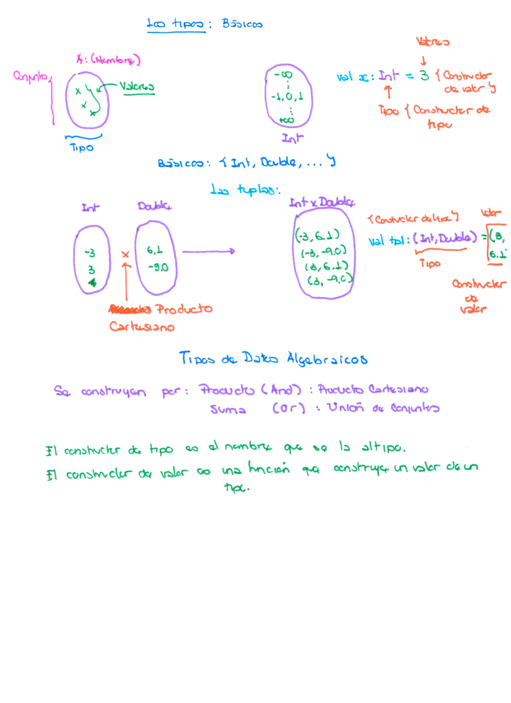
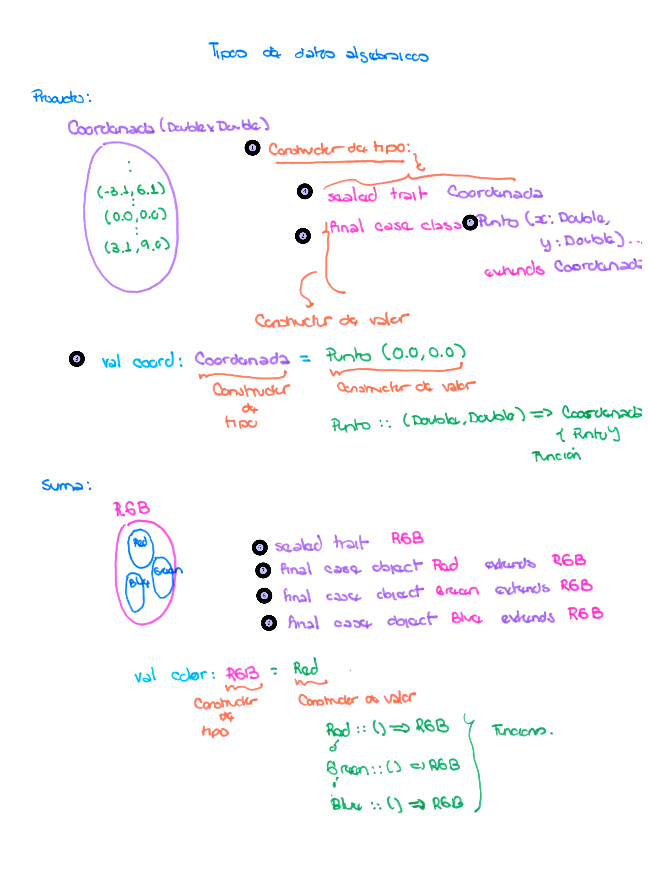
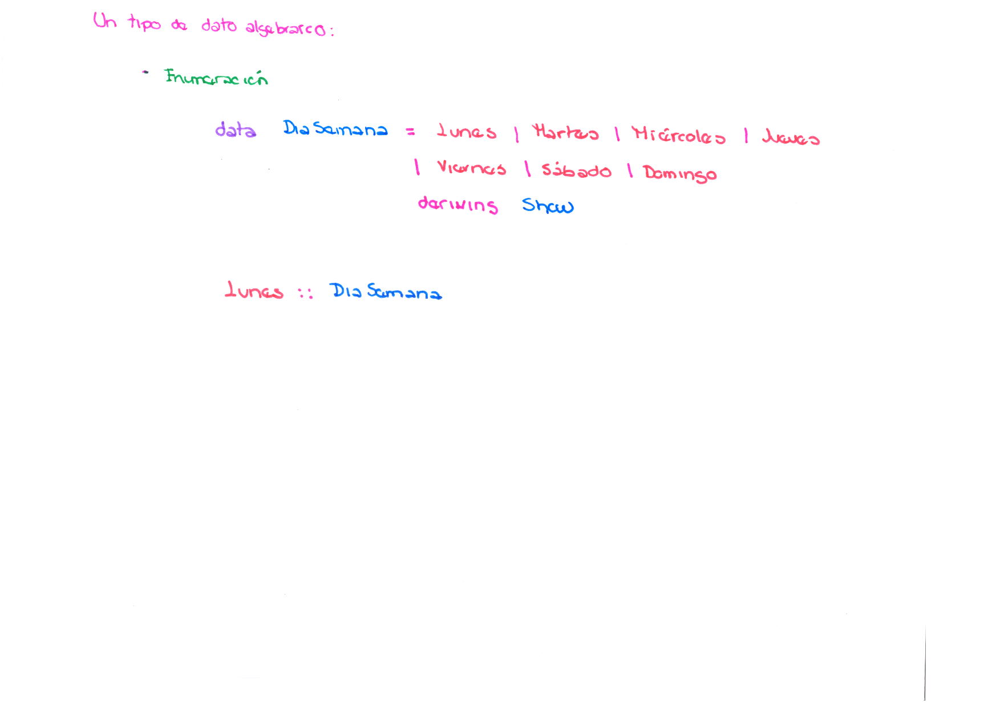
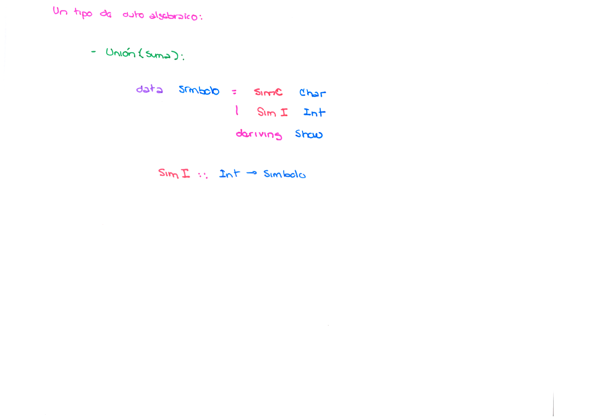
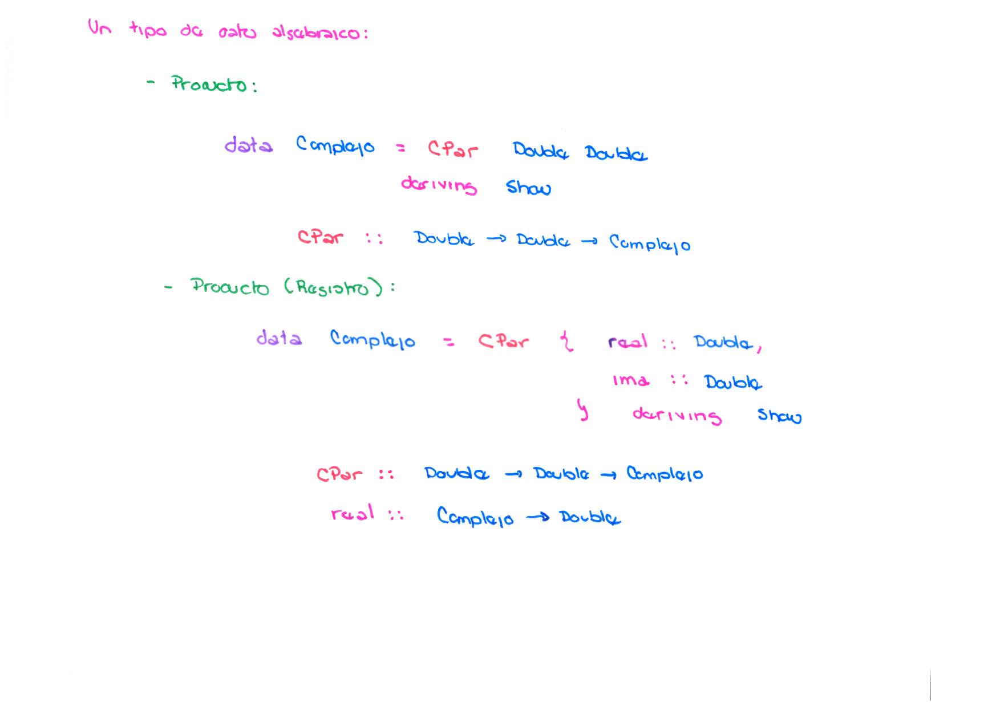
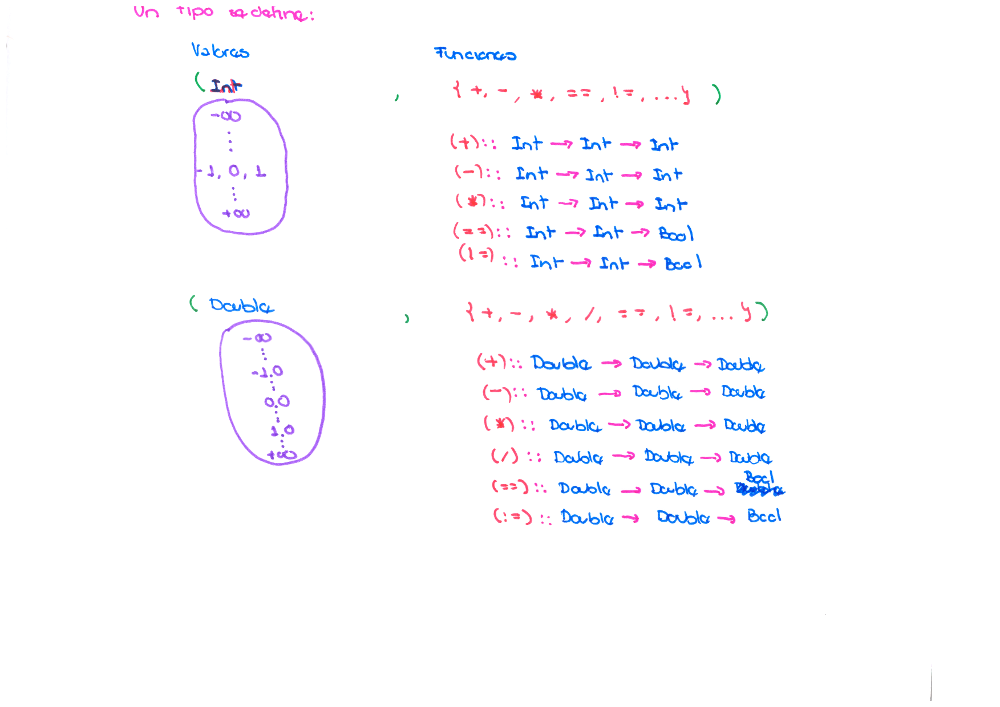
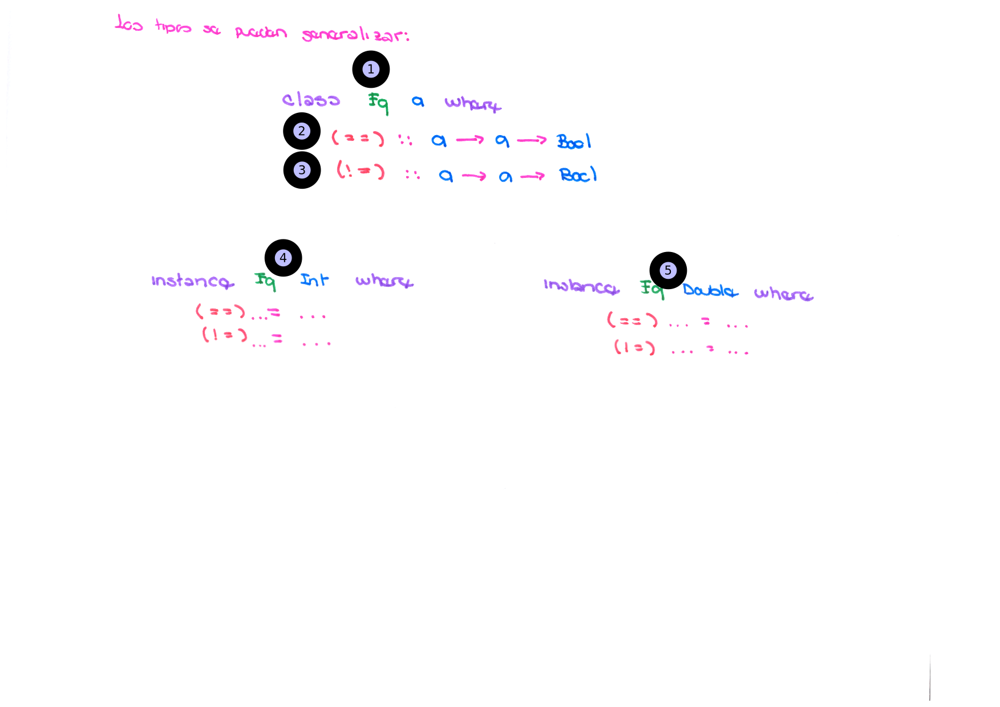
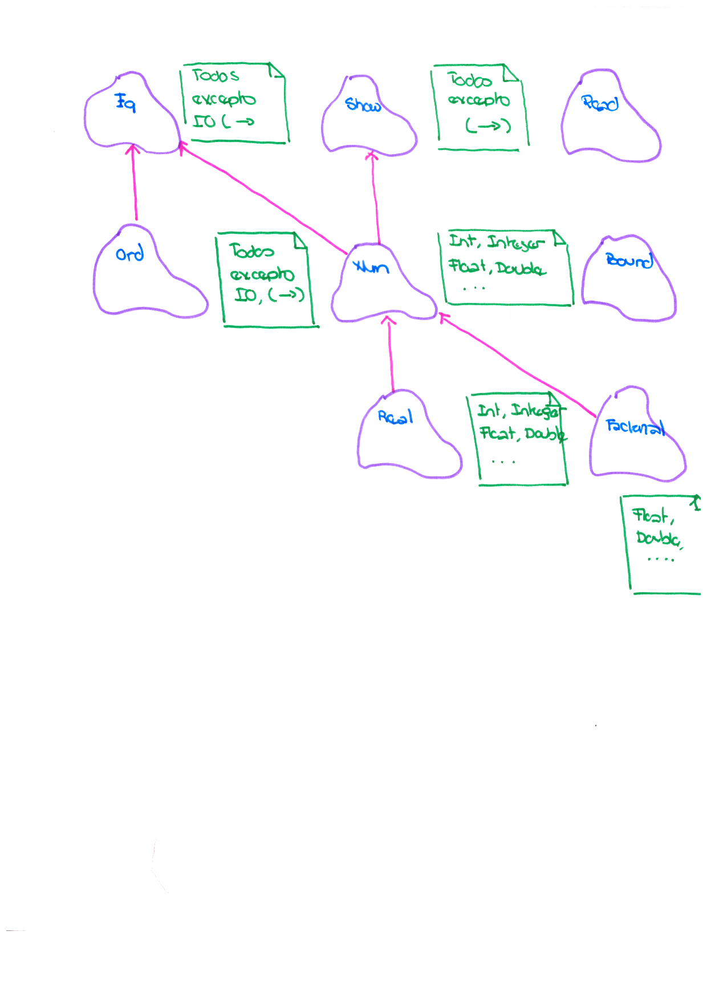

# Programación Funcional Curso 3. Scala_03

## M0. Bienvenida

### U0. Bienvenida

#### Antes de iniciar


**Importante**

* Te invitamos a ingresar al canal de [Microsoft Teams S4N Campus Students](https://teams.microsoft.com/l/channel/19%3ac42db2d304b64e03a6513494cc550918%40thread.tacv2/S4N%2520Campus%2520students?groupId=a1adcd66-1b55-478a-ad09-2a659c71cc5b&amp;tenantId=b41b72d0-4e9f-4c26-8a69-f949f367c91d). Todas tus preguntas y solicitudes serán respondidas allí.
* El aprendizaje será 100% virtual y desarrollarás las unidades a tu propio ritmo (auto-gestionado).
* Estamos en versión Beta. Nos interesa probar los contenidos y las actividades.
* Esperamos feedback de tu parte. Los comentarios podrás agregarlos en este [Sheets](https://docs.google.com/spreadsheets/d/1bU9sgtsiyLLlSSp8jrS84ZZMJ5IihNNDnbuURxk3hLk/edit?usp=sharing).

## M1. Tipos algebraicos

### U1. Introducción a los tipos de datos inmutables: tuplas

#### Introducción

Los lenguajes de programación tienen muchas formas de guardar información asociada: como *registers* (registros), *class* (clases) y similares.

En esta unidad estudiarás un tipo de dato básico llamado la tupla.

- Las tuplas  te permitirá guardar información asociada con algunos cambios muy interesantes: *no tienen nombres asociados a cada campo*.

- Las tuplas también puede ser utilizadas de forma dinámica, lo que significa que no hay que hacer definiciones de tipo de la tupla, ya que la instanciación de una tupla establece el número de sus elementos (*aridad*) y su correspondiente tipo, cosa que no puedes asi con un *registro* o una *clase*.

- Las tuplas son *inmutables*, esta última característica es la que revisaremos con más detalle en este curso en particular y observaremos las consecuencias directas de utilizarlo a través de *métodos de selección* o *coincidencia de patrones*, la forma de crearlo a partir del soporte que da el lenguaje o los objetos que nos permite otras formas de creación.


  **¡Comencemos!**

##### Guía curso


##### Vídeo - Introducción a los tipos de datos inmutables

Observarás la importancia de los tipos de datos inmutables en general, también ampliarás tus concepto de inmutabilidad vistos previamente y entenderás los beneficios de utilizar dichos tipos de datos, en particular las tuplas.

[Vídeo pendiente de edición](videos/els4n-fp-scala-c3-m1-u1-01.mp4)

##### Objetivos de la unidad

###### Lograrás:

* Entender el concepto de tuplas en tus programas
* Utilizaras las tuplas en tus programas.
* Aplicarás la inmutabilidad en tus programas, y podrás "modificar" las tuplas.

###### Lo que debes saber:

* Entender y aplicar el concepto de funciones puras en Scala.
* Entender y aplicar el concepto de tipos de datos inmutables.

###### Esperamos que aprendas a:

* Los beneficios de usar tuplas y la inmutabilidad en tus programas.
* Usar los operadores de selección y la coincidencia de patrones para acceder el contenido de las tuplas.
* Construir nuevas tuplas a partir de tuplas existentes, sin violar la restricción de inmutabilidad.

###### Ruta de aprendizaje:

* Fundamentos
  * Definición de tuplas, creación y acceso
  * Coincidencia de patrones para el manejo de tuplas
  * Otras formas de manejo de tuplas: operador `copy` y funciones de proyección
* Práctica
  * Tuplas definición y uso
  * Ejemplos de tuplas y coincidencia de patrones
  * Manejo y transformación de tulas
* Evaluación
* Cierre

**Tiempo estimado:** 2h 15 min


---------

#### Tuplas

##### Vídeo - La tupla un tipo de dato inmutable muchas veces olvidado

Este vídeo te mostrará la tupla como un tipo de dato inmutable que permite ser creado dinámicamente según lo requieras como programador, permitiéndote crear un tipo nuevo sin necesidad de definirlo explicitámente como lo haces cuando defines una nueva clase. Observa, como declarar una tupla, instanciarla y acceder a sus elementos.

[Vídeo pendiente de edición](videos/ready_pre_edition/EPAM-LATAM-FP-C3-M0-U0-V1-P01-Docente.mp4)


###### Preguntas Vídeo

1.

>>Es un efecto colateral<<

( ). Un programa funcional

(x). Una operación de entrada y salida

( ). Una operación matemática

( ). Una acción llevada por otro procesos


[explanation]

Cada operación que modifique el estado del computador, como memoria, entrada y salidas, es un efecto colateral.

[explanation]


2.

>>Dos tipos de datos inmutables<<

[ ]. Objetos

[x]. Tuplas

[x]. Tipos de datos algebraicos

[ ]. Arreglos


[explanation]

Por definición de lenguaje de programación, las tuplas y los tipos de datos algebraicos son inmutables, es decir, no tienen operaciones de modificación.

[explanation]


##### Jupyter Notebook - Tuplas definición y uso

Este **Notebook** te permitirá poner en práctica lo aprendido con el vídeo anterior:  con la forma de crear tuplas directamente a través del constructor del lenguaje (el operador parentésis), a través de la instanciación de objetos `TupleX` (donde `X` es el indicador de aridad) y utilizando métodos de acceso para acceder al contenido de los mismos.

[Jupyter Notebook - Tuplas definición y uso - Error técnico](https://hub.gke2.mybinder.org/user/juancardonas4n--s4n-fun-prog-c3-5syyqu6i/tree/notebooks/els4n-fp-c3-m1-u1-nb-01.ipynb)


###### Pregunta Jupyter Notebook

1. Dado el siguiente código

```scala
type T3IID = (Int,Int,Double)
type T3IDI = (Int,Double,Int)

def aplicar(tpl1:T3IID,tpl2:T3IDI,f:(Int,Double) => Int) = f(tpl1._1,tpl2._2) + f(tpl2._3,tpl1._3)
```

   > > Si aplicamos la función `aplicar`  con los siguientes valores que resultado `res0` que obtendremos es<<

```scala
scala> aplicar((1,2,3.0),(1,3.0,2),(x:Int,_) => x * 2)
aplicar((1,2,3.0),(1,3.0,2),(x:Int,_) => x * 2)
val res0: Int =
```
   ( ). 4.

   ( ). 5.

   (x). 6.

   ( ). 7.

   [explanation]

   La función `f` toma solamente el primer argumento, el segundo lo ignora. Ahora toma el `tpl1._1 = 1` y `tpl2._3 = 2`, cada uno es múltiplicado por 2 y sumados obteniendo: `1 * 2 + 2 * 2 = 6`.

   [explanation]

###### Cierre Jupyter Notebook


Las **tuplas** te permitirán en tus programas definir contenedores de datos relacionados, que no requieren un **nombre de tipo específico** y mucho menos **definiciones** de dichos tipos, tienen un mecanismo sencillo de acceso a través de su funciones de **accedencia**, numeradas por cada posición. Y también te permitirá mantener tus **funciones puras** de forma que cuando requieres retornar más de un valor dentro de la función lo puedes hacer fácilmente utilizando una **tupla** que contiene los valores necesarios.

> ¡Continuemos con un vídeo! >> 

----

#### Coincidencia de patrones

##### Vídeo - Coincidencia de patrones en tuplas

Este vídeo te mostrará el uso de la coincidencia de patrones bajo las tuplas: a través de la coincidencia de variables, de literales y de comodines, cómo también te mostremos el uso etiquetas.

[Vídeo pendiente de edición](videos/els4n-fp-scala-c3-m1-u1-03.mp4)

###### Pregunta vídeo - Coincidencia de patrones de tuplas

1.

> >Los tipos de datos son vistos como:

(x). Conjuntos.

( ). Referencias.

(). Objectos

( ). Funciones

[explanation]

Un tipo es un conjunto con valores.

[explanation]

2.

> > La palabra reservada `type` nos permite

( ). Definir tipos

(x). Da otro nombre a un tipo ya conocido

( ). Constructor básico para tuplas

( ). Declarar tipos

[explanation]

La palabra reservada `type` define un alias, es decir permite identificar un tipo con dos o más nombres.

[explanation]

##### Jupyter Notebook - Ejemplos de tuplas y coincidencia de patrones

Este *Notebook* te ayudará a cimentar los conceptos vistos en el vídeo anterior y ponerlos en práctica a través de una serie de ejercicios sobre el uso de coincidencia de patrones en tuplas.

[Jupyter Notebook - Ejemplos de tuplas y coincidencia de patrones - Error técnico](https://hub.gke2.mybinder.org/user/juancardonas4n--s4n-fun-prog-c3-1u7gjoff/tree/notebooks/els4n-fp-c3-m1-u1-nb-02.ipynb)

###### Pregunta Jupyter Notebook

1. Suponga que se define la siguiente estructura en scala

```scala
type T2D = (Double, Double)
type Est = (String, T3D, T3D)
```

La tupla `Est` tiene la información de un estudiante, donde el segundo elemento son los porcentajes de tres evaluaciones, y el tercero son la notas. Esperamos implementar la función `obtNotaEst` que se muestra su firma a continuación:

```scala
def obtNotaEst(est:Est):Double = ???
```

>>Cuál de las siguiente funciones computa el valor de la nota del estudiante<<

( ) A.
```scala
def obtNotaEst(est:Est):Double = est._2 * est._3
```
( ) B.
```scala
def obtNotaEst(est:Est):Double =
  est._2._0 * est._3._0 + est._2._1 * est._3._1
```
(x) C.
```scala
def obtNotaEst(est:Est):Double = est match {
  case (_,(p1,p2),(n1,n2)) => n1 * p1 + n2 * p2
```
( ) D.
```scala
def obtNotaEst(est:Est):Double =
  est._2._1 + est._3._1 * est._2._2 + est._3._2
```
[explanation]

La primera opción no es válida, por que no se puede multiplicar dos tuplas completas. La segunda opción no es válida por que las funciones de acceso de cada elemento comienza en ._1 y por cada elemento tiene su correspondiente en su elemento. La tercera opción es válida por que accede a cada elemento de la tupla interna y la multiplica con su correspondiente valor ponderado. La cuarta es incorrecta por que la expresión multiplica las ponderaciones y luego se las suma a las notas.

[explanation]

###### Cierre Jupyter Notebook


Como has observado, las **tuplas** tienen funciones de **accedencia** que permiten acceder ordenamente  a los elementos de la misma. Pero, en muchas ocasiones, cuando una tupla tiene tuplas **anidadas**, no es fácil acceder a los elementos más profundos, por esto nos exige precisión sobre la función de accedencia más externa y luego visualizar correctamente la función de accedencia más interna. Es aquí, cuando la **coincidencia de patrones** nos ayuda a manejar este y otros aspectos con mayor fácilidad, por que nos permite veríficar si una tupla sigue una estructura de anidamiento específica, nos permite preguntar directamente sobre su contenido, al hacer coincidencia sobre valores *literales*, asignar el contenido de una posición de una tupla a una variable, realizar comparaciones a través de **guardas** (`if`), he ignorar elementos a través de **comodines**. Con una característica que a veces nos pasa de largo y es que una coincidencia de patrones es una **expresión** que produce un valor lo que permite ser parte de una expresión más grande.

> ¡Continuemos con un vídeo! >> 

----

#### Manejo de tuplas

##### Vídeo - Manipulación de tuplas

Observarás como se puede manipular las tuplas, en particular al ser tipos de datos inmutables podrás "actualizarlos" creando nuevos a partir de los existentes.

[Vídeo pendiente de edición](videos/els4n-fp-scala-c3-m1-u1-04.mp4)

###### Preguntas - Vídeo - Manipulación de tuplas

1. Según el siguiente guión (*script*) de Scala
```scala
val tpl @ (_,b,3) = (1,2,3)
tpl._2 * b - tpl._3
```

>>Cuál es el resultado de la expresión evaluada en la última línea<<

( ) A. 6
( ) B. 4
( ) C. 2
(x) D. 1

[explanation]
La primera línea en el lado derecho de la asignación instancia una tupla de tres elementos y la asigna completamente a la variable
`tpl`. Asigna a la variable `b` el valor de 2 y las tuplas coinciden en el tercer elemento se realiza la asiganción.
Los valores de `tpl`son `(1,2,3)` respectivamente para las funciones de acceso `._1`, `._2` y `._3`, y la variable `b` contiene el valor de `2`. Por lo tanto la evaluación de expresion `tpl._2 * b - tpl._3` produce `2 * 2 - 3` por lo tanto el resultado es `1`.
[explanation]

2. Según el siguiente guión (*script*) de Scala
```scala
val tpl = (1,2,3)
val tpl2 = tpl.copy(_3 = 1, _1 = 3)
tpl2 match { 
   case (a,1,c) => a * c
   case (a,2,c) => c - a
   case (a,_,c) => a + c
}
```

>> Cuál es el valor retornado por la expresión<<

( ) A. 1
(x) B. 2
( ) C. 3
( ) D. 4

[explanation]
La segunda línea produce una copia de la original, pero intercambiando el primer y tercer elemento de la tupla y viceversa. Por 
lo tanto el resultado de `tpl2` es `(3,2,1)`. Cuando se aplica la coincidencia de patrones en el tercer elemento se obtiene que 
coincide con el tercero por lo tanto realiza la expresión: `c - a` que al sustituir se obtiene `3 - 1` cuyo resultado es `2`.
[explanation]

##### Jupyter Notebook - Manejo y transformación de tuplas

Pondrás en práctica todo lo visto en esta unidad a través del manejo de tuplas y la creación de otras tuplas. De esta forma tendrás los conocimientos y el contexto para aprender a manejar otros tipos de datos inmutables.

[Jupyter Notebook - Manejo y transformación de tuplas - Error técnico](https://hub.gke2.mybinder.org/user/juancardonas4n--s4n-fun-prog-c3-71ef49js/notebooks/notebooks/els4n-fp-c3-m1-u1-nb-03.ipynb)


###### Pregunta Jupyter Notebook - Manejo y transformación de tuplas

1.

>>Cuáles de los siguientes códigos invierte el tipo del parámetro de entrada y su valor<<

[x] A.

```scala
def invertir(tpl:(Int,Double,Bool)) = (tpl._3,tpl._2,tpl._1)
```
[x] B.

```scala
def invertir(tpl:(Int,Double,Bool)) = tpl match {
   case (a,b,c) => new Tuple[Bool,Double,Int](c,b,a)
}
```
[x] C.

```scala
def invertir(tpl:(Int,Double,Bool)) = 
  tpl.copy(_1 = tpl._3, t_3 = tpl._1)
```
[ ] D.

```scala
def invertir(tpl:(Int,Double,Bool)) = tpl match {
    case tpl2 @ (_,_,_) => tpl2
}
```

[explanation]

La primera opción es valida, por que utilizando funciones de acceso, crear una tupla nueva en orden inverso. La segunda opción es válida por que utilizando coincidencia de patrones vuelve a crear una tupla nueva, poniendo los valores de la coincidencia de patrones en orden inverso. La tercera opción es válida por que crea una copia de la original y modifica las primera con el valor de la tercera y la tercera con el valor de la primera. La cuarta opción no es válida, por que devuelve una referencia a la tupla original.

[explanation]

###### Cierre Jupyter Notebook


Para muchos de nosotros la inmutabilidad de las tuplas, puede ser aparentemente un problema, puesto que estamos enseñados a cambiar el estado de un objeto a través sus métodos. Pero una de las ventajas de las tuplas es que no tenemos que preocuparnos de *quien* pueda cambiarla, puesto que la inmutabilidad lo impide, la tupla una vez creada permencerá sin cambio durante toda la ejecución del programa. Si requerimos nueva información, **simplemente la creamos, no la modificamos** (principio de la inmutabilidad). En el caso de la  tuplas, esto puede ser un poco tedioso, puesto que si queremos obtener una tupla nueva a partir de una tupla anterior, debemos copiar uno a uno los elemento de la nueva tupla basados en la anterior, utilizando para ello, las funciones de accedencia o la coincidencia de patrones. El lenguaje nos ayuda a través del **operador de copia**, que se encarga de crear una nueva tupla con los valores anteriores y a través de las **funciones de proyección** podamos cambiar aquellas cosas que deben cambiar para la nueva tupla, sin tener que copiar los cada uno de los valores de manera individual.

> ¡Ahora pasemos a evaluar lo aprendido! >> 

----

#### Evaluación

1.

>>La diferencia entre tuplas y las clases es que<<

( ) A. las tuplas son colecciones, mientras que las clases son tipos de datos.
(x) B. las tuplas son tipos sin nombres, mientras que las clases son tipos generalmente tienen nombres excepto las anónimas.
( ) C. las tuplas no son recursivas mientras que las clases permiten que sus campos (o atributos) sean otras clases.
( ) D. las tuplas permiten que sus campos sean modificados a través de la operación de selección mientras que las clases lo hacen a través de los métodos *setters*.
[explanation]
La opción A, las tuplas son tipos de datos pero no son colecciones por que adolecen de iteradores, aunque permitan guardar valores de diferentes tipos y este se construya utilizando una forma normalizada del operador del operador de producto cartesiano; una clase por definición es un tipo de dato. La opción B, una tupla no nombra sus campos, mientras que las clases cuando se crean son ligadas a un identificador excepto cuando se definen clases anónimas. La opción C, las tuplas pueden contener un campo de cualquier tipo y ese tipo puede ser un tipo asociado con una tupla. La opción D, las tuplas son inmutables por lo tanto estas no pueden ser modificadas, aunque es cierto que las clases puede ser modificadas si tienen métodos *setters*.
[explanation]

2. La firma de la siguiente función produce una tupla cuyo primer valor es el mismo de entrada (\) y el segundo es el valor inverso $valor^{-1}$.
>>Construya el cuerpo de la función en scala:<<

```{.scala}
def obtInv(valor:Double):(Double,Double) = ???
```

[explanation]
La idea es construir una tupla a partir de los valores de entrada `valor` y su correspondiente valor inverso.

```{.scala}
def obtInv(valor:Double):(Double,Double) = (valor,1.0/valor)
```
[explanation]

3. La función `distRango` recibe dos valores enteros `a` y `b`, y retorna una tupla binaria donde el segundo campo es otra tupla binaria. El primer campo de tupla externa es computado con la distancia (`dist`) entre ambos valores de entrada cómo se observa en la fórmula a continuación  y  la tupla interna calcula el rango (`rango`) que toma los dos valores iniciales y establece el orden entre ambos, como se observan la función rango a continuación.

>>Implemente `distRango` construyendo las tuplas a partir de `TupleX`.<<

```{.scala}
def distRango(a:Int, b:Int):Tuple2[Int,Tuple2[Int,Int]] = ???
```

$$
dist(a,b) =\ \mid a - b \mid
$$

$$
rango(a,b) = \begin{cases}(a,b) & \text{Si}\ a \leq b\\
                          (b,a) & \text{En caso contrario} \\
             \end{cases}
$$

[explanation]
El siguiente segmento de código muestra cómo se construye el cuerpo de la función:

```{.scala}
def distRango(a:Int, b:Int):Tuple2[Int,Tuple2[Int,Int]] = new     Tuple2(scala.math.abs(a - b), if (a <= b) new Tuple2(a,b) else new Tuple2(b,a))
```

Se construye una tupla de tipo `Tuple2` donde el primer campo es el rango calculado con el valor absoluto. El segundo campo se construye con una expresión de condición que confirme que la condición $a \leq b$ y esto retorna la tupla conteniendo el rango de `a` y `b` en caso contrario se retorna la tupla conteniendo el rango `b` y `a`.
[explanation]

4. Observa la siguiente firma:
>>cuál de la siguientes opciones obtiene retorna la tupla más interna de la tupla de u<<

```{.scala}
def funcion(u:((Int,Int),Int,Int)) = u match {
...
}
```

[x] A. `case (x,_,_) => x`
[ ] B. `case (_,y,z) => u`
[x] C. `case ((w,x),y,z) => (w,x)`
[ ] D. `case (x,y,z) => (x,z)`

[explanation]
La opción A es válida, porque la coincidencia de patrones toma el primer campo de la tupla más externa que es realidad la tupla más interna. La opción B no es válida, porque ignora el valor del primer campo de la tupla más externa y devuelve la tupla original. La opción C es válida porque se obtiene con detalle la tupla más interna y se vuelve a construir una copia de la tupla original. La opción D no es válida, porque aunque se construye una tupla con otra tupla anidada.
[explanation]

5. Observa la siguiente firma de la función (`funcion`)

```{.scala}
def funcion(u:(Int,Int),v:(Int,Int)) = ???
```

>>ésta tiene dos parámetros que son tuplas `u`y `v`. Implemente una función (`funcion` ) que verifique si `u._2`y `v._1` cumplen las siguientes condiciones: si son iguales y este es cero (`0`) compute: `u._1 + v._2`, si ambos son uno (`1`) compute: `u._1 - v._2`, si son iguales sin importar que valor (diferente de `0`ó `1`) compute: `u._1 * v._2`, en cualquier otro caso retorne cero (`0`). **Recuerde:** que esta implementación utiliza _coincidencia de patrones_ y no los operadores de selección.<<

[explanation]
El siguiente es el cuerpo de la función esperada:

```{.scala}
def funcion(u:(Int,Int),v:(Int,Int)) = (u,v) match {
   case ((w,0),(0,z)) => w + z
   case ((w,1),(1,z)) => w - z
   case ((w,x),(y,z)) if x == y => w * z
   case _             => 0
}
```
[explanation]

6. Observa la siguiente expresión:

```{.scala}
val tupla = new Tuple1(1)
```

>>De acuerdo con la información anterior, el tipo de la expresión obtenida es<<

( ) A. `val tupla: Int = 1`
( ) B. `val tupla: (,Int) = (,1)`
( ) C. `val tupla:(Int) = (1)`
(x) D. `val tupla:(Int,) = (1,)`

[explanation]
El rango de una tupla (El número de elementos que ellas puede contener) es desde un único elemento (o *singlenton*) hasta 22 elementos, todos ellos de diferentes tipos.  El objetivo del ejercicio es mostrar cuál es el tipo creado por una tupla *singlenton* de tipo entero cuya  representación en Scala se obtiene de la siguiente forma: `(Int,)`. La opción A establece que la tupla es de tipo entero. La opción B no está permitida por el lenguaje. La opción C el tipo `(Int)`no existe dentro de Scala. La opción D es la correcta como se explicó previamente.
[explanation]

7.
>>Implementa la función (`funcion`) del ejercicio 5 sin utilizar coincidencia de patrones sobre los parámetros sino utilizando únicamente operaciones de selección sobre tuplas.<<

[explanation]
El siguiente es el código que se implementa

```{.scala}
def funcion(u:(Int,Int),v:(Int,Int)) = if (u._2 == v._1)
                                          if (u._2 == 0) u._1 + v._2
                                          else if (u._2 == 1) u._1 - v._2
                                               else u._1 * v._2
                                       else 0
```
[explanation]

---

#### Cierre

La mayoría de programadores optamos por utilizar tipos de datos como registros o clases y evitamos utilizar las tuplas, debido a que estas no se equiparan en la flexibilidad que tiene las clases. Pero las tuplas, como lo hemos visto tienen características muy interesantes que las hacen muy útiles, la primera de ellas es la capacidad de *retornar varios valores dentro de una tupla*, esto está en la línea directa con una de las características de las funciones puras, como la de una función pura debe retornar un único valor, y en este caso las tuplas ayudan para retornar es único valor.

La segunda característica es la *inmutabilidad*, esta permite crear valores que no pueden ser modificados, lo que igualmente facilita la construcción de funciones puras.

Una tercera característica es la flexibilidad que tienen para crear colecciones de datos, que pueden ser tipos intermedios, sin necesidad de declaración o definición.

Estas y otras más características nos muestran la importancia las tuplas, y de la inmutabilidad, que más adelante nos facilitará crear aplicaciones que consuman gran cantidad de datos. 

##### ¿Quieres saber más?

* [¿Qué son las tuplas? (Inglés)](https://whatis.techtarget.com/definition/tuple)
* [Tuplas definición de Wikipedia](https://es.wikipedia.org/wiki/Tupla)
* [Tuplas en lenguajes de programación (Inglés)](https://weekly-geekly.imtqy.com/articles/276871/index.html)
* [Tuplas en Scala (Inglés)](https://www.geeksforgeeks.org/scala-tuple/)
* [Tuplas en Scala comandos (Inglés)](https://www.tutorialspoint.com/scala/scala_tuples.htm)

##### EPAM Insights

---

### U2. Tipos de datos algebraicos

#### Introducción

El nombre tipos de datos algebraicos te puede sonar extraño, en un mundo trabajas preferentemente con clases, registros, estructuras, objetos, etc. En esta unidad, volveremos rápidamente sobre un tema teórico que es la construcción de tipos de datos y explicaremos dos técnicas de construcción de tipos de datos que son los productos (ya observados cuando estudiamos tuplas) y la suma; te mostraremos que los tipos de datos algebraicos requiere de dos mecanismos, un constructor de tipo y un constructor de valores.

En la primera, vamos ampliar el sistema de tipos de nuestro lenguaje de programación y para ello definiremos 

##### Guía del curso


##### Objetivos de la unidad

###### Lograrás:

* Entender y utilizar los tipos de datos algebraicos (*Algebraic Data Types*), su estructura y su uso.

###### Lo que debes saber:

* El concepto de programación funcional.
* Definición de funciones puras.
* Funciones como valores.
* Definición de tuplas.
* Definición de inmutabilidad de datos.

###### Esperamos que aprendas a:

* Definir tus tipos de datos algebraicos y relacionarlas con tuplas.
* Instanciar, acceder y manipular tipos de datos algebraicos dentro de tus programas.
* Generalizar los tipos de datos algebraicos.

###### Ruta de aprendizaje:

* Fundamentos
  * Construcción de tipos de datos por suma y productos
  * Definición de tipos de datos algebracios
  * Constructores de tipos y de valores de tipos
  * Coincidencia de patrones en tipos de datos algebraicos
  * Manipulación de tipos de datos algebraicos
  * Generalización de tipos de datos algebraicos
* Práctica
  * Construcción y creación de tipos de datos algebraicos
  * Ejemplos de tuplas y coincidencia de patrones
  * Generalización de  tipos de datos algebraicos
* Evaluación
* Cierre

**Tiempo estimado:** 1h 45 min


---

#### Infograma - Construcción de tipos



Puedes observar que el primer figura te mostramos algo que ya conoces cómo es la asociación entre los tipos de datos y conjuntos.

**1)** Básicamente, un tipo de dato es un conjunto y sus elementos son sus valores. Puedes observar que hay dos elementos: 

**2)** *el constructor de tipo* que es básicamente el nombre que utilizar ese nuevo tipo en nuestro *sistema de tipos* y, 

**3)** los literales enteros que representan los valores del tipos de dato, estos literales son también conocidos como *constructores de valores*. 

**4)** Observemos ahora la parte referente a la tupla, esta es un tipo de dato *compuesto* es decir que se puede formar de dos o más tipos utilizando el *producto cartesiano*.

**5)** Nuevamente, tenemos un constructor de tipo que la declaración de la tupla con los tipos de datos que agrupan $Int \times Double$ que dependiendo del lenguaje que implemente las tuplas se verá por ejemplo en Scala: 

**6)** `(Int, Double)`, es decir este es un tipo de dato nuevo que se agregará al *sistema de tipos*, pero se tiene un nuevo constructor de valores que utiliza el operador paréntesis normalizado para indicar los elementos (valores) que pertenencen a la nueva tupla como por ejemplo:

 **7)** `(3,6.1)`. Entonces, siempre que queramos construir un valor del tipo de la tupla determinado necesitaremos el operador paréntisis normalizado.

**8)** Ahora, hablemos que son los **tipos de datos algebraicos**: estos son tipos que se construyen utilizando las operaciones de *suma* y 

**9)** *producto*, no de forma exclusiva, se pueden utilizar ambas. 

**Aparte** Y aunque ya habíamos utilizado el *producto* para construir a las tuplas, existe un problema con ellas, si quiero tener una tupla que contenga valores en la plano de tres dimensiones el tipo probablemente será: $Double \times Double \times Double$; igualmente si quiero representar los porcentajes de un curso que tiene tres notas, problamente utilizaremos un tipo parecido: $Double \times Double \times Double$. ¿Qué podríamos hacer para diferenciar ambos tipos? Muy  probablemente menciones que podríamos utilizar el alias y que lo podríamos indicar de esta forma para cada tipo: `type Coord3D = (Double, Double, Double)`  y `type PorNotas = (Double, Double, Double)`. Si observas bien, lo que hemos hecho es dar dos alias distitos para un mismo tipo, pero no podemos restrigir su entrada a funciones que trabajen distinto como por ejemplo: `convCoord3DPolar`(convertir a coordenadas polares) o `obtNotaFinal`, podríamos la misma tupla de 3 valores a las dos funciones, sin distinguir de que tipo realmente estamos trabajando. 



Es por ello que los tipos de datos algebraicos cambian la  forma de obtener 

**1)** el nuevo tipo (*constructor de tipo*) y de manipular los valores, se obtiene para ello 

**2)** *constructores de valor*. En gráfica anterior se observa esto en particular para construir dos tipos de datos nuevos: `Coordenada`y `RGB`. 

**3)** El primer tipo, `Coordenada` muestra la forma en Scala 2.0 como se construye el tipo en particular, utilizando para ello los 

**4)** **`traits`** que son interfaces, que contienen un nombre (que representará el nuevo tipo) y los constructores de valores, que en esta caso tenemos uno solo `Punto`. 

**5)** El constructor de valor `Punto`identificar cuáles serán sus funciones de acceso: `.x` y `.y`, pero como sucede con las tuplas los tipos de datos algebraicos son también **inmutables**.

**6**) El tipo de dato `RGB` utiliza también de un **`trait`** (`RGB`) para definir el constructor de tipo, pero en este caso realiza la definición de diferentes valores que tiene el tipo en particular, en este caso utiliza un `case object`para indicar que cada uno de ellos:

**7)** `Red`, 

**8)** `Green`y 

**9)**`Blue` son valores, pero adicionalmente cada uno de los tres esta utilizando el operador suma, por que cada definición añade un valor nuevo al tipo `RGB`.

#### Tipos de datos algebraicos

##### Video - Definiendo tipos de datos algebraicos

En este vídeo te mostraremos con más detalle la creación de tipos de datos algebraicos en el lenguaje de programación  Scala a través del uso de productos y del uso de sumas. Igualmente mostramos un ejemplo de como combinar ambos tipos de construcciones. También te observaremos, el uso de los métodos de acceso que nos permite acceder al contenido, la coincidencia de patrones y la forma de construir nuevos tipos de datos algebraicos a partir de los básicos.

[Vídeo - Definiendo tipos de datos algebraicos](https://www.youtube.com/watch?v=xHpVQ2ZqUe4&list=PLZdie3lPm9fTvcUsCTgZb1pg7Ufrj1NwB&index=6)

###### Preguntas - Vídeo - Definición de tipos de datos algebraicos

1. Según el siguiente guión (*script*) de Scala

```scala
sealed trait Monedas
final case object COLPesos  extends Monedas
final case object USDolares extends Monedas
final case object EUEuros   extends Monedas
final case object JAPYenes  extends Monedas
```

>>La anterior es la definición de un tipo de dato algebraico por Producto<<

( ) verdadero
(x) falso

[explanation]

La estructura es una estructura de definición basado en suma (Unión), donde cada `case object`crea un valor para el tipo `Monedas`. Por lo tanto la respuesta es **falso**.

[explanation]

2. Según el siguiente guión (*script*) de Scala

```scala
sealed trait Cuentas
final case class CuentaCorriente(id:String, saldo:Double) extends Cuentas
```

>> De las siguiente funciones cuál obtiene el saldo actual<<

( ) A.
```scala
def funcionA(cuenta:Cuentas) = cuenta.saldo
```
(x) B.
```scala
def funcionB(cuenta:CuentaCorriente) = cuenta.saldo
```
( ) C.
```scala
def funcionC(cuenta:Cuenta) = cuenta._2
```
( ) D.
```scala
def funcionC(cuenta:CuentaCorriente) = cuenta._2
```

[explanation]
La opción A. Aunque la variable `cuenta`es de tipo `Cuentas`el compilador no sabe sobre cual es el subtipo de cuenta, aunque sea único. Por lo tanto, esta opción es incorrecta.

La opción B. La variable `cuenta`es efectivamente del tipo `CuentaCorriente`, por lo tanto el compilador sabe que la función de acceso pertenece a este tipo de dato. Por lo tanto, esta opción es correcta.

La opción C. La expresión está tratando a la variable `cuenta` de tipo `Cuenta` como si fuera una tupla, que en  este caso no lo es, es otro tipo de dato algebraico. Por lo tanto, esta opción es incorrecta.

La opción D. La expresión está tratando a la variable `cuenta` de tipo `CuentaCorriente` como si fuera una tupla, que en  este caso no lo es, es otro tipo de dato algebraico. Por lo tanto, esta opción es incorrecta.

[explanation]

#### Aplicación y uso de tipos de datos algebraicos

##### Infograma - Aplicación y uso de tipos de datos algebraicos

Con la definición que ya has visto de los tipos, ahora podemos mirar como se usan y se aplican, en particular dentro del lenguaje de programación [Haskell](https://www.haskell.org). 

**1)** Comencemos, con la definición de un tipo de dato enumeración llamado `DiaSemana`. En ella se observa, 

**2)** la construcción del tipo que es `DiaSemana` y 

**3)** los diferentes constructores de valores: `Lunes`, `Martes`,  $\ldots$ , y `Domingo`.  

**4)** Es importante observar que cada constructor de valor no sólo es un valor del tipo de dato `DiaSemana` sino también es una función. *La funciones no solo representa cómputos, también representan tipos de datos*.  




[En la siguiente figura]

**1)** Los tipos de datos algebraicos se definen elementos a través de la operación de unión. 

**2)** Observa el tipo de dato `Símbolo`,  sus valores pueden provenir de dos tipos: `Char` y  `Int`.  Como dicho valor proviene de esos dos tipos, se tiene un constructor de valor para cada tipo, por ejemplo 

**3)** el primer constructor  `SimC` toma un valor de `Char` y lo hace parte el tipo `Símbolo`. 

**4)** Igualmente en para el constructor de valor  `SimI`que lo hace con un valor de tipo `Int`. 



[En la siguiente figura]

**1)** Los tipos algebraicos se pueden construir utilizando el producto cartesiano, similar a lo que se se hizo con las tuplas. 

**2)** En este caso estamos utilizando para representar un número `Complejo` que esta formado por dos partes $r + i$ donde $i$ es la representación del valor imaginario $\sqrt{-1}$. 

**3)** Por lo tanto el constructor `CPar`construye un valor complejo con dos valores del tipo `Double`, cómo puede observar esta es una función que recibe dos parámetros de tipo `Double` y produce un valor de tipo`Complejo`. El primer valor `Double` representa la parte real, el segundo valor `Double`representa la parte imaginaria. 



**4)** En la anterior imagen hay otra forma de implementar el tipo de dato `Complejo` y es utilizando registros. Esto luce muy similar los campos de una clase, pero su mayor diferencia, es que esto cada uno de nombre declarados en el registro indican una función de acceso al tipo de dato `Complejo`, que también sirve cuando se quiere crear una nueva copia del tipo original, con uno o varios "campos" del registro modificado.

**5**) Como has observado, bien todavía nos falta por explicar un elemento en la definición de cada uno de los tipos de datos anteriores y es elemento `deriving`. Este nos sirve para adicionar un comportamiento extra al tipo de dato algebraico, que ya explicaremos dentro de esta únidad.

**6**) Tanto `CPar` como `real` son funciones.

##### Vídeo - Aplicación y uso de tipos de datos algebraicos en Scala

En este vídeo te mostraremos con más detalle la creación de tipos de datos algebraicos en el lenguaje de programación  Scala a través del uso de productos y del uso de sumas. Igualmente mostramos un ejemplo de como combinar ambos tipos de construcciones. También te observaremos, el uso de los métodos de acceso que nos permite acceder al contenido, la coincidencia de patrones y la forma de construir nuevos tipos de datos algebraicos a partir de los básicos.

[Vídeo - Aplicación y uso de tipos de datos algebraicos en Scala](https://www.youtube.com/watch?v=XHHwmfJsec8&list=PLZdie3lPm9fTvcUsCTgZb1pg7Ufrj1NwB&index=7)

###### Preguntas - Vídeo - Aplicación y uso de tipos de datos algebraicos en Scala

1. Según el siguiente guión (*script*) de Scala nos describe un tipo de dato `Config` que este caso permite dos valores posibles: `Remote` y `Local`. 

```scala
sealed trait Config
final case class Remote(host:String) extends Config
final case object Local              extends Config
```

>>De las siguiente definiciones de funciones, produce una función que muestra que la conexión es remota *para cualquier valor del tipo `Config`*<<

[ ] A.
```scala
def funcionA(remote:Remote):Boolean = true
```
[ ] B.
```scala
def funcionB(cfg:Config):Boolean = if (cfg == Remote) true else false
```
[x] C.
```scala
def funcionC(cfg:Config):Boolean = cfg match {
   case Remote(_) => true
   case Local     => false
}
```
[x] D.
```scala
def funcionD(cfg:Config):Boolean = cfg match {
   case Local => false
   case _     => true
}
```
[explanation]
La opción A, funciona si el tipo que se pasa solamente es `Remote` pero si le pasan un valor de tipo `Local` el compilador lo rechaza por lo tanto no es válido.
La opción B, aunque se puede hacer una comparación entre tipos algebraicos la comparación no funcion por que en primer lugar `Remote` deber tener una valor asignado (`host`) y segundo la comparación se debe hacer entre valores del mismo tipo. Por lo tanto, esta opción no es válida.
La opción C, utiliza coincidencia de patrones y verifica a través de la coincidencia la variable `cfg` de tipo `Config` y en este caso la coincidencia verifica en el primer `case` que sea de subtipo `Remote` sin importar el valor interno y retorna que es verdadero (`true`); en el segundo `case`, lo constrasta con `Local` en cuyo caso es `falso`. Por lo tanto, cumple con lo solicitado en la pregunta, es válido.
La opción D, también utiliza coincidencia de patrones sobre la variable `cfg`. En el primer `case`verifica que es de tipo `Local` por lo que retorna `false`; y el segundo `case` retorna en cualquier caso (que siempre será del subtipo `Remote`) `true`. Por lo tanto, cumple con lo solicitado en la pregunta, es válido
[explanation]

2. Según el siguiente guión (*script*) de Scala

```scala
sealed trait Cuentas
final case class CuentaCorriente(id:String, saldo:Double) extends Cuentas
````

>> De las siguiente funciones cuál obtiene el saldo actual<<

( ) A.

```scala
def funcionA(cuenta:Cuentas) = cuenta.saldo
```

(x) B.

```scala
def funcionB(cuenta:CuentaCorriente) = cuenta.saldo
```

( ) C.

```scala
def funcionC(cuenta:Cuenta) = cuenta._2
```

( ) D.

```scala
def funcionC(cuenta:CuentaCorriente) = cuenta._2
```

[explanation]
La opción A. Aunque la variable `cuenta`es de tipo `Cuentas`el compilador no sabe sobre cual es el subtipo de cuenta, aunque sea único. Por lo tanto, esta opción es incorrecta.

La opción B. La variable `cuenta`es efectivamente del tipo `CuentaCorriente`, por lo tanto el compilador sabe que la función de acceso pertenece a este tipo de dato. Por lo tanto, esta opción es correcta.

La opción C. La expresión está tratando a la variable `cuenta` de tipo `Cuenta` como si fuera una tupla, que en  este caso no lo es, es otro tipo de dato algebraico. Por lo tanto, esta opción es incorrecta.

La opción D. La expresión está tratando a la variable `cuenta` de tipo `CuentaCorriente` como si fuera una tupla, que en  este caso no lo es, es otro tipo de dato algebraico. Por lo tanto, esta opción es incorrecta.

[explanation]

#### Práctica de aplicación y uso de tipos de datos algebraicos

##### Jupyter Notebook - Tipos de datos algebraicos en Scala

En este *notebook* pondrás en práctica todo lo visto en esta unidad a través de varios ejercicios que te permitan construir tipos de datos algebraicos por medio del producto, suma y ambos. También utilizarás lo aprendido en el vídeo anterior de cómo crear nuevos tipos de datos algebraicos a partir del contenido de los anteriores y a recordar como utilizar la composición de funciones.

[Jupyter Notebook - Aplicación de tipos de datos algebraicos - Local](notebook/els4n-fp-c3-m1-u2-nb-01.ipynb)

###### Pregunta Jupyter Notebook - Aplicación de tipos de datos algebraicos

1. Se tiene definido un tipo de algebraico de la siguiente forma:

   ```scala
   sealed trait UnTDA
   final case class  CValor1(a:Int,b:Double,c:Boolean) extends UnTDA
   final case class  CValor2(d:Double,e:Int) extends UnTDA
   final case class  CValor3(f:Int) extends UnTDA
   final case object CValor4 extends UnTDA
   ```

>>Cuál de las siguientes funciones calcula la aridad de cualquiera de los valores de un tipo  `UnTDA`<<

[ ] A.

```scala
def a(unTDA:UnTDA):Int = unTDA.productArity
```
[ ] B.

```scala
def b(unTDA:UnTDA):Int = unTDA match {
   case (a,b,c)  => 3
   case (d,e)    => 2
   case (f)      => 1
   case _        => 0
}
```
[x]. C.

```scala
def c(unTDA:UnTDA):Int = unTDA match {
    case CValor1(_,_,_) => 3
    case CValor2(_,_)   => 2
    case CValor3(_)     => 1
    case CValor4        => 0
}
```

[x]. D.

```scala
def d(unTDA:UnTDA):Int = unTDA match {
    case s @ CValor1(a,b,c) => 3
    case t @ CValor2(d,e)   => 2
    case u @ CValor3(f)     => 1
    case _                  => 0
}
```

[explanation]

La primera opción funciona si el tipo de dato es una tupla, pero en este caso no es válido, por que trabajamos con tipos de datos algebraicos. La segunda opción indica que trabaja en la estructura de producto de cada uno de los constructores, pero nuevamente funcionaría si fuera una tupla. La tercera opción es correcta, puesto que en cada caso mira la forma de los constructores de valores del tipo `UnTDA` y  no le importa el contenido, por que esta utilizando el comodín, pero examina la estructura y dependiendo de esta retorna el número de elementos que forman el producto, por lo tanto es válida. La cuarta, aunque en los tres primeros casos esta utilizando la etiqueta, pero en cada uno de ellos examina la estructura del producto de cada constructor, y aunque asigna valores para cada uno de los elementos del producto, el valor a retornar es la aridad del producto, por lo tanto es también correcta.

[explanation]

###### Cierre Jupyter Notebook


Cómo ya habías visto en la  conclusión del tema de las tuplas, **los tipos de datos algebraicos** son también **tipos de datos inmutables**, que permite ser creados utilizando dos operaciones traídas de la teoría de conjuntos: el **producto** (*producto cartesiano*) y la **suma** (*unión*); a diferencia de la tupla que sólo utiliza el primero. Pero, adicionalmente la forma de construir los tipos de datos algebraicos, nos permiten **nombrar cada constructor de valor** (`case class` ó `case object`), esto te permitirá específicar con mayor claridad la información relacionada con el valor a construir y en cuando la utilices en la coincidencia de patrones, te permitirá idéntificar sin equivocos el constructor de valor. Con las tuplas y los tipos de datos algebraicos, tienes dos herramientas que te facilitarán la construcción de funciones pura y como las visto en el último ejercicio del actual notebook, te permite realizar fácilmente composición de funciones, en próximos cursos te mostremos como sacar un mayor provecho de esta combinación de técnicas.

#### Generalizar tipos de datos algebraicos

##### Infograma - Jerarquía de tipos y generalización

Hemos dado una definición de tipo asociada a la teoría de conjuntos donde un tipo de dato son los valores agrupados por un conjunto determinado con un nombre. Ampliaremos dicha definición, indicando que un tipo se encuentra completamente definido cuando no solamente indicamos los valores sino que también hablamos de las funciones que los utilizan. En la siguiente imagen tenemos la representación de dos tipos de datos: **1)** `Int` y **2)** `Double`, con sus respectivas funciones. Por ejemplo, el tipo de dato `Int` tiene las conocidas operadores **3)** (*funcione*): `+`, `-`, `*`, `==`, `!=` entre otros (No aparece la definición de la división por algunos propiedades que no examinaremos en esta unidad, pero más adelante exploraremos.). Si observas el tipo  `Double`también tiene una serie de operadores **4)** (*funciones*), muy similares, por que podríamos concluir rápidamente que existen dos operadores de sumas: una para enteros y otra para valores dobles. 



Una corta reflexión nos indica que es muy compliado y confuso que el lenguaje ofrecezca al programador dos operaciones de suma, en realidad se ofrece una única operación de suma, y no solo para estos dos tipos sino para otros tipos que requieran esta operación. Esa única operación de suma que se ofrece se encuentra sobrecargada y sirve para cualquiera de los tipos que la requieran. Esto se logra por que las operaciones de los tipos se pueden agrupar en clases. **¡Clases!** como en la programación orientada a objeto. **¡No!**, este tipo de clases parte de una definición que se encarga de *clasificar* a los tipos de datos por comportamientos similares. En este caso como se observa en la imagen siguiente, creamos una clasificación específica llamada **1)** `Eq` que indica como se comporta las funciónes de comparación por igual **2)** (`==`) y por diferente **3)** (`!=`), que por ejemplo para el primero recibe dos valores de tipo `a` y los compara y devuelve un valor de tipo `Bool` (*boolean*) indicando si son iguales o diferentes. La clase `Eq` es una clasificación que indica que un tipo para pertenecer a esta clasificiación debe implementar esos dos métodos.  



En al parte inferior de la imagen, esta lo que debe hacer cualquier tipo de dato para pertenecer a una clasificación especifica, es decir tiene que indicar que es una instancia (*la definición de instancia no es la misma de POO, aquí significa que es un ejemplar de dicha clasificación.*). Esta instanciación se hace indicando como el tipo específico implementa las funciones necesarias, en este caso cada una de las dos instanciaciones **4)** `Int` y **5)** `Double` implementa ambas funciones (en muchos casos no es necesario, con la comparación se puede obtener la negación.). Cada tipo de dato que quiera pertenecer a una clasificación debe escribir la instanciación específica. Pero esto no es necesario y es aquí donde la teoría de tipos nos ayuda. Por ejemplo, los valores de un tipo algebraico formado por *enumeración* como es el caso de `DiaSemana` encontramos que cada constructor de valor hace que sean diferentes, si los constructores son diferentes, el resultado de la comparación es diferente, si son el mismo, obviamente serán iguales. Ahora, para un producto, simple se compara uno a uno los elementos y se puede de esar forma saber si son iguales  o no. 


Esta clasificación nos permite tener una jerarquía de clasificaciones, donde por ejemplo, para tener elementos de la clase **1)** `Ord`(Orden), primer los tipos debe pertenecer a **2)** `Eq` y luego implementar los métodos de ordenamiento como: `<`, `>` y así. En la figura se muestra una figura de clasificación. Es esto donde el operador `deriving` nos ayuda en un lenguaje como Haskell a que el compilador realice este tipo de tareas y en la figura a continuación se muestra dichar jerarquía. 


##### Notebook - Uso de la generalización de tipos

[Jupyter Notebook - Uso de la generalización de tipos - Local](notebook/els4n-fp-c3-m1-u2-nb-02.ipynb)

###### Pregunta - Notebook - Uso de la generalización de tipos

1. Se tiene definido un tipo de algebraico de la siguiente forma:

   ```scala
   sealed trait UnTDAG[+A]
   final case class  VTDG1[+A](a:A) extends UnTDAG[A]
   final case class  VTDG2[+A](a:A,b:A) extends UnTDAG[A]
   final case class  VTDG3[+A](a:A,b:A,c:A) extends UnTDAG[A]
   final case object VTDG0 extends UnTDA[Nothing]
   ```

>>Cuál de las siguientes funciones calcula la aridad de cualquiera de los valores de un tipo  `UnTDA`<<

[x] A.

```scala
def funcionA[A](unTDAG:UnTDAG[A]):Int = unTDAG match {
    case VTDG1(_)     => 1
    case VTDG2(_,_)   => 2
    case VTDG3(_,_,_) => 3
    case VTDG0        => 0
} 
```

[x] B.

```scala
def funcionB[B](unTDAG:UnTDAG[B]):Int = unTDAG match {
   case VTDG1(_)     => 3
   case VTDG2(_,_)   => 2
   case VTDG3(_,_,_) => 1
   case VDTG0        => 0
}
```

[x]. C.

```scala
def funcionC[A](unTDAG:UnTDAG[B]):Int = unTDAG match {
    case VDTG1(a)     => 3
    case VDTG2(a,b)   => 2
    case VDTG3(a,b,c) => 1
    case VDTG0        => 0
}
```

[ ]. D.

```scala
def funcionD[A](unTDAG:UnTDAG[A]):Int = unTDA match {
    case VDTG1 => 3
    case VDTG2 => 2
    case VDTG3 => 1
    case VDTG0 => 0
}
```

[explanation]

La opción A, trabaja sobre un tipo genérico `A` y a través de la coincidencida de patrones verifica que todos los valores con sus correspondientes comodines en las posiciones específicas que están definidas para el tipo de dato `UnTDAG`, por lo tanto es correcta.

La opción B, trabaja sobre un tipo genérico `B` y a través de la coincidencida de patrones verifica que todos los valores con sus correspondientes comodines en las posiciones específicas que están definidas para el tipo de dato `UnTDAG`, por lo tanto es correcta.

La opción C, trabaja sobre un tipo genérico `A` y a través de la coincidencida de patrones verifica que todos los valores con sus correspondientes variables diferentes en las posiciones específicas que están definidas para el tipo de dato `UnTDAG`, por lo tanto es correcta. 

La opción D, trabaja sobre un tipo genérico `A`en la coincidencia de patrones falla al dar la estructura de cada uno de los tipos de valores construidos para este tipo en particular (`UnTDAG`), excepto para último que no tiene otros valores asociados.

[explanation]

###### Cierre - Notebook - Uso de la generalización de tipos


La generalización de los tipos de datos algebraicos, te ayudará a que tus tipos de datos y tus funciones tenga un comportamiento independiente de los tipos de datos y te puedas enfocar mucho más en **las partes comunes de muchos algoritmos** que enfocarte en las partes diferentes, lo que hará finalmente que tus programas sean **menos complejos** y sean **más fáciles de mantener**. Pero esto no es trivial, antes de poder generalizar, tienes que tener un gran sentido de observación y ver las partes comunes de tu programas, es decir que primero programarás sin generalización y a medida que esos patrones comunes surgan irás replazando esas partes comunes por código genérico. Más adelante, observarás que la combinación de tipos de datos algebraicos con funciones puras te facilitarán la ocurrencia de dicho patrones y encontrás las formas que la programación funcional te puede ayudar para simplificar tu código.

#### Evaluación

1.

>>A partir de cero o más conjunto de datos, estas operaciones nos sirve para definir tipos de datos algebraicos<<

( ) A. Producto cartesiano y cardialidad de conjuntos.
(x) B. La unión y el producto.
( ) C. Suma e idempotencia de conjuntos.
( ) D. Producto cartesiano y constructores de valores.
[explanation]
La opción A, con el producto cartesiano construimos TDA, pero con la cardinalidad sabemos del número de elementos.

La opción B, la unión y el producto nos permite construir tipos de datos algebraicos, esto es por definición de los tipos de datos algebraicos.

La opción C, la *suma* es otra forma de unión y nos permite contruir TDA, pero la idempotencia de conjuntos es la propiedad de funciones con la construcción del conjunto de Kleene que permite tener todos las frases de un conjunto.

La opción D, el *producto cartesiano* nos permite construir un TDA, pero los constructures de valores es un término muy genérico y puede incluir los literales enteros que sirven para construir el conjunto de los enteros que no es un TDA.

[explanation]

2. 

>>Son las tuplas un tipo de dato algebraico<<

(x) verdadero.

( ) falso.

[explanation]
Las tuplas son construidas utilizando la operación de producto entre tipos, como los tipos de datos algebraicos que son definidos por *sumas* y *productos*. Por lo tanto es verdadero.

[explanation]

3. Observe el siguiente código:
```scala
sealed trait Bool
final case object False extends Bool
final case object True extends Bool
```
>>Cuál de las siguiente funciones convierte un valor de tipo `Boolean` al tipo `Bool`<<

[X] A.
```scala
def funcionA(b:Boolean):Bool = if (b) True else False
```
[X] B.
```scala
def funcionB(b:Boolean):Bool = b match {
   case true => True
   case _    => False
}
```
[ ] C.
```scala
def funcionC(b:Boolean):Bool = b match {
   case _    => False
   case true => True
}
```
[X] D.
```scala
def funcionD(b:Boolean):Bool = b match {
   case c if c => True
   case _      => False
}
```
[explanation]
La opción A, verifica que el valor de la variable `b` que es de tipo `Bool` en la expresión `if` y por lo tanto convierte cada valor de la variable `b` en el correspondiente valor del tipo esperado. Es válida.
La opción B, utiliza la coincidencia de patrones sobre la variable `b` de forma que cada uno de sus valores literales es convertido al valor del tipo esperado. Es válida.
La opción C, utiliza la coincidencia de patrones sobre la variable `b`, pero esta vez los `case`s en vez de ir del más específico al más genérico, van del más genérico al más específico, por lo que el comodín `_` producirá `False` en cualquier caso. No es válida.
La opción D, utiliza coincidencia de patrones pero esta vez utiliza las guardas que puede tener un constructor `case` lo que hace que que válida que el valor de c contiene un valor de verdad, este produce el valor `True`, en el caso por omisión produce el valor de `False`,  por lo tanto produce los valores del tipo esperado. Es válida.
[explanation]
4. Observe el siguiente código:
```scala
sealed trait Transacciones
final case class TransCant(seq:Int,cantidad:Double,valor:Double) extends Transacciones
final case class TransDesc(seq:Int,valor:Double,descuento:Double) extends Transacciones
final case object NoTrans extends Transacciones
```
>>Cuál de las siguiente funciones obtiene el valor final de la transacción<<

( ) A.
```scala
def funcionA(trans:Transacciones):Double =
  if (trans.cantidad == 0)
     if (trans.descuento == 0) 0.0
     else trans.valor * trans.descuento
  else
     trans.cantidad * trans.valor
```
( ) B.
```scala
def funcionB(trans:Transacciones):Double = b match {
   case TransCant(_,c,v) => c + v
   case TransDesc(_,v,d) => v - d
}
```
( ) C.
```scala
def funcionC(trans:Transacciones):Double = b match {
   case _ => 0.0
   case TransCant(_,c,v) => c * v
   case TransDesc(_,v,d) => v - d
}
```
(x) D.
```scala
def funcionD(trans:Transacciones):Double = b match {
   case NoTrans          => 0.0
   case TransCant(s,c,v) => c * v
   case TransDesc(s,v,d) => v - d
}
```
[explanation]
La opción A, no se puede tener acceso a los métodos de acceso sin especificar el tipo sobre el que se va actuar. No es válida.
La opción B, no cubre todos los casos de los valores de tipo `Transacciones`y adicionalemente la operación en valor `TransCant` no es la correcta. No es válida.
La opción C, el primer `case` es más genérico que los demás y por lo tanto siempre calcula el valor de `0.0`. No es válida.
La opción D, para cada valor calcula el resultado específico, si el valor es `NoTrans` el resultado es `0.0`. Cuando es `TransCant` múltiplica la cantidad por el valor y cuando es `TransDesc` toma el valor menos el descuento. Es válida.
[explanation]
5. Observe el siguiente código:
```scala
sealed trait Tipo
final case class  SubTipoA(a:Int,b:Boolean) extends Tipo 
final case class  SubTipoB(d:Double,c:Char) extends Tipo
final case object SubTipoC extends Tipo
```
>>Cuál es la función del constructor `sealed` en el trait<<

( ) A. Un `sealed trait` es una forma para distinguir los tipos de datos algebraicos (TDA).
( ) B. Un `sealed trait` es un constructor al inicio del archivo para declarar al compilador que lo que sigue con `final` pertenecen al mismo tipo.
(x) C. Un `sealed trait` indica que el `Tipo` y todos sus subtipos deben estar definidos dentro del mismo archivo.
() D. Un `sealed trait` es un constructor que indica que la siguiente es una clase de orden y solo se especifica una vez dentro de un archivo. 
[explanation]
El constructor `sealed` se antepone ante un `trait` que todos sus subtipos deben definirse dentro del mismo archivo para que el compilador reconozca todos los posible valores de los tipos de datos algebraicos. La opción C, es válida.
[explanation]
6. Observe el siguiente código:
```scala
sealed trait Marcados[+A]
final case class  Marca[A](sec:Int,unA:A) extends Marcados[A] 
final case object SinMarca extends Marcados[Nothing]
```
>>Cuál de las siguiente funciones implementa una función que incrementa la secuencia de la marca, si se encuentra `SinMarca` se deja igual.<<

[x] A.
```scala
def funcionA[A](mrc:Marcados[A]):Marcados[A] = mrc match {
   case m @ Marca(s,_) => m.copy(sec = s + 1)
   case j              => j
}
```
[ ] B. 
```scala
def funcionB[B](mrc:Marcados[B]):Marcados[B] = mrc match {
   case m @ Marca(s,_) => Marca(s + 1, m.unA)
   case _              => _
}
```
[ ] C. 
```scala
def funcionC[C](mrc:Marcados[C]):Marcados[C] = mrc match {
   case m @ Marca(_,_) => m.copy(sec += 1)
   case _              => SinMarca
}
```
[x] D. 
```scala
def funcionD[D](mrc:Marcados[D]):Marcados[D] = mrc match {
   case Marca(s,u) => Marca(s + 1, u)
   case _          => SinMarca
}
```
[explanation]
La opción A, realiza coincidencia de patrones desde el particular al más general, si encuentra un marca a través de la etiqueta `m` crea una copia del valor e inicializa el campo de `sec` con el valor actual más uno. El segundo devuelve el mismo valor. Es válido.
La opción B, realiza la coincidencia de patrones desde el particular al más general, el primer caso crea una `Marca` nueva incrementando la secuencia, y copiando el valor genérico original en la copia. El problema se presenta en la segundo `case` puesto que éste reconce los demás con el comodín, pero no puede pasar de nuevo el mismo comodín. Es no válido.
La opción C, realiza la coincidencia de patrones desde el particular al más general, el problema está en la construcción del resultado, la función `sec` es una función de acceso, y como el tipo es inmutable no se puede ser modificado.
La opción D, realiza la coincidencia de patrones desde el particular al más general, en el primer `case` se encarga de crear una copia construyendo un nuevo valor y en la segundo `case` el tipo esperado es un `SinMarca` por lo tanto lo returna nuevamente dicho valor. Es válido.
[explanation]


#### Cierre

En esta unidad te has encontrado con los tipos de datos algebraicos (TDA), construyéndolos a través de la operaciones de conjuntos: *suma* (*unión*) y *producto* (*producto cartesiano*).  En ellos has encontrado que las operaciones de próducto cartesiando puedes acceder los valores por su posición también los puedes acceder utilizando las funciones de acceso por ellos definidos en su declaración. La suma te permite combinar diferentes constructores de valores y puedes definir tus propios valores literales, esto te permite una flexibilidad infinita en la definición de tipos de datos.

Lo que has obtenido con los TDA es definir tipos de también llamados tipos de datos símbolicos, por que, permiten ser almacenados, consultados y creados cómo se leen y se escriben, a diferencia que las estructuras de datos como: registros y clases que en general su forma de almacenar es críptica para el usuario.

La flexibilidad de utilizar la teoría de conjuntos directamente en la definición de conjuntos, te permitirá generalizarlos, es decir de poder observar que su contenido puede pertenecer a cualquier tipo y que simplemente no tienes que crear un número infinito de tipos con nombres diferentes, cuando con su simple nombre y una o más variables de tipos puedas dinámicamente crear infinitos tipos.

Pero, es solo el principio, en la siguiente unidad observaremos como crear tipos de datos algebraicos utilizando una herramienta ya conocida como lo es la recursividad y más adelante, combinaremos esta recursividad de tipos con la de funciones y observarás que la programación funcional encontrá nuevos patrones que te permirán simplificar tu programación. 

##### ¿Quieres saber más?

* [Everthing Your Ever Wanted to Know about Sealed Traits in Scala](https://underscore.io/blog/posts/2015/06/02/everything-about-sealed.html)
* [Algebraic Data Types - Sums and Products  -Scala](https://nrinaudo.github.io/scala-best-practices/definitions/adt.html#:~:text=Algebraic%20Data%20Types%20%28ADTs%20for%20short%29%20are%20a,represent.%20There%20are%20two%20basic%20categories%20of%20ADTs%3A)
* [Algebraic Data Types - Haskell](https://wiki.haskell.org/Algebraic_data_type)
* [Variances - Scala](https://docs.scala-lang.org/tour/variances.html#:~:text=Scala%20supports%20variance%20annotations%20of%20type%20parameters%20of,can%20restrict%20the%20reuse%20of%20a%20class%20abstraction.)
* [Scala `case class` - `case object` - Part 1](https://www.journaldev.com/9733/scala-caseclass-caseobject-part1)
* [Scala `case class` - `case object` - Part 2](https://www.journaldev.com/12122/scala-caseclass-caseobject-part2)

##### EPAM Insights

