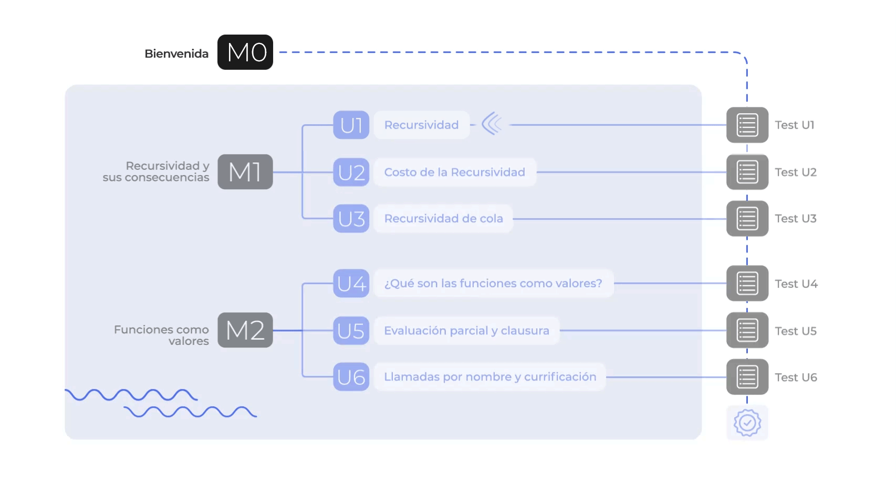

# Programación Funcional Curso 3. Scala_03

## M0. Bienvenida

### U0. Bienvenida

#### Antes de iniciar



**Importante**

* Te invitamos a ingresar al canal de [Microsoft Teams S4N Campus Students](https://teams.microsoft.com/l/channel/19%3ac42db2d304b64e03a6513494cc550918%40thread.tacv2/S4N%2520Campus%2520students?groupId=a1adcd66-1b55-478a-ad09-2a659c71cc5b&amp;tenantId=b41b72d0-4e9f-4c26-8a69-f949f367c91d). Todas tus preguntas y solicitudes serán respondidas allí.
* El aprendizaje será 100% virtual y desarrollarás las unidades a tu propio ritmo (auto-gestionado).
* Estamos en versión Beta. Nos interesa probar los contenidos y las actividades.
* Esperamos feedback de tu parte. Los comentarios podrás agregarlos en este [Sheets](https://docs.google.com/spreadsheets/d/1bU9sgtsiyLLlSSp8jrS84ZZMJ5IihNNDnbuURxk3hLk/edit?usp=sharing).


## M1. Tipos algebraicos

### U1. Introducción a los tipos de datos inmutables: tuplas

#### Introducción

Los lenguajes de programación tienen muchas formas de guardar información asociada: como *registers* (registros), *class* (clases) y similares. En esta unidad estudiarás un tipo de dato básico llamados las tuplas, que nos permite guardar información asociada con algunos cambios muy interesantes: *no tienen nombres asociados a cada campo* lo que nos permite utilizarlos de manera dinámica y son *inmutables*, esta última característica es la que revisaremos con más detalle en este curso en particular y observaremos las consecuencias directas de utilizarlo a través de *métodos de selección* o *coincidencia de patrones*, la forma de crearlo a partir del soporte que da el lenguaje o los objetos que nos permite otras formas de creación. **¡Comencemos!**

##### Guía curso


##### Vídeo - Introducción a los tipos de datos inmutables

Veremos la importancia de los tipos de datos inmutables en general, ampliaremos los conceptos vistos previamente y mostraremos los beneficios de utilizar dichos tipos de datos, introduciendo los tipos que datos que veremos en este curso, que son las tuplas y *tipos de datos algebraicos*.

[Vídeo pendiente de grabación](videos/els4n-fp-scala-c3-m1-u1-01.mp4)

##### Objetivos módulo

###### Lograrás:

* Aplicar las tuplas en tus programas.
* Utilizar las tuplas en tus programas.

###### Lo que debes saber:

* Entender y aplicar el concepto de funciones puras en Scala.
* Entender y aplicar el concepto de tipos de datos inmutables.

###### Esperamos que aprendas a:

* Los beneficios de usar tuplas en tus programas.
* Acceder a los elementos de las tuplas.
* Construir nuevas tuplas a partir de tuplas existentes.

###### Ruta de aprendizaje:

* 4 Vídeos.
* 3 Jupyters Notebooks
* S4N Insights + Test

**Tiempo estimado:** 2h 15 min


---------

#### Tuplas

##### Vídeo - La tupla un tipo de dato inmutable muchas veces olvidado

Este vídeo nos mostrará la tupla como un tipo de dato inmutable que permite ser creado dinámicamente según la necesidad del programador permitiendo crear un tipo nuevo sin necesidad de definirlo o declararlo específicamente como se hacen por ejemplo con las clases. Veamos las cosas que se pueden lograr con la tupla y como utilizar su inmutablidad. 

[Vídeo pendiente de grabación](videos/els4n-fp-scala-c3-m1-u1-02.mp4)

<!-- 2021/11/17 - 17:37 @Lina En cada una de estas secciones no se debería incluir preguntas especificas cómo se han hecho en secciones anteriores [Estado: Sin resolver]-->

##### Jupyter Notebook - Tuplas definición y uso

Este **Notebook** nos permitirá interactuar con la forma de crear tuplas directamente a través del constructor del lenguaje y a través de los objetos `TupleX` (donde `X` es le indicador de aridad.)

[Jupyter Notebook - pendiente de escribir](notebooks/els4n-c3-m1-u1-nb-01.ipynb)

<!-- 2021/11/17 - 17:38 @Lina Los notebooks debería tener soluciones en cada uno de sus ejercicios. Entonces, ¿deberíamos tener preguntas extras? [Estado: Sin resolver]-->

----

#### Coincidencia de patrones

##### Vídeo - Coincidencia de patrones en tuplas

Este vídeo te mostrará el uso de la coincidencia de patrones bajo las tuplas, como se utiliza a través del constructor `match` de Scala y como puede ser utilizado en conjunto con la coincidencia de patrones para otros tipos en conjunto con los de tuplas.

[Vídeo pendiente de grabación](videos/els4n-fp-scala-c3-m1-u1-03.mp4)

<!-- 2021/11/17 - 18:23 @Lina En cada una de estas secciones no se debería incluir preguntas especificas cómo se han hecho en secciones anteriores [Estado: Sin resolver]-->

##### Jupyter Notebook - Ejemplos de tuplas y coincidencia de patrones

Este *Notebook* te ayudará a cimentar los conceptos vistos en el vídeo anterior y ponerlos en práctica para aprender a utilizarla en diferentes situaciones que se presenten con estos tipos de datos.

[Jupyter Notebook - pendiente de escribir](notebooks/els4n-c3-m1-u1-nb-02.ipynb)

<!-- 2021/11/17 - 17:38 @Lina Los notebooks debería tener soluciones en cada uno de sus ejercicios. Entonces, ¿deberíamos tener preguntas extras? [Estado: Sin resolver]-->

----

#### Manejo de tuplas

##### Vídeo - Coincidencia de patrones en tuplas

Observarás como se puede manipular las tuplas, en particular al ser tipos de datos inmutables podrás "actualizarlos" creando nuevos a partir de los existentes. 

[Vídeo pendiente de grabación](videos/els4n-fp-scala-c3-m1-u1-04.mp4)

##### Jupyter Notebook - Manejo y transformación de tuplas

Pondrás en práctica todo lo visto en esta unidad a través del manejo de tuplas y la creación de otras tuplas. De esta forma tendrás los conocimientos y el contexto para aprender a manejar otros tipos de datos inmutables. 

----

## Evaluación

1. 
>>La diferencia entre tuplas y las clases es que<<

( ) A. las tuplas son colecciones, mientras que las clases son tipos de datos.
(x) B. las tuplas son tipos sin nombres, mientras que las clases son tipos generalmente tienen nombres excepto las anónimas.
( ) C. las tuplas no son recursivas mientras que las clases permiten que sus campos (o atributos) sean otras clases.
( ) D. las tuplas permiten que sus campos sean modificados a través de la operación de selección mientras que las clases lo hacen a través de los métodos *setters*.
[explanation]
La opción A, las tuplas son tipos de datos pero no son colecciones por que adolecen de iteradores, aunque permitan guardar valores de diferentes tipos y este se construya utilizando una forma normalizada del operador del operador de producto cartesiano; una clase por definición es un tipo de dato. La opción B, una tupla no nombra sus campos, mientras que las clases cuando se crean son ligadas a un identificador excepto cuando se definen clases anónimas. La opción C, las tuplas pueden contener un campo de cualquier tipo y ese tipo puede ser un tipo asociado con una tupla. La opción D, las tuplas son inmutables por lo tanto estas no pueden ser modificadas, aunque es cierto que las clases puede ser modificadas si tienen métodos *setters*.
[explanation]

2. La firma de la siguiente función produce una tupla cuyo primer valor es el mismo de entrada (\) y el segundo es el valor inverso $valor^{-1}$.     
>>Construya el cuerpo de la función en scala:<<

```{.scala}
def obtInv(valor:Double):(Double,Double) = ???
```

[explanation]
La idea es construir una tupla a partir de los valores de entrada `valor` y su correspondiente valor inverso.

```{.scala}
def obtInv(valor:Double):(Double,Double) = (valor,1.0/valor)
```
[explanation]

3. La función `distRango` recibe dos valores enteros `a` y `b`, y retorna una tupla binaria donde el segundo campo es otra tupla binaria. El primer campo de tupla externa es computado con la distancia (`dist`) entre ambos valores de entrada cómo se observa en la fórmula a continuación  y  la tupla interna calcula el rango (`rango`) que toma los dos valores iniciales y establece el orden entre ambos, como se observan la función rango a continuación. 

>>Implemente `distRango` construyendo las tuplas a partir de `TupleX`.<<

```{.scala}
def distRango(a:Int, b:Int):Tuple2[Int,Tuple2[Int,Int]] = ???
```

$$
dist(a,b) =\ \mid a - b \mid
$$

$$
rango(a,b) = \begin{cases}(a,b) & \text{Si}\ a \leq b\\
                          (b,a) & \text{En caso contrario} \\
             \end{cases}
$$

[explanation]
El siguiente segmento de código muestra cómo se construye el cuerpo de la función:
    
```{.scala}
def distRango(a:Int, b:Int):Tuple2[Int,Tuple2[Int,Int]] = new     Tuple2(scala.math.abs(a - b), if (a <= b) new Tuple2(a,b) else new Tuple2(b,a))
```

Se construye una tupla de tipo `Tuple2` donde el primer campo es el rango calculado con el valor absoluto. El segundo campo se construye con una expresión de condición que confirme que la condición $a \leq b$ y esto retorna la tupla conteniendo el rango de `a` y `b` en caso contrario se retorna la tupla conteniendo el rango `b` y `a`.
[explanation]

4. Observa la siguiente firma:
>>cuál de la siguientes opciones obtiene retorna la tupla más interna de la tupla de u<<

```{.scala}
def funcion(u:((Int,Int),Int,Int)) = u match {
...
}
```

[x] A. `case (x,_,_) => x`
[ ] B. `case (_,y,z) => u`
[x] C. `case ((w,x),y,z) => (w,x)`
[ ] D. `case (x,y,z) => (x,z)`

[explanation]
La opción A es válida, porque la coincidencia de patrones toma el primer campo de la tupla más externa que es realidad la tupla más interna. La opción B no es válida, porque ignora el valor del primer campo de la tupla más externa y devuelve la tupla original. La opción C es válida porque se obtiene con detalle la tupla más interna y se vuelve a construir una copia de la tupla original. La opción D no es válida, porque aunque se construye una tupla con otra tupla anidada.
[explanation]

5. Observa la siguiente firma de la función (`funcion`)

```{.scala}
def funcion(u:(Int,Int),v:(Int,Int)) = ???
```

>>ésta tiene dos parámetros que son tuplas `u`y `v`. Implemente una función (`funcion` ) que verifique si `u._2`y `v._1` cumplen las siguientes condiciones: si son iguales y este es cero (`0`) compute: `u._1 + v._2`, si ambos son uno (`1`) compute: `u._1 - v._2`, si son iguales sin importar que valor (diferente de `0`ó `1`) compute: `u._1 * v._2`, en cualquier otro caso retorne cero (`0`). **Recuerde:** que esta implementación utiliza _coincidencia de patrones_ y no los operadores de selección.<<

[explanation]
El siguiente es el cuerpo de la función esperada:

```{.scala}
def funcion(u:(Int,Int),v:(Int,Int)) = (u,v) match {
   case ((w,0),(0,z)) => w + z
   case ((w,1),(1,z)) => w - z
   case ((w,x),(y,z)) if x == y => w * z
   case _             => 0
}
```
[explanation]

6. Observa la siguiente expresión:
   
```{.scala}
val tupla = new Tuple1(1)
```

>>De acuerdo con la información anterior, el tipo de la expresión obtenida es<<

( ) A. `val tupla: Int = 1`
( ) B. `val tupla: (,Int) = (,1)`
( ) C. `val tupla:(Int) = (1)`
(x) D. `val tupla:(Int,) = (1,)`

[explanation]
El rango de una tupla (El número de elementos que ellas puede contener) es desde un único elemento (o *singlenton*) hasta 22 elementos, todos ellos de diferentes tipos.  El objetivo del ejercicio es mostrar cuál es el tipo creado por una tupla *singlenton* de tipo entero cuya  representación en Scala se obtiene de la siguiente forma: `(Int,)`. La opción A establece que la tupla es de tipo entero. La opción B no está permitida por el lenguaje. La opción C el tipo `(Int)`no existe dentro de Scala. La opción D es la correcta como se explicó previamente.
[explanation]

7. 
>>Implementa la función (`funcion`) del ejercicio 5 sin utilizar coincidencia de patrones sobre los parámetros sino utilizando únicamente operaciones de selección sobre tuplas.<<

[explanation]
El siguiente es el código que se implementa

```{.scala}
def funcion(u:(Int,Int),v:(Int,Int)) = if (u._2 == v._1)
                                          if (u._2 == 0) u._1 + v._2
                                          else if (u._2 == 1) u._1 - v._2
                                               else u._1 * v._2
                                       else 0
```
[explanation]
